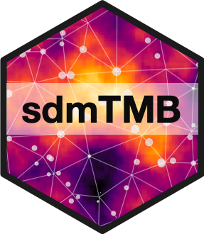

<!-- README.md is generated from README.Rmd. Please edit that file -->

```{r setup, include = FALSE}
knitr::opts_chunk$set(
  collapse = TRUE,
  comment = "#>",
  fig.path = "man/figures/README-",
  out.width = "100%"
)
```

# sdmTMB <a href='https://github.com/pbs-assess/sdmTMB'></a>

> Spatial and spatiotemporal GLMMs with TMB

<!-- badges: start -->
[](https://github.com/pbs-assess/sdmTMB/actions)
[](https://www.repostatus.org/#wip)
[](https://codecov.io/github/pbs-assess/sdmTMB?branch=master)
<!-- badges: end -->

sdmTMB is an R package that implements spatial and spatiotemporal predictive-process GLMMs (Generalized Linear Mixed Effects Models) using Template Model Builder ([TMB](https://github.com/kaskr/adcomp)), [R-INLA](https://www.r-inla.org/), and Gaussian Markov random fields. One common application is for species distribution models (SDMs).
    
## Installation

Assuming you have a [C++ compiler](https://support.rstudio.com/hc/en-us/articles/200486498-Package-Development-Prerequisites) installed, you can install sdmTMB:

```{r, eval=FALSE}
# install.packages("remotes")
remotes::install_github("pbs-assess/sdmTMB")
```

## Functionality

sdmTMB:

- Fits GLMMs with spatial, spatiotemporal, spatial and spatiotemporal, or AR1 spatiotemporal Gaussian Markov random fields with TMB. It can also fit spatially varying local trends through time as a random field.
- Uses formula interfaces for fixed effects and any time-varying effects (dynamic regression) (e.g. `formula = y ~ 1 + x1 + (1 | g), time_varying = ~ 0 + x2`), where `y` is the response, `1` represents an intercept, `0` omits an intercept, `x1` is a covariate with a constant effect, `(1 | g)` is a random intercept across groups `g`, and `x2` is a covariate with a time-varying effect.
- Can handle formulas with splines from mgcv. E.g., `y ~ s(x, k = 4)`.
- Can handle linear breakpoint or logistic threshold fixed effects: `y ~ breakpt(x1)` or `y ~ logistic(x2)`.
- Uses a `family(link)` format similar to `glm()`, lme4, or glmmTMB. This includes Gaussian, Poisson, negative binomial, gamma, binomial, lognormal, Student-t, and Tweedie distributions with identity, log, inverse, and logit links. E.g., `family = tweedie(link = "log")`.
- Has `predict()` and `residuals()` methods. The residuals are randomized-quantile residuals similar to those implemented in the [DHARMa](https://cran.r-project.org/package=DHARMa) package. The `predict()` function can take a `newdata` argument similar to `lm()` or `glm()` etc. The predictions are bilinear interpolated predictive-process predictions (i.e., they make smooth pretty maps).
- Has a simulation function `sdmTMB_sim()` for simulation testing models and `sdmTMB_cv()` for cross-validation testing of model accuracy or comparing across model configurations.
- Includes functionality for estimating the centre of gravity or total biomass by time step for index standardization.
- Can optionally allow for anisotropy in the random fields (spatial correlation that is directionally dependent) and barriers (e.g., land for ocean species) to spatial correlation.
- Can generate an SPDE predictive-process mesh or can take any standard R-INLA mesh created externally as input.

## Examples

The main function is `sdmTMB()`. See `?sdmTMB` and `?predict.sdmTMB` for the most complete examples. Also see the vignettes ('Articles') on the [documentation site](https://pbs-assess.github.io/sdmTMB/index.html).
