<!-- README.md is generated from README.Rmd. Please edit that file -->

# sdmTMB <a href='https://github.com/pbs-assess/sdmTMB'></a>

> Spatial and spatiotemporal GLMMs with TMB

<!-- badges: start -->
[](https://github.com/pbs-assess/sdmTMB/actions)
[](https://www.repostatus.org/#wip)
[](https://codecov.io/github/pbs-assess/sdmTMB?branch=master)
<!-- badges: end -->

sdmTMB is an R package that fits spatial and spatiotemporal predictive-process GLMMs (Generalized Linear Mixed Effects Models) using Template Model Builder ([TMB](https://github.com/kaskr/adcomp)), [R-INLA](https://www.r-inla.org/), and Gaussian Markov random fields. One common application is for species distribution models (SDMs). See also the [documentation site](https://pbs-assess.github.io/sdmTMB/index.html).

## Table of contents

-   [Installation](#installation)
-   [Overview](#overview)
-   [Basic use](#basic-use)
-   [Advanced functionality](#advanced-functionality)
    -   [Time-varying coefficients](#time-varying-coefficients)
    -   [Spatially varying coefficients
        (SVC)](#spatially-varying-coefficients-svc)
    -   [Random intercepts](#random-intercepts)
    -   [Breakpoint and theshold
        effects](#breakpoint-and-theshold-effects)
    -   [Simulating data](#simulating-data)
    -   [Sampling from the joint precision
        matrix](#sampling-from-the-joint-precision-matrix)
    -   [Calculating uncertainty on spatial
        predictions](#calculating-uncertainty-on-spatial-predictions)
    -   [Cross validation](#cross-validation)
    -   [Priors](#priors)
    -   [Bayesian MCMC sampling with
        Stan](#bayesian-mcmc-sampling-with-stan)
    -   [Turning off random fields](#turning-off-random-fields)
    -   [Using a custom INLA mesh](#using-a-custom-inla-mesh)
    -   [Barrier meshes](#barrier-meshes)

## Installation

Assuming you have a [C++
compiler](https://support.rstudio.com/hc/en-us/articles/200486498-Package-Development-Prerequisites)
installed, you can install sdmTMB:

``` r
# install.packages("remotes")
remotes::install_github("pbs-assess/sdmTMB", dependencies = TRUE)
```

## Overview

Analyzing geostatistical data (coordinate-referenced observations from
some underlying spatial process) is becoming increasingly common in
ecology. sdmTMB implements geostatistical spatial and spatiotemporal
GLMMs using TMB for model fitting and R-INLA to set up SPDE (stochastic
partial differential equation) matrices. One common application is for
species distribution models (SDMs), hence the package name. The goal of
sdmTMB is to provide a fast, flexible, and user-friendly
interface—similar to the popular R package glmmTMB—but with a focus on
spatial and spatiotemporal models with an SPDE approach. We extend the
generalized linear mixed models (GLMMs) familiar to ecologists to
include the following optional features:

-   spatial random fields
-   spatiotemporal random fields that may be independent by year or
    modelled with random walks or autoregressive processes
-   smooth terms for covariates, using the familiar `s()` notation from
    mgcv
-   breakpoint (hockey-stick) or logistic covariates
-   time-varying covariates (coefficients modelled as random walks)
-   spatially varying coefficient models (SVCs)
-   interpolation or forecasting over missing or future time slices
-   a wide range of families: all standard R families plus `tweedie()`,
    `nbinom1()`, `nbinom2()`, `lognormal()`, and `student()`, plus some
    truncated and censored families

Estimation is performed in sdmTMB via maximum marginal likelihood with
the objective function calculated in TMB and minimized in R via
`stats::nlminb()` with the random effects integrated over via the
Laplace approximation. The sdmTMB package also allows for models to be
passed to Stan via tmbstan, allowing for Bayesian model estimation.

<!-- sdmTMB: -->
<!-- - Fits GLMMs with spatial, spatiotemporal, spatial and spatiotemporal, or AR1 spatiotemporal Gaussian Markov random fields with TMB.  -->
<!-- - Uses formula interfaces for fixed effects and any time-varying effects (dynamic regression) (e.g. `formula = y ~ 1 + x1 + (1 | g), time_varying = ~ 0 + x2`), where `y` is the response, `1` represents an intercept, `0` omits an intercept, `x1` is a covariate with a constant effect, `(1 | g)` is a random intercept across groups `g`, and `x2` is a covariate with a time-varying effect. -->
<!-- - Can fit spatially varying coefficients as a random field (e.g. `spatial_varying = ~ 0 + x3`). -->
<!-- - Can handle GAMs (generalized additive models) with penalized smoothers from mgcv. E.g., `y ~ s(x)`. -->
<!-- - Can handle linear breakpoint or logistic threshold fixed effects: `y ~ breakpt(x1)` or `y ~ logistic(x2)`. -->
<!-- - Uses a `family(link)` format similar to `glm()`, lme4, or glmmTMB. This includes Gaussian, Poisson, negative binomial, gamma, binomial, lognormal, Student-t, and Tweedie distributions with identity, log, inverse, and logit links. E.g., `family = tweedie(link = "log")`. -->
<!-- - Has `predict()` and `residuals()` methods. The residuals are randomized-quantile residuals similar to those implemented in the [DHARMa](https://cran.r-project.org/package=DHARMa) package. The `predict()` function can take a `newdata` argument similar to `lm()` or `glm()` etc. The predictions are bilinear interpolated predictive-process predictions (i.e., they make smooth pretty maps). -->
<!-- - Has a simulation function `simulate()` for simulating from existing fits (e.g., for DHARMa), `sdmTMB_simulate()` for generating simulated data from scratch, and `sdmTMB_cv()` for cross-validation testing of model accuracy or comparing across model configurations. -->
<!-- - Includes functionality for estimating the centre of gravity or total biomass by time step for index standardization. -->
<!-- - Can optionally allow for anisotropy in the random fields (spatial correlation that is directionally dependent) and barriers (e.g., land for ocean species) to spatial correlation. -->
<!-- - Can interpolate over missing time slices or forecast onto future time slices. -->
<!-- - Can generate an SPDE predictive-process mesh or can take any standard R-INLA mesh created externally as input. -->

See
[`?sdmTMB`](https://pbs-assess.github.io/sdmTMB/reference/sdmTMB.html)
and
[`?predict.sdmTMB`](https://pbs-assess.github.io/sdmTMB/reference/predict.sdmTMB.html)
for the most complete examples. Also see the vignettes (‘Articles’) on
the [documentation
site](https://pbs-assess.github.io/sdmTMB/index.html).

## Basic use

An sdmTMB model requires a data frame that contains a response column,
columns for any predictors, and columns for spatial coordinates. It
usually makes sense to convert the spatial coordinates to an equidistant
projection such as UTMs such that distance remains constant throughout
the study region \[e.g., using `sf::st_transform()`\]. Here, we
illustrate a spatial model fit to Pacific cod (*Gadus macrocephalus*)
trawl survey data from Queen Charlotte Sound, BC, Canada. Our model
contains a main effect of depth as a penalized smoother, a spatial
random field, and Tweedie observation error. Our data frame `pcod`
(built into the package) has a column `year` for the year of the survey,
`density` for density of Pacific cod in a given survey tow, `present`
for whether `density > 0`, `depth` for depth in meters of that tow, and
spatial coordinates `X` and `Y`, which are UTM coordinates in
kilometres.

``` r
library(dplyr)
library(ggplot2)
library(sdmTMB)
head(pcod)
```

    #> # A tibble: 3 × 6
    #>    year density present depth     X     Y
    #>   <int>   <dbl>   <dbl> <dbl> <dbl> <dbl>
    #> 1  2003   113.        1   201  446. 5793.
    #> 2  2003    41.7       1   212  446. 5800.
    #> 3  2003     0         0   220  449. 5802.

We start by creating a mesh object that contains matrices to apply the
SPDE approach.

``` r
mesh <- make_mesh(pcod, xy_cols = c("X", "Y"), cutoff = 10)
```

Here, `cutoff` defines the minimum allowed distance between points in
the units of `X` and `Y` (km). Alternatively, we could have created any
mesh via the INLA package and supplied it to `make_mesh()`. We can
inspect our mesh object with the associated plotting method
`plot(mesh)`.

Fit a spatial model with a smoother for depth:

``` r
fit <- sdmTMB(
  density ~ s(depth, k = 5),
  data = pcod,
  mesh = mesh,
  family = tweedie(link = "log"),
  spatial = "on"
)
```

Print the model fit:

``` r
fit
#> Spatiotemporal model fit by ML ['sdmTMB']
#> Formula: density ~ s(depth, k = 5)
#> Mesh: mesh
#> Data: pcod
#> Family: tweedie(link = 'log')
#>             coef.est coef.se
#> (Intercept)     2.34    0.23
#> sdepth        -26.96   21.52
#> 
#> Smooth terms:
#>            Std. Dev.
#> sds(depth)     34.03
#> 
#> Dispersion parameter: 12.70
#> Tweedie p: 1.58
#> Matern range: 17.47
#> Spatial SD: 1.86
#> ML criterion at convergence: 6403.637
#> 
#> See ?tidy.sdmTMB to extract these values as a data frame.
```

The output indicates our model was fit by maximum (marginal) likelihood
(`ML`). We also see the formula, mesh, fitted data, and family. Next we
see any estimated main effects including the linear component of the
smoother (`sdepth`), the standard deviation on the smoother weights
(`sds(depth)`), the Tweedie dispersion and power parameters, the Matérn
range distance (distance at which points are effectively independent),
the marginal spatial field standard deviation, and the negative log
likelihood at convergence.

We can extract parameters as a data frame:

``` r
tidy(fit, conf.int = TRUE)
#> # A tibble: 1 × 5
#>   term        estimate std.error conf.low conf.high
#>   <chr>          <dbl>     <dbl>    <dbl>     <dbl>
#> 1 (Intercept)     2.34     0.227     1.89      2.78
tidy(fit, effects = "ran_pars", conf.int = TRUE)
#> # A tibble: 4 × 5
#>   term      estimate std.error conf.low conf.high
#>   <chr>        <dbl> <lgl>        <dbl>     <dbl>
#> 1 range        17.5  NA           10.5      29.1 
#> 2 phi          12.7  NA           11.9      13.5 
#> 3 sigma_O       1.86 NA            1.51      2.29
#> 4 tweedie_p     1.58 NA            1.57      1.60
```

Plot the smoother effect:

``` r
plot_smooth(fit, ggplot = TRUE)
```

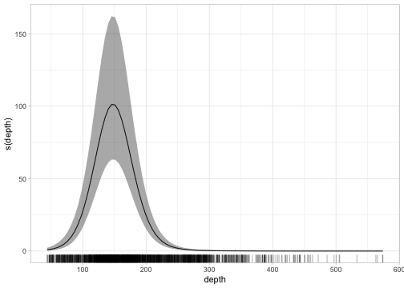

Predict on new data:

``` r
p <- predict(fit, newdata = qcs_grid)
```

``` r
head(p)
```

    #> # A tibble: 3 × 7
    #>       X     Y depth   est est_non_rf est_rf omega_s
    #>   <dbl> <dbl> <dbl> <dbl>      <dbl>  <dbl>   <dbl>
    #> 1   456  5636  347. -2.32      -2.34 0.0155  0.0155
    #> 2   458  5636  223.  2.06       2.02 0.0475  0.0475
    #> 3   460  5636  204.  3.10       3.02 0.0796  0.0796

``` r
ggplot(p, aes(X, Y, fill = exp(est))) + geom_raster() +
  scale_fill_viridis_c(trans = "sqrt")
```

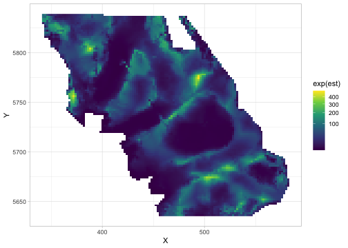

We could switch to a presence-absence model by changing the response
column and family:

``` r
fit <- sdmTMB(
  present ~ s(depth, k = 5),
  data = pcod, 
  mesh = mesh,
  family = binomial(link = "logit")
)
```

We could instead fit a spatiotemporal model by specifying the `time`
column and a spatiotemporal structure:

``` r
fit_spatiotemporal <- sdmTMB(
  density ~ s(depth, k = 5), 
  data = pcod, 
  mesh = mesh,
  time = "year",
  family = tweedie(link = "log"), 
  spatial = "off", 
  spatiotemporal = "ar1"
)
```

If we wanted to create an area-weighted standardized population index,
we could predict on a grid covering the entire survey (`qcs_grid`) with
grid cell area 4 (2 x 2 km) and pass the predictions to `get_index()`:

``` r
p_st <- predict(fit_spatiotemporal, newdata = qcs_grid, 
  return_tmb_object = TRUE, area = 4)
index <- get_index(p_st)
ggplot(index, aes(year, est)) +
  geom_ribbon(aes(ymin = lwr, ymax = upr), fill = "grey90") +
  geom_line(lwd = 1, colour = "grey30") +
  labs(x = "Year", y = "Biomass (kg)")
```

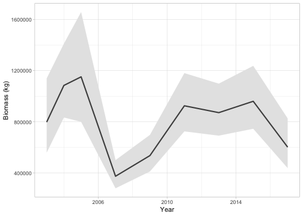

Or the center of gravity:

``` r
cog <- get_cog(p_st, format = "wide")
ggplot(cog, aes(est_x, est_y, colour = year)) +
  geom_pointrange(aes(xmin = lwr_x, xmax = upr_x)) +
  geom_pointrange(aes(ymin = lwr_y, ymax = upr_y)) +
  scale_colour_viridis_c()
```

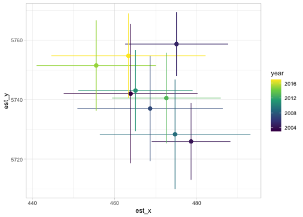

For more on these basic features, see the vignettes [Intro to modelling
with
sdmTMB](https://pbs-assess.github.io/sdmTMB/articles/basic-intro.html)
and [Index standardization with
sdmTMB](https://pbs-assess.github.io/sdmTMB/articles/index-standardization.html).

## Advanced functionality

### Time-varying coefficients

Time-varying intercept:

``` r
fit <- sdmTMB(
  density ~ 0 + s(depth, k = 5), 
  time_varying = ~ 1, 
  data = pcod, mesh = mesh,
  time = "year",  
  family = tweedie(link = "log"),
  silent = FALSE # see progress
)
```

Time-varying (random walk) effect of depth:

``` r
fit <- sdmTMB(
  density ~ 1, 
  time_varying = ~ 0 + depth_scaled + depth_scaled2,
  data = pcod, mesh = mesh,
  time = "year",
  family = tweedie(link = "log"),
  spatial = "off",
  spatiotemporal = "ar1",
  silent = FALSE
)
```

See the vignette [Intro to modelling with
sdmTMB](https://pbs-assess.github.io/sdmTMB/articles/basic-intro.html)
for more details.

### Spatially varying coefficients (SVC)

Spatially varying effect of time:

``` r
pcod$year_scaled <- as.numeric(scale(pcod$year))
fit <- sdmTMB(
  density ~ s(depth, k = 5) + year_scaled,
  spatial_varying = ~ 0 + year_scaled, 
  data = pcod, mesh = mesh, 
  time = "year",
  family = tweedie(link = "log"),
  spatiotemporal = "off"
)
```

See `zeta_s` in the output, which represents the coefficient varying in
space. You’ll want to ensure you set up your model such that it ballpark
has a mean of 0 (e.g., by including it in `formula` too).

``` r
qcs_grid$year_scaled <- (qcs_grid$year - mean(pcod$year)) / sd(pcod$year)
p <- predict(fit, newdata = subset(qcs_grid, year == 2011))
ggplot(p, aes(X, Y, fill = zeta_s)) + geom_raster() +
  scale_fill_gradient2()
```

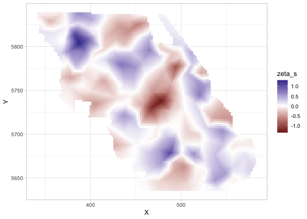

See the vignette on [Fitting spatial trend models with
sdmTMB](https://pbs-assess.github.io/sdmTMB/articles/spatial-trend-models.html)
for more details.

### Random intercepts

We can use the same syntax (`1 | group`) as lme4 or glmmTMB to fit
random intercepts:

``` r
pcod$year_factor <- as.factor(pcod$year)
fit <- sdmTMB(
  density ~ s(depth, k = 5) + (1 | year_factor),
  data = pcod, mesh = mesh,
  time = "year",
  family = tweedie(link = "log")
)
```

### Breakpoint and theshold effects

``` r
fit <- sdmTMB(
  present ~ 1 + breakpt(depth_scaled), 
  data = pcod, mesh = mesh,
  family = binomial(link = "logit")
)
```

``` r
fit <- sdmTMB(
  present ~ 1 + logistic(depth_scaled), 
  data = pcod, mesh = mesh,
  family = binomial(link = "logit")
)
```

See the vignette on [Threshold modeling with
sdmTMB](https://pbs-assess.github.io/sdmTMB/articles/threshold-models.html)
for more details.

### Simulating data

#### Simulating data from scratch

``` r
predictor_dat <- expand.grid(
  X = seq(0, 1, length.out = 100), Y = seq(0, 1, length.out = 100)
)
mesh <- make_mesh(predictor_dat, xy_cols = c("X", "Y"), cutoff = 0.05)
sim_dat <- sdmTMB_simulate(
  formula = ~ 1,
  data = predictor_dat,
  mesh = mesh,
  family = poisson(link = "log"),
  range = 0.3,
  sigma_O = 0.4,
  seed = 1,
  B = 1 # B0 = intercept
)
head(sim_dat)
#> # A tibble: 6 × 7
#>        X     Y omega_s    mu   eta observed `(Intercept)`
#>    <dbl> <dbl>   <dbl> <dbl> <dbl>    <dbl>         <dbl>
#> 1 0          0  -0.154  2.33 0.846        1             1
#> 2 0.0101     0  -0.197  2.23 0.803        0             1
#> 3 0.0202     0  -0.240  2.14 0.760        2             1
#> 4 0.0303     0  -0.282  2.05 0.718        2             1
#> 5 0.0404     0  -0.325  1.96 0.675        3             1
#> 6 0.0505     0  -0.367  1.88 0.633        2             1

# sample 200 points for fitting:
set.seed(1)
sim_dat_obs <- sim_dat[sample(seq_len(nrow(sim_dat)), 200), ]
```

``` r
ggplot(sim_dat, aes(X, Y)) +
  geom_raster(aes(fill = exp(eta))) + # mean without observation error
  geom_point(aes(size = observed), data = sim_dat_obs, pch = 21) +
  scale_fill_viridis_c() +
  scale_size_area() +
  coord_cartesian(expand = FALSE)
```

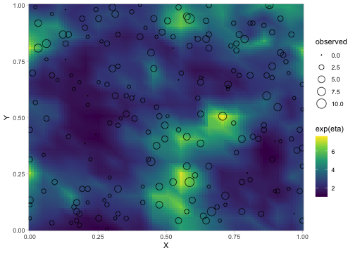

Fit to the simulated data:

``` r
mesh <- make_mesh(sim_dat_obs, xy_cols = c("X", "Y"), cutoff = 0.05)
fit <- sdmTMB(
  observed ~ 1,
  data = sim_dat_obs,
  mesh = mesh,
  family = poisson()
)
```

See
[`?sdmTMB_simulate`](https://pbs-assess.github.io/sdmTMB/reference/sdmTMB_simulate.html)
for more details.

#### Simulating from an existing fit

``` r
s <- simulate(fit, nsim = 500)
dim(s)
#> [1] 969 500
s[1:3,1:4]
#>      [,1]     [,2]     [,3]     [,4]
#> [1,]    0 59.40310 83.20888  0.00000
#> [2,]    0 34.56408  0.00000 19.99839
#> [3,]    0  0.00000  0.00000  0.00000
```

Using those simulations to check DHARMa residuals:

``` r
# dharma_residuals(s, fit)
# or with the pipe, %>%:
simulate(fit, nsim = 500) %>% 
  dharma_residuals(fit)
```

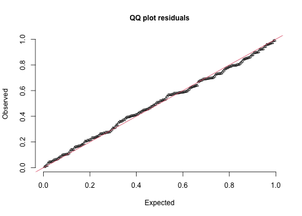

See the vignette on [Residual checking with
sdmTMB](https://pbs-assess.github.io/sdmTMB/articles/residual-checking.html),
[`?simulate.sdmTMB`](https://pbs-assess.github.io/sdmTMB/reference/simulate.sdmTMB.html),
and
[`?dharma_residuals`](https://pbs-assess.github.io/sdmTMB/reference/dharma_residuals.html)
for more details.

### Sampling from the joint precision matrix

We can take samples from the implied parameter distribution assuming an
MVN covariance matrix on the internal parameterization:

``` r
samps <- gather_sims(fit, nsim = 1000)
ggplot(samps, aes(.value)) + geom_histogram() +
  facet_wrap(~.variable, scales = "free_x")
#> `stat_bin()` using `bins = 30`. Pick better value with `binwidth`.
```

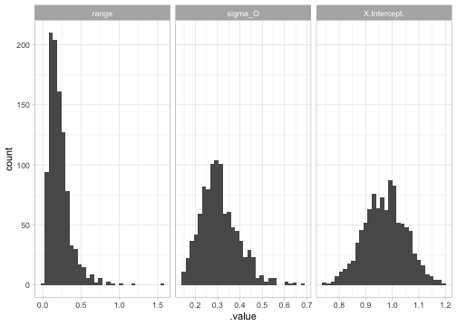

See
[`?gather_sims`](https://pbs-assess.github.io/sdmTMB/reference/gather_sims.html)
and
[`?get_index_sims`](https://pbs-assess.github.io/sdmTMB/reference/get_index_sims.html)
for more details.

### Calculating uncertainty on spatial predictions

The fastest way to get point-wise prediction uncertainty is to use the
MVN samples:

``` r
p <- predict(fit, newdata = predictor_dat, nsim = 500)
predictor_dat$se <- apply(p, 1, sd)
ggplot(predictor_dat, aes(X, Y, fill = se)) +
  geom_raster() +
  scale_fill_viridis_c(option = "A") +
  coord_cartesian(expand = FALSE)
```

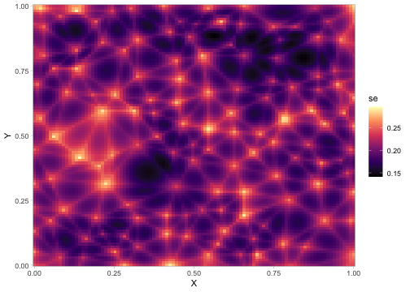

### Cross validation

sdmTMB has built-in functionality for cross-validation. If we were to
set a `future::plan()`, the folds would be fit in parallel:

``` r
mesh <- make_mesh(pcod, c("X", "Y"), cutoff = 10)
## Set parallel processing if desired:
# library(future)
# plan(multisession)
m_cv <- sdmTMB_cv(
  density ~ s(depth, k = 5),
  data = pcod, mesh = mesh,
  family = tweedie(link = "log"), k_folds = 2
)
#> Running fits with `future.apply()`.
#> Set a parallel `future::plan()` to use parallel processing.
# Sum of log likelihoods of left-out data:
m_cv$sum_loglik
#> [1] -6750.892
# Expected log pointwise predictive density from left-out data:
# (average likelihood density)
m_cv$elpd
#> [1] -1.008653
```

See
[`?sdmTMB_cv`](https://pbs-assess.github.io/sdmTMB/reference/sdmTMB_cv.html)
for more details.

### Priors

Priors/penalties can be placed on most parameters. For example, here we
place a PC (penalized complexity) prior on the Matérn random field
parameters, a standard normal prior on the effect of depth, a Normal(0,
10^2) prior on the intercept, and a half-normal prior on the Tweedie
dispersion parameter (`phi`):

``` r
mesh <- make_mesh(pcod, c("X", "Y"), cutoff = 10)
fit <- sdmTMB(
  density ~ depth_scaled,
  data = pcod, mesh = mesh,
  family = tweedie(),
  priors = sdmTMBpriors(
    matern_s = pc_matern(range_gt = 10, sigma_lt = 5),
    b = normal(c(0, 0), c(1, 10)),
    phi = halfnormal(0, 15)
  )
)
```

We can visualize the PC Matérn prior:

``` r
plot_pc_matern(range_gt = 10, sigma_lt = 5)
```

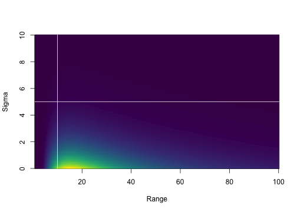

See
[`?sdmTMBpriors`](https://pbs-assess.github.io/sdmTMB/reference/priors.html)
for more details.

### Bayesian MCMC sampling with Stan

The fitted model can be passed to the tmbstan package to sample from the
posterior with Stan. Note this can be slow for large or poorly
identified models. See examples of fixing parameters in
[`?extract_mcmc`](https://pbs-assess.github.io/sdmTMB/reference/extract_mcmc.html).

``` r
# only 1 chain and 400 iterations for speed:
fit_mcmc <- tmbstan::tmbstan(fit$tmb_obj, chains = 1, iter = 400)
```

Internal parameter posteriors:

``` r
print(fit_mcmc, pars = c("b_j", "omega_s[1]"))
#> Inference for Stan model: sdmTMB.
#> 1 chains, each with iter=400; warmup=200; thin=1; 
#> post-warmup draws per chain=200, total post-warmup draws=200.
#> 
#>             mean se_mean   sd  2.5%   25%   50%  75% 97.5% n_eff Rhat
#> b_j         0.99    0.03 0.15  0.62  0.93  1.00 1.06  1.27    35 1.00
#> omega_s[1] -0.07    0.03 0.23 -0.50 -0.23 -0.06 0.10  0.33    63 1.01
#> 
#> Samples were drawn using NUTS(diag_e).
#> For each parameter, n_eff is a crude measure of effective sample size,
#> and Rhat is the potential scale reduction factor on split chains (at 
#> convergence, Rhat=1).
```

Predicting with the Stan/tmbstan model:

``` r
pred_mcmc <- predict(fit, newdata = qcs_grid, tmbstan_model = fit_mcmc)
# Each row has 200 posterior samples for a row of the `newdata` data frame:
dim(pred_mcmc)
#> [1] 65826   200
```

See
[`?extract_mcmc`](https://pbs-assess.github.io/sdmTMB/reference/extract_mcmc.html)
for more details.

### Turning off random fields

We can turn off the random fields for model comparison:

``` r
fit_sdmTMB <- sdmTMB(
  present ~ poly(depth_scaled, 2),
  data = pcod, mesh = mesh,
  spatial = "off",
  family = binomial()
)
fit_glm <- glm(
  present ~ poly(depth_scaled, 2),
  data = pcod,
  family = binomial()
)

tidy(fit_sdmTMB)
#> # A tibble: 3 × 3
#>   term                   estimate std.error
#>   <chr>                     <dbl>     <dbl>
#> 1 (Intercept)              -0.426    0.0573
#> 2 poly(depth_scaled, 2)1  -31.7      3.03  
#> 3 poly(depth_scaled, 2)2  -66.9      4.09
broom::tidy(fit_glm)
#> # A tibble: 3 × 5
#>   term                   estimate std.error statistic  p.value
#>   <chr>                     <dbl>     <dbl>     <dbl>    <dbl>
#> 1 (Intercept)              -0.426    0.0573     -7.44 1.03e-13
#> 2 poly(depth_scaled, 2)1  -31.7      3.03      -10.5  1.20e-25
#> 3 poly(depth_scaled, 2)2  -66.9      4.09      -16.4  3.50e-60
```

### Using a custom INLA mesh

Defining a mesh directly with INLA:

``` r
bnd <- INLA::inla.nonconvex.hull(cbind(pcod$X, pcod$Y), convex = -0.1)
mesh_inla <- INLA::inla.mesh.2d(
  boundary = bnd,
  max.edge = c(25, 50)
)
mesh <- make_mesh(pcod, c("X", "Y"), mesh = mesh_inla)
plot(mesh)
```

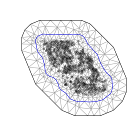

``` r
fit <- sdmTMB(
  density ~ s(depth, k = 5),
  data = pcod, mesh = mesh,
  family = tweedie(link = "log")
)
```

### Barrier meshes

A barrier mesh limits correlation across barriers (e.g., land or water).
See the example in
[`?add_barrier_mesh`](https://pbs-assess.github.io/sdmTMB/reference/add_barrier_mesh.html).
