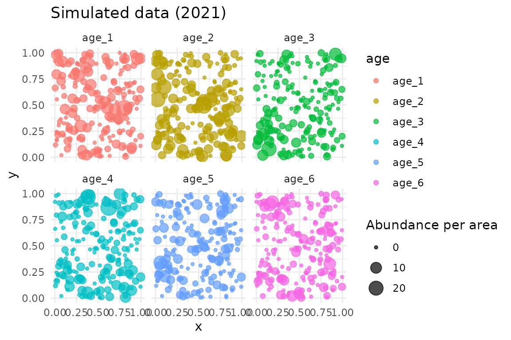
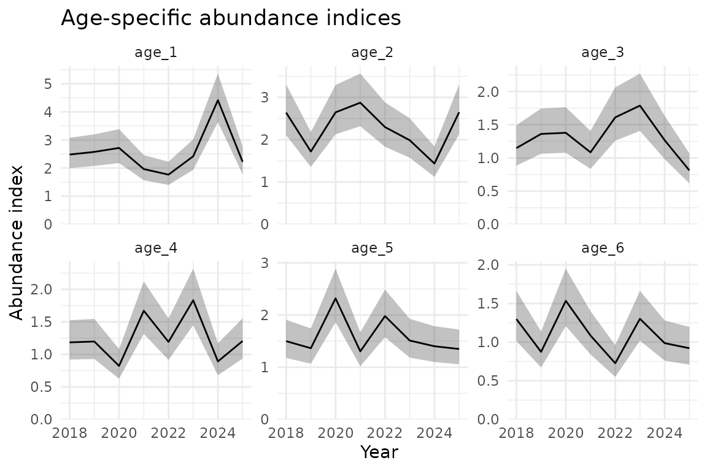

# Area-weighted age composition standardization with sdmTMB

``` r
library(sdmTMB)
library(fmesher)
library(ggplot2)
library(dplyr)
theme_set(theme_minimal())
```

This document shows area-weighted age composition expansion with sdmTMB
using simulated data. In other words, we use area-expansion to calculate
proportion-at-age using (potentially) spatially unbalanced sampling
data. Please see Thorson and Haltuch (2018) for further description.

We will start by simulating some data. This simulation code chunk is
hidden for simplicity.

We can look at the simulated data:

``` r
head(data)
#>   year         x          y abundance_per_area   age   year_age
#> 1 2018 0.2875775 0.63918581         0.51004952 age_1 2018_age_1
#> 2 2018 0.7883051 0.12482240         1.60038328 age_1 2018_age_1
#> 3 2018 0.4089769 0.25526578         0.00000000 age_1 2018_age_1
#> 4 2018 0.8830174 0.82057469         0.04387091 age_1 2018_age_1
#> 5 2018 0.9404673 0.80378039         1.27301974 age_1 2018_age_1
#> 6 2018 0.0455565 0.04583463         0.86470310 age_1 2018_age_1
```

We are assuming that these data have already gone “first stage
expansion”. I.e., each subsample has been expanded to represent the
total abundance (or biomass) of the primary sample from which it came.
Although we model abundance per area here, we could alternatively model
abundance with an offset for (log) area. And instead of a Tweedie
distribution, we could use a delta-gamma or delta-lognormal family or
even a Poisson or negative binomial.

Plot the raw simulated data:

``` r
ggplot(data, aes(x, y, colour = log(abundance_per_area + 1))) +
  geom_point() +
  facet_grid(year ~ age) +
  scale_colour_viridis_c() +
  labs(colour = "Abundance\nper\narea")
```


``` r

# Show data for one year
data_subset <- filter(data, year == 2021)
ggplot(data_subset, aes(x, y, size = abundance_per_area, colour = age)) +
  geom_point(alpha = 0.7) +
  facet_wrap(~age) +
  labs(title = "Simulated data (2021)", size = "Abundance per area")
```



Now we will set up the spatial and spatiotemporal fields with shared SDs
across ages. This could alternatively be set up to have different
spatial SDs by age and/or different spatiotemporal SDs by age.

``` r
mesh_sdm <- make_mesh(data, c("x", "y"), cutoff = 0.1)

# Use a helper function to set up the model components
svc_setup <- sdmTMB::make_category_svc(
  data = data,
  category_column = "age",
  time_column = "year",
  share_spatial_sd = TRUE, # All ages share spatial SD
  share_spatiotemporal_sd = TRUE # All age-year combinations share spatiotemporal SD
)
```

This would return information on what just ran:

``` r
svc_setup$info
```

The important parts are the following.

Our data frame has additional columns for use in the `spatial_varying`
argument:

``` r
colnames(svc_setup$data_expanded)
#>  [1] "year"                      "x"                        
#>  [3] "y"                         "abundance_per_area"       
#>  [5] "age"                       "year_age"                 
#>  [7] "ageage_1"                  "ageage_2"                 
#>  [9] "ageage_3"                  "ageage_4"                 
#> [11] "ageage_5"                  "ageage_6"                 
#> [13] "factor(year)2018:ageage_1" "factor(year)2019:ageage_1"
#> [15] "factor(year)2020:ageage_1" "factor(year)2021:ageage_1"
#> [17] "factor(year)2022:ageage_1" "factor(year)2023:ageage_1"
#> [19] "factor(year)2024:ageage_1" "factor(year)2025:ageage_1"
#> [21] "factor(year)2018:ageage_2" "factor(year)2019:ageage_2"
#> [23] "factor(year)2020:ageage_2" "factor(year)2021:ageage_2"
#> [25] "factor(year)2022:ageage_2" "factor(year)2023:ageage_2"
#> [27] "factor(year)2024:ageage_2" "factor(year)2025:ageage_2"
#> [29] "factor(year)2018:ageage_3" "factor(year)2019:ageage_3"
#> [31] "factor(year)2020:ageage_3" "factor(year)2021:ageage_3"
#> [33] "factor(year)2022:ageage_3" "factor(year)2023:ageage_3"
#> [35] "factor(year)2024:ageage_3" "factor(year)2025:ageage_3"
#> [37] "factor(year)2018:ageage_4" "factor(year)2019:ageage_4"
#> [39] "factor(year)2020:ageage_4" "factor(year)2021:ageage_4"
#> [41] "factor(year)2022:ageage_4" "factor(year)2023:ageage_4"
#> [43] "factor(year)2024:ageage_4" "factor(year)2025:ageage_4"
#> [45] "factor(year)2018:ageage_5" "factor(year)2019:ageage_5"
#> [47] "factor(year)2020:ageage_5" "factor(year)2021:ageage_5"
#> [49] "factor(year)2022:ageage_5" "factor(year)2023:ageage_5"
#> [51] "factor(year)2024:ageage_5" "factor(year)2025:ageage_5"
#> [53] "factor(year)2018:ageage_6" "factor(year)2019:ageage_6"
#> [55] "factor(year)2020:ageage_6" "factor(year)2021:ageage_6"
#> [57] "factor(year)2022:ageage_6" "factor(year)2023:ageage_6"
#> [59] "factor(year)2024:ageage_6" "factor(year)2025:ageage_6"
```

We have a formula for the `spatial_varying` argument:

``` r
svc_setup$svc_formula
#> ~ageage_1 + ageage_2 + ageage_3 + ageage_4 + ageage_5 + ageage_6 + 
#>     `factor(year)2018:ageage_1` + `factor(year)2019:ageage_1` + 
#>     `factor(year)2020:ageage_1` + `factor(year)2021:ageage_1` + 
#>     `factor(year)2022:ageage_1` + `factor(year)2023:ageage_1` + 
#>     `factor(year)2024:ageage_1` + `factor(year)2025:ageage_1` + 
#>     `factor(year)2018:ageage_2` + `factor(year)2019:ageage_2` + 
#>     `factor(year)2020:ageage_2` + `factor(year)2021:ageage_2` + 
#>     `factor(year)2022:ageage_2` + `factor(year)2023:ageage_2` + 
#>     `factor(year)2024:ageage_2` + `factor(year)2025:ageage_2` + 
#>     `factor(year)2018:ageage_3` + `factor(year)2019:ageage_3` + 
#>     `factor(year)2020:ageage_3` + `factor(year)2021:ageage_3` + 
#>     `factor(year)2022:ageage_3` + `factor(year)2023:ageage_3` + 
#>     `factor(year)2024:ageage_3` + `factor(year)2025:ageage_3` + 
#>     `factor(year)2018:ageage_4` + `factor(year)2019:ageage_4` + 
#>     `factor(year)2020:ageage_4` + `factor(year)2021:ageage_4` + 
#>     `factor(year)2022:ageage_4` + `factor(year)2023:ageage_4` + 
#>     `factor(year)2024:ageage_4` + `factor(year)2025:ageage_4` + 
#>     `factor(year)2018:ageage_5` + `factor(year)2019:ageage_5` + 
#>     `factor(year)2020:ageage_5` + `factor(year)2021:ageage_5` + 
#>     `factor(year)2022:ageage_5` + `factor(year)2023:ageage_5` + 
#>     `factor(year)2024:ageage_5` + `factor(year)2025:ageage_5` + 
#>     `factor(year)2018:ageage_6` + `factor(year)2019:ageage_6` + 
#>     `factor(year)2020:ageage_6` + `factor(year)2021:ageage_6` + 
#>     `factor(year)2022:ageage_6` + `factor(year)2023:ageage_6` + 
#>     `factor(year)2024:ageage_6` + `factor(year)2025:ageage_6`
#> <environment: 0x55601637e880>
```

And we have a TMB ‘map’ list, which controls which random field SDs are
shared vs. estimated separately. Factor levels that are the same get
shared; those that are different are estimated separately.

``` r
svc_setup$svc_map
#> $ln_tau_Z
#>  [1] 1 1 1 1 1 1 2 2 2 2 2 2 2 2 2 2 2 2 2 2 2 2 2 2 2 2 2 2 2 2 2 2 2 2 2 2 2 2
#> [39] 2 2 2 2 2 2 2 2 2 2 2 2 2 2 2 2
#> Levels: 1 2
```

Internally, `ln_tau_Z` is a precision parameter that affects the SD of
the SVC fields.

We’ll set up a control list. The only critical part is the map argument.

``` r
control_sdmTMB <- sdmTMBcontrol(
  map = svc_setup$svc_map, # critical part
  multiphase = FALSE, # often faster here
  newton_loops = 0, # for a faster example
  profile = "b_j", # often faster here
  getsd = TRUE # skip running sdreport() if desired for speed while testing
)
```

Fit our model:

``` r
fit_sdmTMB <- sdmTMB(
  abundance_per_area ~ 0 + year_age,
  mesh = mesh_sdm,
  data = svc_setup$data_expanded, # Use expanded data
  family = tweedie(),
  time = "year",
  spatial = "off", # all spatial variation with spatial_varying
  spatiotemporal = "off", # all spatiotemporal variation with spatial_varying
  spatial_varying = svc_setup$svc_formula,
  silent = FALSE,
  control = control_sdmTMB
)
#> ℹ Fixing or mirroring `ln_tau_Z`
#> running TMB sdreport
```

``` r
sanity(fit_sdmTMB)
#> ✔ Non-linear minimizer suggests successful convergence
#> ✔ Hessian matrix is positive definite
#> ✔ No extreme or very small eigenvalues detected
#> ✔ No gradients with respect to fixed effects are >= 0.001
#> ✔ No fixed-effect standard errors are NA
#> ✔ No standard errors look unreasonably large
#> ✔ No sigma parameters are < 0.01
#> ✔ No sigma parameters are > 100
#> ✔ Range parameter doesn't look unreasonably large
fit_sdmTMB
#> Spatial model fit by ML ['sdmTMB']
#> Formula: abundance_per_area ~ 0 + year_age
#> Mesh: mesh_sdm (isotropic covariance)
#> Time column: year
#> Data: svc_setup$data_expanded
#> Family: tweedie(link = 'log')
#>  
#> Conditional model:
#>                    coef.est coef.se
#> year_age2018_age_1     0.73    0.19
#> year_age2018_age_2     0.81    0.19
#> year_age2018_age_3    -0.08    0.20
#> year_age2018_age_4     0.00    0.20
#> year_age2018_age_5     0.24    0.20
#> year_age2018_age_6     0.11    0.20
#> year_age2019_age_1     0.78    0.19
#> year_age2019_age_2     0.41    0.19
#> year_age2019_age_3     0.13    0.20
#> year_age2019_age_4    -0.01    0.20
#> year_age2019_age_5     0.13    0.20
#> year_age2019_age_6    -0.28    0.20
#> year_age2020_age_1     0.79    0.19
#> year_age2020_age_2     0.80    0.19
#> year_age2020_age_3     0.13    0.20
#> year_age2020_age_4    -0.39    0.21
#> year_age2020_age_5     0.66    0.19
#> year_age2020_age_6     0.27    0.20
#> year_age2021_age_1     0.51    0.19
#> year_age2021_age_2     0.88    0.19
#> year_age2021_age_3    -0.17    0.20
#> year_age2021_age_4     0.29    0.20
#> year_age2021_age_5     0.10    0.20
#> year_age2021_age_6    -0.08    0.20
#> year_age2022_age_1     0.39    0.19
#> year_age2022_age_2     0.68    0.19
#> year_age2022_age_3     0.26    0.20
#> year_age2022_age_4    -0.03    0.20
#> year_age2022_age_5     0.50    0.19
#> year_age2022_age_6    -0.47    0.21
#> year_age2023_age_1     0.69    0.19
#> year_age2023_age_2     0.55    0.19
#> year_age2023_age_3     0.40    0.19
#> year_age2023_age_4     0.40    0.19
#> year_age2023_age_5     0.22    0.20
#> year_age2023_age_6     0.12    0.20
#> year_age2024_age_1     1.32    0.18
#> year_age2024_age_2     0.19    0.20
#> year_age2024_age_3     0.06    0.20
#> year_age2024_age_4    -0.31    0.20
#> year_age2024_age_5     0.09    0.20
#> year_age2024_age_6    -0.18    0.20
#> year_age2025_age_1     0.58    0.19
#> year_age2025_age_2     0.82    0.19
#> year_age2025_age_3    -0.39    0.21
#> year_age2025_age_4    -0.01    0.20
#> year_age2025_age_5     0.12    0.20
#> year_age2025_age_6    -0.26    0.20
#> 
#> Dispersion parameter: 2.99
#> Tweedie p: 1.60
#> Matérn range: 0.20
#> Spatially varying coefficient SD (ageage_1): 0.47
#> Spatially varying coefficient SD (ageage_2): 0.47
#> Spatially varying coefficient SD (ageage_3): 0.47
#> Spatially varying coefficient SD (ageage_4): 0.47
#> Spatially varying coefficient SD (ageage_5): 0.47
#> Spatially varying coefficient SD (ageage_6): 0.47
#> Spatially varying coefficient SD (`factor(year)2018:ageage_1`): 0.51
#> Spatially varying coefficient SD (`factor(year)2019:ageage_1`): 0.51
#> Spatially varying coefficient SD (`factor(year)2020:ageage_1`): 0.51
#> Spatially varying coefficient SD (`factor(year)2021:ageage_1`): 0.51
#> Spatially varying coefficient SD (`factor(year)2022:ageage_1`): 0.51
#> Spatially varying coefficient SD (`factor(year)2023:ageage_1`): 0.51
#> Spatially varying coefficient SD (`factor(year)2024:ageage_1`): 0.51
#> Spatially varying coefficient SD (`factor(year)2025:ageage_1`): 0.51
#> Spatially varying coefficient SD (`factor(year)2018:ageage_2`): 0.51
#> Spatially varying coefficient SD (`factor(year)2019:ageage_2`): 0.51
#> Spatially varying coefficient SD (`factor(year)2020:ageage_2`): 0.51
#> Spatially varying coefficient SD (`factor(year)2021:ageage_2`): 0.51
#> Spatially varying coefficient SD (`factor(year)2022:ageage_2`): 0.51
#> Spatially varying coefficient SD (`factor(year)2023:ageage_2`): 0.51
#> Spatially varying coefficient SD (`factor(year)2024:ageage_2`): 0.51
#> Spatially varying coefficient SD (`factor(year)2025:ageage_2`): 0.51
#> Spatially varying coefficient SD (`factor(year)2018:ageage_3`): 0.51
#> Spatially varying coefficient SD (`factor(year)2019:ageage_3`): 0.51
#> Spatially varying coefficient SD (`factor(year)2020:ageage_3`): 0.51
#> Spatially varying coefficient SD (`factor(year)2021:ageage_3`): 0.51
#> Spatially varying coefficient SD (`factor(year)2022:ageage_3`): 0.51
#> Spatially varying coefficient SD (`factor(year)2023:ageage_3`): 0.51
#> Spatially varying coefficient SD (`factor(year)2024:ageage_3`): 0.51
#> Spatially varying coefficient SD (`factor(year)2025:ageage_3`): 0.51
#> Spatially varying coefficient SD (`factor(year)2018:ageage_4`): 0.51
#> Spatially varying coefficient SD (`factor(year)2019:ageage_4`): 0.51
#> Spatially varying coefficient SD (`factor(year)2020:ageage_4`): 0.51
#> Spatially varying coefficient SD (`factor(year)2021:ageage_4`): 0.51
#> Spatially varying coefficient SD (`factor(year)2022:ageage_4`): 0.51
#> Spatially varying coefficient SD (`factor(year)2023:ageage_4`): 0.51
#> Spatially varying coefficient SD (`factor(year)2024:ageage_4`): 0.51
#> Spatially varying coefficient SD (`factor(year)2025:ageage_4`): 0.51
#> Spatially varying coefficient SD (`factor(year)2018:ageage_5`): 0.51
#> Spatially varying coefficient SD (`factor(year)2019:ageage_5`): 0.51
#> Spatially varying coefficient SD (`factor(year)2020:ageage_5`): 0.51
#> Spatially varying coefficient SD (`factor(year)2021:ageage_5`): 0.51
#> Spatially varying coefficient SD (`factor(year)2022:ageage_5`): 0.51
#> Spatially varying coefficient SD (`factor(year)2023:ageage_5`): 0.51
#> Spatially varying coefficient SD (`factor(year)2024:ageage_5`): 0.51
#> Spatially varying coefficient SD (`factor(year)2025:ageage_5`): 0.51
#> Spatially varying coefficient SD (`factor(year)2018:ageage_6`): 0.51
#> Spatially varying coefficient SD (`factor(year)2019:ageage_6`): 0.51
#> Spatially varying coefficient SD (`factor(year)2020:ageage_6`): 0.51
#> Spatially varying coefficient SD (`factor(year)2021:ageage_6`): 0.51
#> Spatially varying coefficient SD (`factor(year)2022:ageage_6`): 0.51
#> Spatially varying coefficient SD (`factor(year)2023:ageage_6`): 0.51
#> Spatially varying coefficient SD (`factor(year)2024:ageage_6`): 0.51
#> Spatially varying coefficient SD (`factor(year)2025:ageage_6`): 0.51
#> ML criterion at convergence: 17325.664
#> 
#> See ?tidy.sdmTMB to extract these values as a data frame.
```

### Area expansion

Now let’s calculate area-weighted abundance indices for each age class.
First, we need to set up our ‘grid’ data frame over which we will
predict. Here we make a simple grid over our 0-1 simulated survey
domain.

``` r
# Create prediction grid on the same 0-1 spatial domain
n_pred <- 10
pred_grid <- expand.grid(
  x = seq(0, 1, length.out = n_pred),
  y = seq(0, 1, length.out = n_pred)
)

# Each grid cell area (since we're on 0-1 domain)
cell_area <- (1 / n_pred)^2

# Replicate over years and ages
nd <- replicate_df(pred_grid, "year", years)
nd <- replicate_df(nd, "age", ages)
nd$year_age <- paste(nd$year, nd$age, sep = "_")

# Use helper function to add model matrix columns
nd_setup <- sdmTMB::make_category_svc(
  data = nd,
  category_column = "age",
  time_column = "year",
  share_spatial_sd = TRUE,
  share_spatiotemporal_sd = TRUE
)
```

Calculate indices for each age:

``` r
ind_list <- lapply(ages, function(age) {
  cat("Calculating index for age:", age, "\n")

  # Subset prediction data for this age
  nd_age <- nd_setup$data_expanded[nd_setup$data_expanded$age == age, ]

  # Get predictions
  pred <- predict(fit_sdmTMB, newdata = nd_age, return_tmb_object = TRUE)

  # Calculate area-weighted index
  ind <- get_index(pred, area = cell_area, bias_correct = TRUE)
  data.frame(ind, age = age)
})

ind <- do.call(rbind, ind_list)
```

Plot abundance indices by age:

``` r
ggplot(ind, aes(year, est)) +
  geom_ribbon(aes(ymin = lwr, ymax = upr), alpha = 0.3) +
  geom_line() +
  facet_wrap(~age, scales = "free_y") +
  scale_y_continuous(limits = c(0, NA), expand = expansion(mult = c(0, 0.05))) +
  labs(
    x = "Year",
    y = "Abundance index",
    title = "Age-specific abundance indices"
  )
```



### Convert to age composition (proportions)

Convert the abundance indices to proportions-at-age:

``` r
ind_props <- ind |>
  group_by(year) |>
  mutate(
    total = sum(est),
    proportion = est / total
  ) |>
  ungroup()
```

Plot age composition:

``` r
ggplot(ind_props, aes(year, proportion, fill = factor(age, levels = rev(ages)))) +
  geom_area(position = "stack", alpha = 0.7) +
  labs(
    x = "Year",
    y = "Proportion",
    fill = "Age",
  )
```


``` r

ggplot(ind_props, aes(year, proportion, colour = age)) +
  geom_line() +
  geom_point() +
  labs(
    x = "Year",
    y = "Proportion",
    colour = "Age",
  )
```


### Calculate effective sample sizes

Here we’ll calculate effective sample sizes for the age composition,
following the method from VAST (Thorson 2019) as described in Thorson
and Haltuch (2018).

``` r
# Function to calculate effective sample sizes from index estimates
# This may be folded into sdmTMB eventually
get_comp_neff <- function(dat, index_df, time_column = "year", bin_column = "age") {
  # Get unique years and ages in original order
  years_unique <- unique(dat[[time_column]])
  bins_unique <- unique(dat[[bin_column]])
  nyrs <- length(years_unique)
  nbins <- length(bins_unique)

  # Reshape estimates and SEs to matrices (bins x years)
  est_mat <- t(matrix(index_df$est, nrow = nyrs, ncol = nbins))
  se_mat <- t(matrix(index_df$se_natural, nrow = nyrs, ncol = nbins))

  # Calculate total abundance and SE by year
  total_by_year <- colSums(est_mat)
  total_se_by_year <- sqrt(colSums(se_mat^2))

  # Calculate proportions
  prop_mat <- est_mat / rep(total_by_year, each = nbins)

  # Calculate proportion variance and effective sample sizes using delta method
  var_prop_mat <- matrix(NA, nrow = nbins, ncol = nyrs)
  neff_mat <- matrix(NA, nrow = nbins, ncol = nyrs)

  for (i in 1:nbins) {
    for (j in 1:nyrs) {
      if (est_mat[i, j] > 0) {
        var_prop_mat[i, j] <- est_mat[i, j]^2 / total_by_year[j]^2 *
          (se_mat[i, j]^2 / est_mat[i, j]^2 -
            2 * se_mat[i, j]^2 / (est_mat[i, j] * total_by_year[j]) +
            total_se_by_year[j]^2 / total_by_year[j]^2)
        neff_mat[i, j] <- prop_mat[i, j] * (1 - prop_mat[i, j]) / var_prop_mat[i, j]
      } else {
        var_prop_mat[i, j] <- 0
        neff_mat[i, j] <- 0
      }
    }
  }

  # Calculate median Neff by year
  neff_median <- apply(neff_mat, 2, median, na.rm = TRUE)

  # Convert to data frame
  bin_indices <- rep(1:nbins, nyrs)
  year_indices <- rep(1:nyrs, each = nbins)
  result <- data.frame(
    prop_se = sqrt(as.vector(var_prop_mat)),
    prop = as.vector(prop_mat),
    neff = as.vector(neff_mat),
    neff_median = rep(neff_median, each = nbins)
  )

  # Add year and bin columns
  result[[time_column]] <- years_unique[year_indices]
  result[[bin_column]] <- bins_unique[bin_indices]
  result
}

# Calculate effective sample sizes
neff_results <- get_comp_neff(data, ind)

# Show results
head(neff_results)
#>      prop_se      prop      neff neff_median year   age
#> 1 0.18427485 0.2419754  5.401600    8.519126 2018 age_1
#> 2 0.19090118 0.2575352  5.246810    8.519126 2018 age_2
#> 3 0.09922406 0.1119492 10.097755    8.519126 2018 age_3
#> 4 0.10186871 0.1156016  9.852132    8.519126 2018 age_4
#> 5 0.12500528 0.1462638  7.991050    8.519126 2018 age_5
#> 6 0.11057981 0.1266747  9.047203    8.519126 2018 age_6
```

Plot effective sample sizes:

``` r
ggplot(neff_results, aes(year, neff, colour = age)) +
  geom_line() +
  geom_point() +
  labs(
    x = "Year",
    y = "Effective sample size",
    colour = "Age",
    title = "Effective sample sizes by age"
  )
```


``` r

# Plot median effective sample size across ages
neff_median <- neff_results |>
  select(year, neff_median) |>
  distinct()

ggplot(neff_median, aes(year, neff_median)) +
  geom_line() +
  geom_point() +
  labs(
    x = "Year",
    y = "Median effective sample size",
    title = "Median effective sample size across ages"
  )
```


## Troubleshooting and advanced options

The previous example assumed shared spatial and spatiotemporal SDs
across ages. However, there are several common scenarios where you might
want to modify this behaviour or handle challenging data structures.

### sdmTMB vs. tinyVAST for age composition models

If you want independent spatial/spatiotemporal fields across ages (as
shown in the examples here), you can fit identical models with either
sdmTMB or tinyVAST. The choice doesn’t matter functionally. However, if
you want correlation between the age-specific spatial fields, you’ll
need to use tinyVAST. Most published applications, including the
approach described by Thorson and Haltuch (2018), use independent fields
across ages. Also, if you want to have different levels of observation
error by age, you’ll need to use tinyVAST. There is a branch that has
this in sdmTMB, but it hasn’t been merged into main yet.

### Different spatial/spatiotemporal SDs by age

If you expect different magnitude of spatial or spatiotemporal variation
by age, you can specify independent SDs for each age. This will be
harder to estimate.

``` r
# Set up model with independent spatial and spatiotemporal SDs for each age
svc_setup_independent <- sdmTMB::make_category_svc(
  data = data,
  category_column = "age",
  time_column = "year",
  share_spatial_sd = FALSE,      # Each age has its own spatial SD
  share_spatiotemporal_sd = FALSE # Each age has its own spatiotemporal SD
)

# Now there's one factor level for each field
print(svc_setup_independent$svc_map)

# Then fit the model as before with the new 'map'
```

### Selective sharing of spatial SDs

Sometimes you may want some ages to share SDs while others are kept
independent. You can manually manipulate the map after creating it with
the helper function. Here we will share all spatiotemporal SDs but share
only some of the spatial SDs.

``` r
# Start with independent SDs using the helper function
svc_setup_selective <- sdmTMB::make_category_svc(
  data = data,
  category_column = "age",
  time_column = "year",
  share_spatial_sd = FALSE,
  share_spatiotemporal_sd = TRUE
)
```

Look at the original map structure

``` r
print(svc_setup_selective$svc_map)
#> $ln_tau_Z
#>  [1] 1 2 3 4 5 6 7 7 7 7 7 7 7 7 7 7 7 7 7 7 7 7 7 7 7 7 7 7 7 7 7 7 7 7 7 7 7 7
#> [39] 7 7 7 7 7 7 7 7 7 7 7 7 7 7 7 7
#> Levels: 1 2 3 4 5 6 7
```

Look at the order of the fields in the column names. `ageage1` through
`ageage_6` are the spatial fields. Then the rest are the spatiotemporal
fields.

``` r
print(colnames(svc_setup_selective$data_expanded))
#>  [1] "year"                      "x"                        
#>  [3] "y"                         "abundance_per_area"       
#>  [5] "age"                       "year_age"                 
#>  [7] "ageage_1"                  "ageage_2"                 
#>  [9] "ageage_3"                  "ageage_4"                 
#> [11] "ageage_5"                  "ageage_6"                 
#> [13] "factor(year)2018:ageage_1" "factor(year)2019:ageage_1"
#> [15] "factor(year)2020:ageage_1" "factor(year)2021:ageage_1"
#> [17] "factor(year)2022:ageage_1" "factor(year)2023:ageage_1"
#> [19] "factor(year)2024:ageage_1" "factor(year)2025:ageage_1"
#> [21] "factor(year)2018:ageage_2" "factor(year)2019:ageage_2"
#> [23] "factor(year)2020:ageage_2" "factor(year)2021:ageage_2"
#> [25] "factor(year)2022:ageage_2" "factor(year)2023:ageage_2"
#> [27] "factor(year)2024:ageage_2" "factor(year)2025:ageage_2"
#> [29] "factor(year)2018:ageage_3" "factor(year)2019:ageage_3"
#> [31] "factor(year)2020:ageage_3" "factor(year)2021:ageage_3"
#> [33] "factor(year)2022:ageage_3" "factor(year)2023:ageage_3"
#> [35] "factor(year)2024:ageage_3" "factor(year)2025:ageage_3"
#> [37] "factor(year)2018:ageage_4" "factor(year)2019:ageage_4"
#> [39] "factor(year)2020:ageage_4" "factor(year)2021:ageage_4"
#> [41] "factor(year)2022:ageage_4" "factor(year)2023:ageage_4"
#> [43] "factor(year)2024:ageage_4" "factor(year)2025:ageage_4"
#> [45] "factor(year)2018:ageage_5" "factor(year)2019:ageage_5"
#> [47] "factor(year)2020:ageage_5" "factor(year)2021:ageage_5"
#> [49] "factor(year)2022:ageage_5" "factor(year)2023:ageage_5"
#> [51] "factor(year)2024:ageage_5" "factor(year)2025:ageage_5"
#> [53] "factor(year)2018:ageage_6" "factor(year)2019:ageage_6"
#> [55] "factor(year)2020:ageage_6" "factor(year)2021:ageage_6"
#> [57] "factor(year)2022:ageage_6" "factor(year)2023:ageage_6"
#> [59] "factor(year)2024:ageage_6" "factor(year)2025:ageage_6"
```

Manually modify the map to share SDs between some ages. For example,
share spatial SDs between ages 1-4, but keep 5-6 independent:

``` r
modified_map <- svc_setup_selective$svc_map

modified_map$ln_tau_Z[1:4] <- factor(1)

# get rid of empty factor levels:
modified_map$ln_tau_Z <- droplevels(modified_map$ln_tau_Z)

print(modified_map$ln_tau_Z)
#>  [1] 1 1 1 1 5 6 7 7 7 7 7 7 7 7 7 7 7 7 7 7 7 7 7 7 7 7 7 7 7 7 7 7 7 7 7 7 7 7
#> [39] 7 7 7 7 7 7 7 7 7 7 7 7 7 7 7 7
#> Levels: 1 5 6 7

# Now use the modified map in the model
```

### Fixing spatial SDs to zero (turning off spatial variation)

If some ages have spatial or spatiotemporal SDs that want to collapse to
zero or you want to turn off spatial variation for specific ages, you
can map the corresponding `ln_tau_Z` elements to `factor(NA)` and set
their starting values to a large value.

Among other times, this will be necessary if you have empty categories
(age-year combinations) and separate spatiotemporal SDs by age.

``` r
# Set up independent SDs first using the helper function
svc_setup_fixed <- sdmTMB::make_category_svc(
  data = data,
  category_column = "age",
  time_column = "year",
  share_spatial_sd = FALSE,
  share_spatiotemporal_sd = TRUE
)

# Create map and starting values to fix some SDs to effectively zero
# Suppose we want to turn off spatial variation for ages 5 and 6
modified_map_fixed <- svc_setup_fixed$svc_map

print(modified_map_fixed)
#> $ln_tau_Z
#>  [1] 1 2 3 4 5 6 7 7 7 7 7 7 7 7 7 7 7 7 7 7 7 7 7 7 7 7 7 7 7 7 7 7 7 7 7 7 7 7
#> [39] 7 7 7 7 7 7 7 7 7 7 7 7 7 7 7 7
#> Levels: 1 2 3 4 5 6 7

modified_map_fixed$ln_tau_Z[5:6] <- factor(NA)
modified_map_fixed$ln_tau_Z <- droplevels(modified_map_fixed$ln_tau_Z)

print(modified_map_fixed)
#> $ln_tau_Z
#>  [1] 1    2    3    4    <NA> <NA> 7    7    7    7    7    7    7    7    7   
#> [16] 7    7    7    7    7    7    7    7    7    7    7    7    7    7    7   
#> [31] 7    7    7    7    7    7    7    7    7    7    7    7    7    7    7   
#> [46] 7    7    7    7    7    7    7    7    7   
#> Levels: 1 2 3 4 7

# Set starting ln_tau_Z values to large for fixed parameters to imply
# a near zero marginal SD
# sdmTMB is expecting a matrix here
# for a 'delta' model, sdmTMB would be expecting a 2 column matrix
# we can check this with:
head(fit_sdmTMB$tmb_params$ln_tau_Z)
#>      [,1]
#> [1,]    0
#> [2,]    0
#> [3,]    0
#> [4,]    0
#> [5,]    0
#> [6,]    0

# all 0s as default:
ln_tau_start <- matrix(0, ncol = 1, nrow = length(modified_map_fixed$ln_tau_Z))

# find the correct index:
cn <- colnames(svc_setup$data_expanded)
cn[7:60]
#>  [1] "ageage_1"                  "ageage_2"                 
#>  [3] "ageage_3"                  "ageage_4"                 
#>  [5] "ageage_5"                  "ageage_6"                 
#>  [7] "factor(year)2018:ageage_1" "factor(year)2019:ageage_1"
#>  [9] "factor(year)2020:ageage_1" "factor(year)2021:ageage_1"
#> [11] "factor(year)2022:ageage_1" "factor(year)2023:ageage_1"
#> [13] "factor(year)2024:ageage_1" "factor(year)2025:ageage_1"
#> [15] "factor(year)2018:ageage_2" "factor(year)2019:ageage_2"
#> [17] "factor(year)2020:ageage_2" "factor(year)2021:ageage_2"
#> [19] "factor(year)2022:ageage_2" "factor(year)2023:ageage_2"
#> [21] "factor(year)2024:ageage_2" "factor(year)2025:ageage_2"
#> [23] "factor(year)2018:ageage_3" "factor(year)2019:ageage_3"
#> [25] "factor(year)2020:ageage_3" "factor(year)2021:ageage_3"
#> [27] "factor(year)2022:ageage_3" "factor(year)2023:ageage_3"
#> [29] "factor(year)2024:ageage_3" "factor(year)2025:ageage_3"
#> [31] "factor(year)2018:ageage_4" "factor(year)2019:ageage_4"
#> [33] "factor(year)2020:ageage_4" "factor(year)2021:ageage_4"
#> [35] "factor(year)2022:ageage_4" "factor(year)2023:ageage_4"
#> [37] "factor(year)2024:ageage_4" "factor(year)2025:ageage_4"
#> [39] "factor(year)2018:ageage_5" "factor(year)2019:ageage_5"
#> [41] "factor(year)2020:ageage_5" "factor(year)2021:ageage_5"
#> [43] "factor(year)2022:ageage_5" "factor(year)2023:ageage_5"
#> [45] "factor(year)2024:ageage_5" "factor(year)2025:ageage_5"
#> [47] "factor(year)2018:ageage_6" "factor(year)2019:ageage_6"
#> [49] "factor(year)2020:ageage_6" "factor(year)2021:ageage_6"
#> [51] "factor(year)2022:ageage_6" "factor(year)2023:ageage_6"
#> [53] "factor(year)2024:ageage_6" "factor(year)2025:ageage_6"

# large value means a very small marginal field SD for age 5 and 6 spatial fields here:
ln_tau_start[5:6,1] <- 10

head(ln_tau_start)
#>      [,1]
#> [1,]    0
#> [2,]    0
#> [3,]    0
#> [4,]    0
#> [5,]   10
#> [6,]   10
```

``` r
fit_fixed <- sdmTMB(
  abundance_per_area ~ 0 + year_age,
  mesh = mesh_sdm,
  data = svc_setup_fixed$data_expanded,
  family = tweedie(),
  time = "year",
  spatial = "off",
  spatiotemporal = "off",
  spatial_varying = svc_setup_fixed$svc_formula,
  control = sdmTMBcontrol(
    map = modified_map_fixed, #< new
    start = list(ln_tau_Z = ln_tau_start) #< new
  )
)
```

You can then ignore the warning from
[`sanity()`](https://sdmTMB.github.io/sdmTMB/reference/sanity.md) about
`sigma_Z` being less than 0.01; we’ve set it up that way on purpose! Do
check the output of [`summary()`](https://rdrr.io/r/base/summary.html)
though to make sure *other* spatially varying SDs haven’t collapsed.

### References

Thorson, J.T., and Haltuch, M.A. 2018. Spatio-temporal analysis of
compositional data: increased precision and improved workflow using
model-based inputs to stock assessment. Can. J. Fish. Aquat. Sci.
<doi:10.1139/cjfas-2018-0015>.

Thorson, J.T. 2019. Guidance for decisions using the Vector
Autoregressive Spatio-Temporal (VAST) package in stock, ecosystem,
habitat and climate assessments. Fisheries Research 210: 143–161.
<doi:10.1016/j.fishres.2018.10.013>.
