# Introduction to modelling with sdmTMB

**If the code in this vignette has not been evaluated, a rendered
version is available on the [documentation
site](https://sdmTMB.github.io/sdmTMB/index.html) under ‘Articles’.**

``` r
library(ggplot2)
library(dplyr)
library(sdmTMB)
```

In this vignette, we describe the basic steps to fitting a spatial or
spatiotemporal GLMM with sdmTMB. The goal is to show how to (i) build a
mesh that captures spatial structure, (ii) fit increasingly rich models
(GLM → spatial → spatiotemporal), (iii) interpret coefficients and
random fields, and (iv) check predictions/uncertainty. These models are
useful for (dynamic, i.e. changing through time) species distribution
models and relative abundance index standardization among many other
uses. See the [model
description](https://sdmTMB.github.io/sdmTMB/articles/model-description.html)
for full model structure and equations.

We will use built-in package data for Pacific Cod from a fisheries
independent trawl survey (kg caught, swept area, and tow time).

- Density is in kg/km² (biomass standardization using swept area and tow
  duration).
- X and Y are coordinates in UTM zone 9. We could add these to a new
  dataset with
  [`sdmTMB::add_utm_columns()`](https://sdmTMB.github.io/sdmTMB/reference/add_utm_columns.md).
- Depth was centered and scaled by its standard deviation so that
  coefficient sizes weren’t too big or small.
- There are columns for depth (`depth_scaled`) and depth squared
  (`depth_scaled2`).

Before fitting, it helps to see the raw data we’re fitting to:

``` r
ggplot(pcod, aes(X, Y, col = density)) +
  geom_point() +
  coord_fixed() +
  scale_colour_viridis_c(trans = "sqrt") +
  labs(colour = "Density", title = "Observed survey tows")
```

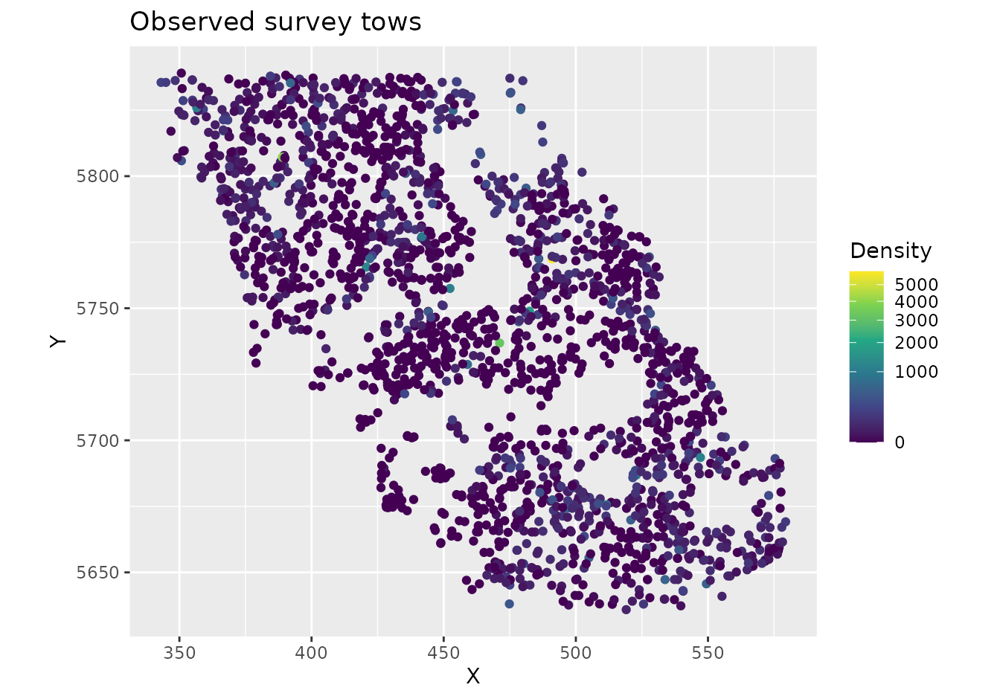

``` r
glimpse(pcod)
#> Rows: 2,143
#> Columns: 12
#> $ year          <int> 2003, 2003, 2003, 2003, 2003, 2003, 2003, 2003, 2003, 20…
#> $ X             <dbl> 446.4752, 446.4594, 448.5987, 436.9157, 420.6101, 417.71…
#> $ Y             <dbl> 5793.426, 5800.136, 5801.687, 5802.305, 5771.055, 5772.2…
#> $ depth         <dbl> 201, 212, 220, 197, 256, 293, 410, 387, 285, 270, 381, 1…
#> $ density       <dbl> 113.138476, 41.704922, 0.000000, 15.706138, 0.000000, 0.…
#> $ present       <dbl> 1, 1, 0, 1, 0, 0, 0, 0, 0, 1, 0, 0, 0, 0, 0, 0, 0, 0, 0,…
#> $ lat           <dbl> 52.28858, 52.34890, 52.36305, 52.36738, 52.08437, 52.094…
#> $ lon           <dbl> -129.7847, -129.7860, -129.7549, -129.9265, -130.1586, -…
#> $ depth_mean    <dbl> 5.155194, 5.155194, 5.155194, 5.155194, 5.155194, 5.1551…
#> $ depth_sd      <dbl> 0.4448783, 0.4448783, 0.4448783, 0.4448783, 0.4448783, 0…
#> $ depth_scaled  <dbl> 0.3329252, 0.4526914, 0.5359529, 0.2877417, 0.8766077, 1…
#> $ depth_scaled2 <dbl> 0.11083919, 0.20492947, 0.28724555, 0.08279527, 0.768440…
```

The most basic model structure possible in sdmTMB replicates a GLM as
can be fit with [`glm()`](https://rdrr.io/r/stats/glm.html) or a GLMM as
can be fit with lme4 or glmmTMB, for example. The spatial components in
sdmTMB are included as random fields using a triangulated (“finite
element”) mesh with vertices (knots) that approximate spatial
variability. A Gaussian Markov random field (GMRF) is a set of spatial
random effects with a sparse precision matrix; the SPDE approach
(Lindgren et al., 2011) links a Gaussian random field with Matérn
covariance to this discrete GMRF. Bilinear interpolation is used to
approximate a continuous spatial field (Rue et al., 2009; Lindgren et
al., 2011) from the estimated values of the spatial surface at these
knot locations to other locations including those of actual
observations.

There are different options for creating the spatial mesh (see
[`sdmTMB::make_mesh()`](https://sdmTMB.github.io/sdmTMB/reference/make_mesh.md)).
We will start with a relatively coarse mesh for a balance between speed
and accuracy (`cutoff = 10`, where cutoff is in the units of X and Y (km
here) and represents the minimum distance between knots before a new
mesh vertex is added). Smaller values create meshes with more knots
(finer spatial detail, slower fitting). Larger values create fewer knots
(faster, but coarser). In applied scenarios, start coarse, then check
whether a finer mesh changes conclusions. The circles represent
observations and the vertices are the knot locations.

``` r
mesh <- make_mesh(pcod, c("X", "Y"), cutoff = 10)
plot(mesh)
```


We will start with a logistic regression of Pacific Cod
encounter/non-encounter in tows as a function of depth and depth
squared. We will first use
[`sdmTMB()`](https://sdmTMB.github.io/sdmTMB/reference/sdmTMB.md)
without any spatial random effects (`spatial = "off"`). This mirrors a
standard GLM and serves as a baseline:

``` r
m <- sdmTMB(
  data = pcod,
  formula = present ~ depth_scaled + depth_scaled2,
  family = binomial(link = "logit"),
  spatial = "off"
)
m
#> Model fit by ML ['sdmTMB']
#> Formula: present ~ depth_scaled + depth_scaled2
#> Mesh: NULL (isotropic covariance)
#> Data: pcod
#> Family: binomial(link = 'logit')
#>  
#> Conditional model:
#>               coef.est coef.se
#> (Intercept)       0.57    0.06
#> depth_scaled     -1.04    0.07
#> depth_scaled2    -0.99    0.06
#> 
#> ML criterion at convergence: 1193.035
#> 
#> See ?tidy.sdmTMB to extract these values as a data frame.
AIC(m)
#> [1] 2392.07
```

For comparison, here’s the same model with
[`glm()`](https://rdrr.io/r/stats/glm.html):

``` r
m0 <- glm(
  data = pcod,
  formula = present ~ depth_scaled + depth_scaled2,
  family = binomial(link = "logit")
)
summary(m0)
#> 
#> Call:
#> glm(formula = present ~ depth_scaled + depth_scaled2, family = binomial(link = "logit"), 
#>     data = pcod)
#> 
#> Coefficients:
#>               Estimate Std. Error z value Pr(>|z|)    
#> (Intercept)    0.56599    0.05979   9.467   <2e-16 ***
#> depth_scaled  -1.03590    0.07266 -14.258   <2e-16 ***
#> depth_scaled2 -0.99259    0.06066 -16.363   <2e-16 ***
#> ---
#> Signif. codes:  0 '***' 0.001 '**' 0.01 '*' 0.05 '.' 0.1 ' ' 1
#> 
#> (Dispersion parameter for binomial family taken to be 1)
#> 
#>     Null deviance: 2958.4  on 2142  degrees of freedom
#> Residual deviance: 2386.1  on 2140  degrees of freedom
#> AIC: 2392.1
#> 
#> Number of Fisher Scoring iterations: 5
```

Notice that the AIC, log likelihood, parameter estimates, and standard
errors are all identical. Interpreting these coefficients: a negative
linear depth term with a positive quadratic suggests peak presence at
intermediate depths; the logit link means these are log-odds changes per
SD of depth.

Next, we can incorporate spatial random effects into the above model by
changing `spatial` to `"on"` and adding our `mesh`. These spatial random
fields absorb spatial structure not explained by depth and typically
reduce residual spatial autocorrelation. Expect coefficient estimates
and their standard errors to shift once spatial structure is accounted
for:

``` r
m1 <- sdmTMB(
  data = pcod,
  formula = present ~ depth_scaled + depth_scaled2,
  mesh = mesh,
  family = binomial(link = "logit"),
  spatial = "on"
)
m1
#> Spatial model fit by ML ['sdmTMB']
#> Formula: present ~ depth_scaled + depth_scaled2
#> Mesh: mesh (isotropic covariance)
#> Data: pcod
#> Family: binomial(link = 'logit')
#>  
#> Conditional model:
#>               coef.est coef.se
#> (Intercept)       1.14    0.44
#> depth_scaled     -2.17    0.21
#> depth_scaled2    -1.59    0.13
#> 
#> Matérn range: 43.54
#> Spatial SD: 1.65
#> ML criterion at convergence: 1042.157
#> 
#> See ?tidy.sdmTMB to extract these values as a data frame.
AIC(m1)
#> [1] 2094.314
```

To add spatiotemporal random fields to this model, we need to include
both the time argument that indicates what column of your data frame
contains the time slices at which spatial random fields should be
estimated (e.g., `time = "year"`) and we need to choose whether these
fields are independent and identically distributed
(`spatiotemporal = "IID"`), first-order autoregressive
(`spatiotemporal = "AR1"`, each year correlated with the previous), or a
random walk (`spatiotemporal = "RW"`, cumulative drift). We will stick
with IID for these examples.

``` r
m2 <- sdmTMB(
  data = pcod,
  formula = present ~ depth_scaled + depth_scaled2,
  mesh = mesh,
  family = binomial(link = "logit"),
  spatial = "on",
  time = "year",
  spatiotemporal = "IID"
)
m2
#> Spatiotemporal model fit by ML ['sdmTMB']
#> Formula: present ~ depth_scaled + depth_scaled2
#> Mesh: mesh (isotropic covariance)
#> Time column: year
#> Data: pcod
#> Family: binomial(link = 'logit')
#>  
#> Conditional model:
#>               coef.est coef.se
#> (Intercept)       1.37    0.58
#> depth_scaled     -2.47    0.25
#> depth_scaled2    -1.83    0.15
#> 
#> Matérn range: 49.96
#> Spatial SD: 1.91
#> Spatiotemporal IID SD: 0.95
#> ML criterion at convergence: 1014.753
#> 
#> See ?tidy.sdmTMB to extract these values as a data frame.
```

We can also model biomass density using a Tweedie distribution (handles
zero-inflated continuous biomass). We’ll switch to
[`poly()`](https://rdrr.io/r/stats/poly.html) notation to make some of
the plotting easier.

``` r
m3 <- sdmTMB(
  data = pcod,
  formula = density ~ poly(log(depth), 2),
  mesh = mesh,
  family = tweedie(link = "log"),
  spatial = "on",
  time = "year",
  spatiotemporal = "IID"
)
m3
#> Spatiotemporal model fit by ML ['sdmTMB']
#> Formula: density ~ poly(log(depth), 2)
#> Mesh: mesh (isotropic covariance)
#> Time column: year
#> Data: pcod
#> Family: tweedie(link = 'log')
#>  
#> Conditional model:
#>                      coef.est coef.se
#> (Intercept)              1.86    0.21
#> poly(log(depth), 2)1   -65.13    6.32
#> poly(log(depth), 2)2   -96.54    5.98
#> 
#> Dispersion parameter: 11.03
#> Tweedie p: 1.50
#> Matérn range: 19.75
#> Spatial SD: 1.40
#> Spatiotemporal IID SD: 1.55
#> ML criterion at convergence: 6277.624
#> 
#> See ?tidy.sdmTMB to extract these values as a data frame.
```

## Parameter estimates

We can view the confidence intervals on the fixed effects by using the
tidy function. For interpretation, think of a 1-unit increase in a
standardized covariate as 1 SD in the original units; exponentiate
log-linked effects to get multiplicative changes in biomass density:

``` r
tidy(m3, conf.int = TRUE)
#> # A tibble: 3 × 5
#>   term                 estimate std.error conf.low conf.high
#>   <chr>                   <dbl>     <dbl>    <dbl>     <dbl>
#> 1 (Intercept)              1.86     0.208     1.45      2.26
#> 2 poly(log(depth), 2)1   -65.1      6.32    -77.5     -52.8 
#> 3 poly(log(depth), 2)2   -96.5      5.98   -108.      -84.8
```

And similarly for the random effect and variance parameters:

``` r
tidy(m3, "ran_pars", conf.int = TRUE)
#> # A tibble: 5 × 5
#>   term      estimate std.error conf.low conf.high
#>   <chr>        <dbl>     <dbl>    <dbl>     <dbl>
#> 1 range        19.8     3.03      14.6      26.7 
#> 2 phi          11.0     0.377     10.3      11.8 
#> 3 sigma_O       1.40    0.162      1.12      1.76
#> 4 sigma_E       1.55    0.129      1.32      1.83
#> 5 tweedie_p     1.50    0.0119     1.48      1.52
```

These parameters are defined as follows:

- `range`: A derived parameter that defines the distance at which 2
  points are effectively independent (actually about 13% correlated). If
  the `share_range` argument is changed to `FALSE` then the spatial and
  spatiotemporal ranges will be unique, otherwise the default is for
  both to share the same range.

- `phi`: Observation error scale parameter (e.g., SD in Gaussian).

- `sigma_O`: SD of the spatial process (“Omega”).

- `sigma_E`: SD of the spatiotemporal process (“Epsilon”).

- `tweedie_p`: Tweedie p (power) parameter; between 1 and 2.

If the model used AR1 spatiotemporal fields then:

- `rho`: Spatiotemporal correlation between years; between -1 and 1.

## Model diagnostics

We can inspect randomized quantile residuals:

``` r
pcod$resids <- residuals(m3, type = "mle-mvn") # randomized quantile residuals
qqnorm(pcod$resids)
abline(0, 1)
```


``` r
ggplot(pcod, aes(X, Y, col = resids)) +
  scale_colour_gradient2() +
  geom_point() +
  facet_wrap(~year) +
  coord_fixed()
```

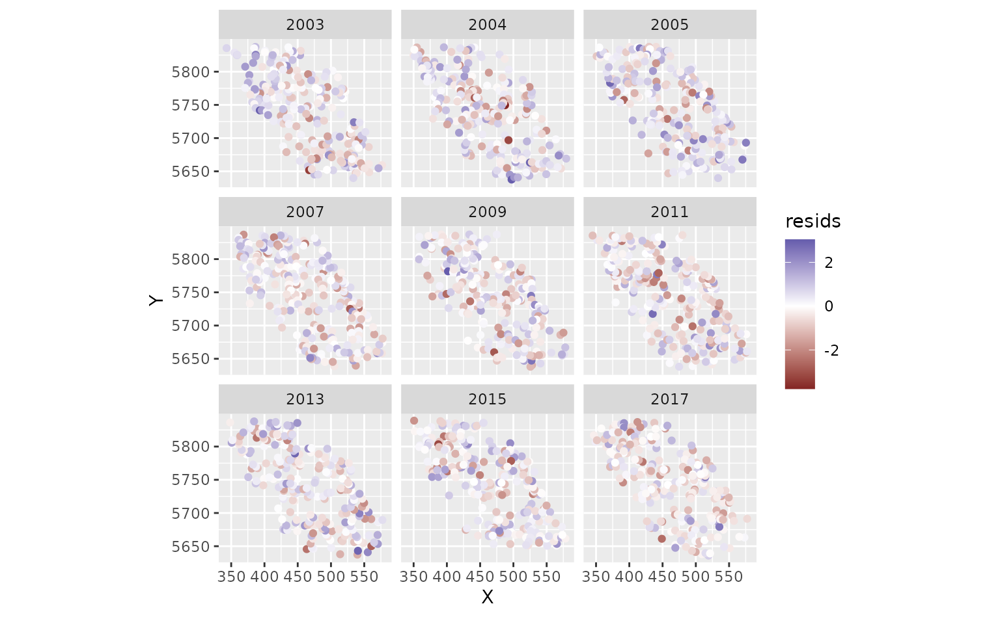

Look for straight QQ lines and no large spatial patches of residuals;
strong spatial patterns suggest missing covariates or a too-coarse mesh.

We can also use simulation-based randomized quantile residuals.

``` r
set.seed(19283)
s <- simulate(m3, nsim = 300, type = "mle-mvn")
dharma_residuals(s, m3)
```

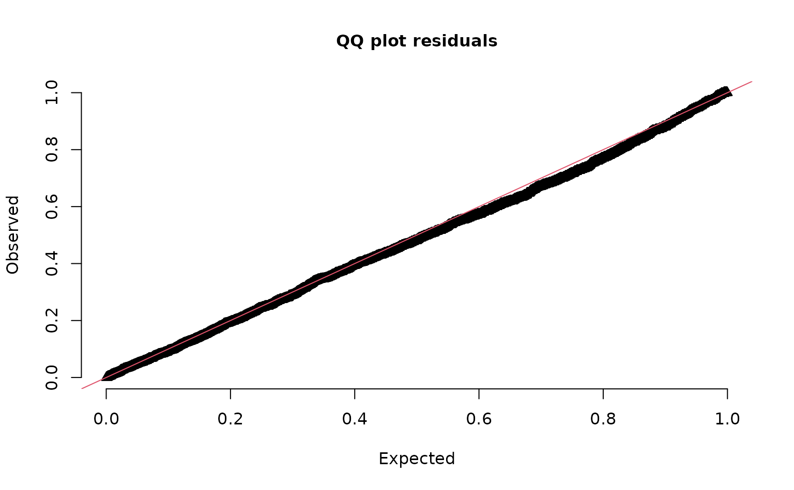

See `?residuals.sdmTMB()` and the [residuals
vignette](https://sdmtmb.github.io/sdmTMB/articles/residual-checking.html).

## Spatial predictions

Now, for the purposes of this example (e.g., visualization), we want to
predict on a fine-scale grid on the entire survey domain. There is a
grid built into the package for Queen Charlotte Sound named `qcs_grid`.
See [this discussion](https://github.com/sdmTMB/sdmTMB/discussions/151)
thread if you’re looking for some suggestions for how to form your own
grid. Our prediction grid also needs to have all the covariates that we
used in the model above. We replicate the grid across years so that
spatiotemporal fields can be projected to every time slice.

``` r
glimpse(qcs_grid)
#> Rows: 7,314
#> Columns: 5
#> $ X             <dbl> 456, 458, 460, 462, 464, 466, 468, 470, 472, 474, 476, 4…
#> $ Y             <dbl> 5636, 5636, 5636, 5636, 5636, 5636, 5636, 5636, 5636, 56…
#> $ depth         <dbl> 347.08345, 223.33479, 203.74085, 183.29868, 182.99983, 1…
#> $ depth_scaled  <dbl> 1.56081222, 0.56976988, 0.36336929, 0.12570465, 0.122036…
#> $ depth_scaled2 <dbl> 2.436134794, 0.324637712, 0.132037240, 0.015801659, 0.01…
```

We can replicate our grid across all necessary years:

``` r
grid_yrs <- replicate_df(qcs_grid, "year", unique(pcod$year))
```

Now we will make the predictions on new data:

``` r
predictions <- predict(m3, newdata = grid_yrs)
```

Let’s make a small function to help make maps.

``` r
plot_map <- function(dat, column) {
  ggplot(dat, aes(X, Y, fill = {{ column }})) +
    geom_raster() +
    coord_fixed()
}
```

The `{{ }}` syntax is just a “[tidy-eval
helper](https://ggplot2.tidyverse.org/reference/tidyeval.html)” that
lets us supply the unquoted column name and pass it on to ggplot.

There are four kinds of predictions that we get out of the model. Use
cases: - `est`: fixed + spatial + spatiotemporal; use for maps and
indices. - `est_non_rf`: fixed effects only; use to understand
covariate-driven signal. - `omega_s`: spatial random effects; use to see
persistent spatial deviations. - `epsilon_st`: spatiotemporal random
effects; use to see year-specific anomalies.

First, we will show the predictions that incorporate all fixed effects
and random effects:

``` r
plot_map(predictions, exp(est)) +
  scale_fill_viridis_c(
    trans = "sqrt",
    # trim extreme high values to make spatial variation more visible:
    na.value = "yellow", limits = c(0, quantile(exp(predictions$est), 0.995))
  ) +
  facet_wrap(~year) +
  ggtitle("Prediction (fixed effects + all random effects)",
    subtitle = paste("maximum estimated biomass density =", round(max(exp(predictions$est))))
  )
```

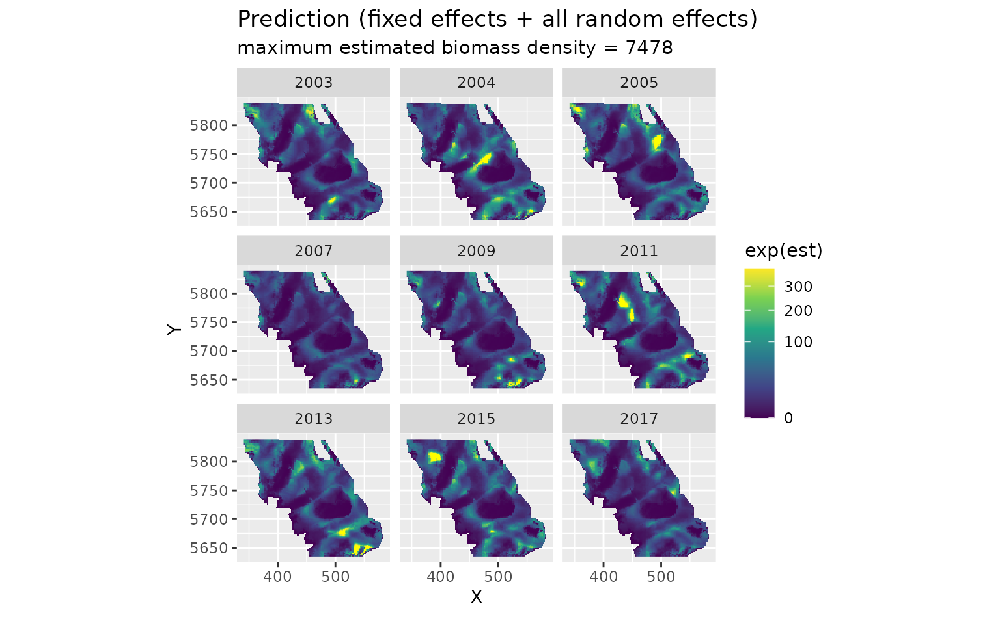

We can also look at just the fixed effects, here only a quadratic effect
of depth:

``` r
plot_map(predictions, exp(est_non_rf)) +
  scale_fill_viridis_c(trans = "sqrt") +
  ggtitle("Prediction (fixed effects only)")
```

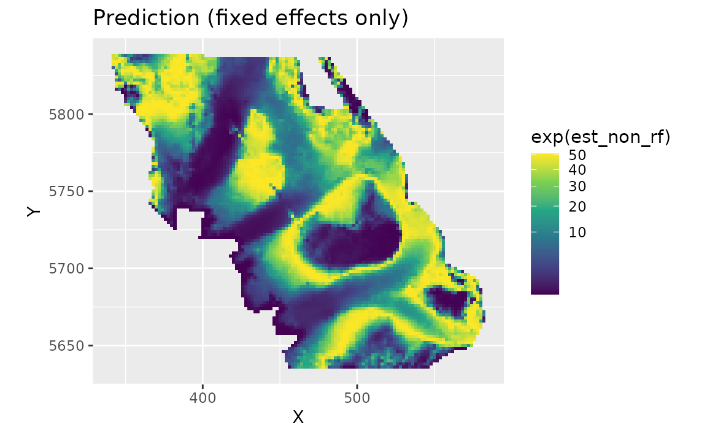

We can look at the spatial random effects that represent consistent
deviations in space through time that are not accounted for by our fixed
effects. In other words, these deviations represent consistent spatially
structured biotic and abiotic factors that are affecting biomass density
but are not accounted for in the model.

``` r
plot_map(predictions, omega_s) +
  scale_fill_gradient2() +
  ggtitle("Spatial random effects only")
```

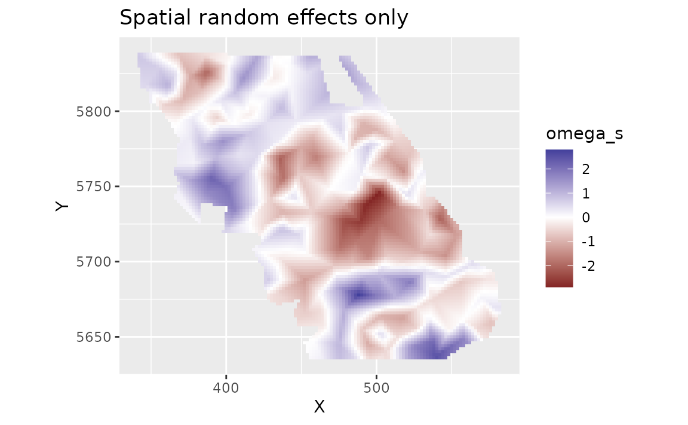

And finally we can look at the spatiotemporal random effects that
represent deviation from the fixed effect predictions and the spatial
random effect deviations. These represent spatially structured biotic
and abiotic factors that are changing through time and are not accounted
for in the model.

``` r
plot_map(predictions, epsilon_st) +
  scale_fill_gradient2() +
  facet_wrap(~year) +
  ggtitle("Spatiotemporal random effects only")
```

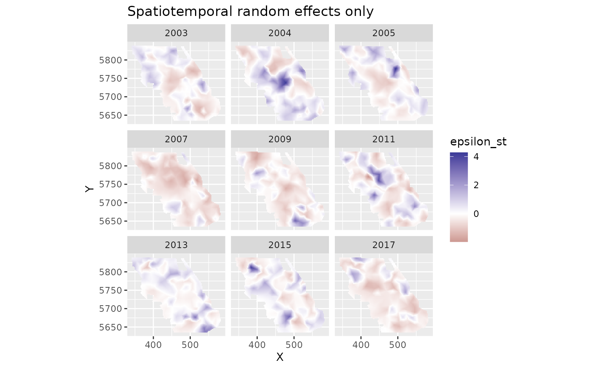

We can also estimate the uncertainty in our spatiotemporal density
predictions using simulations from the joint precision matrix by setting
`nsim > 0` in the predict function. Here we generate 100 estimates and
use [`apply()`](https://rdrr.io/r/base/apply.html) to calculate upper
and lower confidence intervals, a standard deviation, and a coefficient
of variation (CV).

``` r
sim <- predict(m3, newdata = grid_yrs, nsim = 100)
sim_last <- sim[grid_yrs$year == max(grid_yrs$year), ] # just plot last year
pred_last <- predictions[predictions$year == max(grid_yrs$year), ]
pred_last$lwr <- apply(exp(sim_last), 1, quantile, probs = 0.025)
pred_last$upr <- apply(exp(sim_last), 1, quantile, probs = 0.975)
pred_last$sd <- round(apply(exp(sim_last), 1, function(x) sd(x)), 2)
pred_last$cv <- round(apply(exp(sim_last), 1, function(x) sd(x) / mean(x)), 2)
```

Plot the CV on the estimates:

``` r
ggplot(pred_last, aes(X, Y, fill = cv)) +
  geom_raster() +
  scale_fill_viridis_c()
```

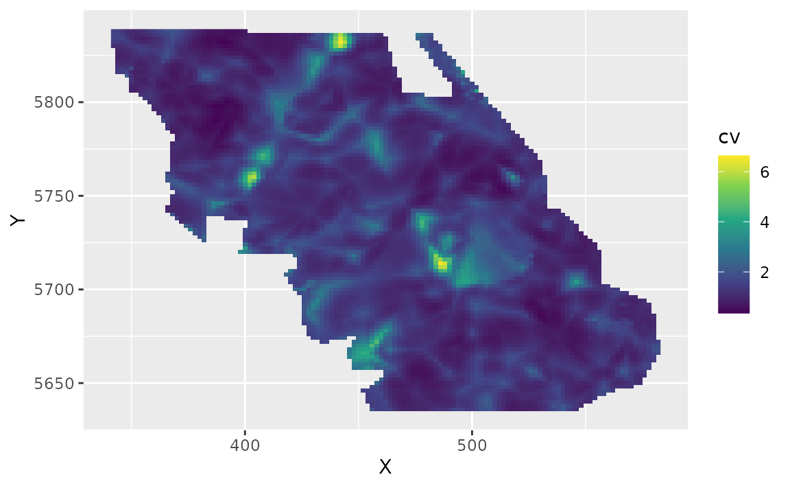

## Conditional effects

We can visualize the conditional effect of any covariates by feeding
simplified data frames to the predict function that fix covariate values
we want fixed (e.g., at means) and vary parameters we want to visualize
(across a range of values):

``` r
nd <- data.frame(
  depth = seq(min(pcod$depth),
    max(pcod$depth),
    length.out = 100
  ),
  year = 2015L # a chosen year
)
p <- predict(m3, newdata = nd, se_fit = TRUE, re_form = NA)

ggplot(p, aes(depth, exp(est),
  ymin = exp(est - 1.96 * est_se),
  ymax = exp(est + 1.96 * est_se)
)) +
  geom_line() +
  geom_ribbon(alpha = 0.4) +
  scale_x_continuous() +
  coord_cartesian(expand = F) +
  labs(x = "Depth (m)", y = "Biomass density (kg/km2)")
```

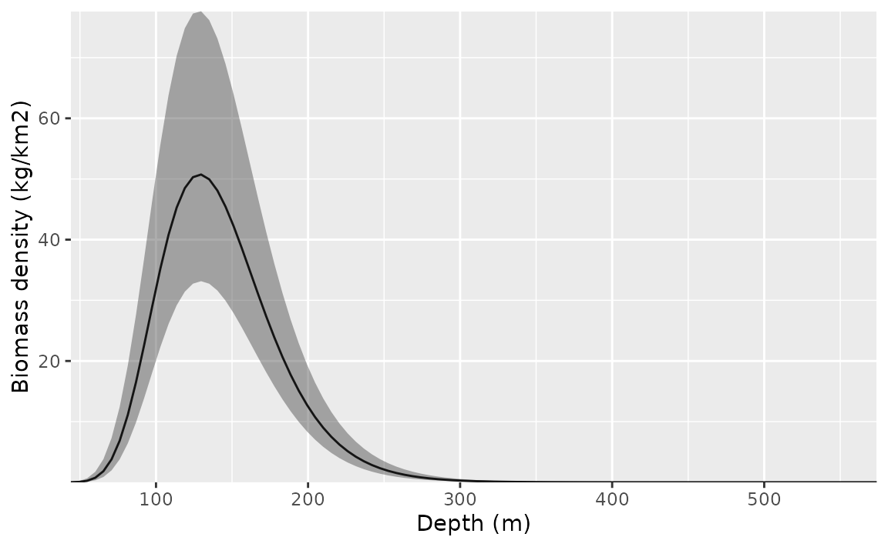

We could also do this with the visreg package. This version is in link
space and the residuals are partial randomized quantile residuals. See
the `scale` argument in visreg for response scale plots.

``` r
visreg::visreg(m3, "depth")
```

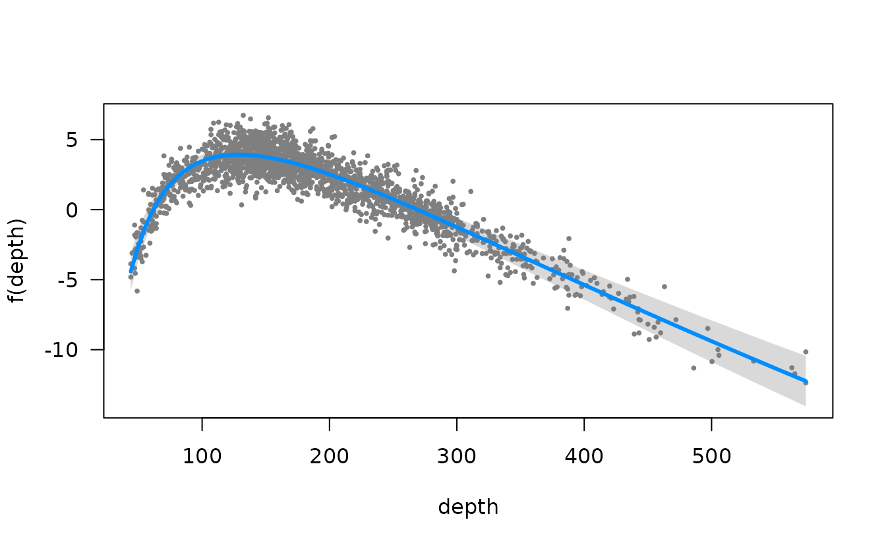

Or the ggeffects package for a marginal effects plot. This will also be
faster since it relies on the already estimated coefficients and
variance-covariance matrix.

``` r
ggeffects::ggeffect(m3, "depth [0:500 by=1]") |> plot()
#> Warning: Removed 1 row containing missing values or values outside the scale range
#> (`geom_line()`).
#> Warning: Removed 1 row containing missing values or values outside the scale range
#> (`geom_ribbon()`).
```

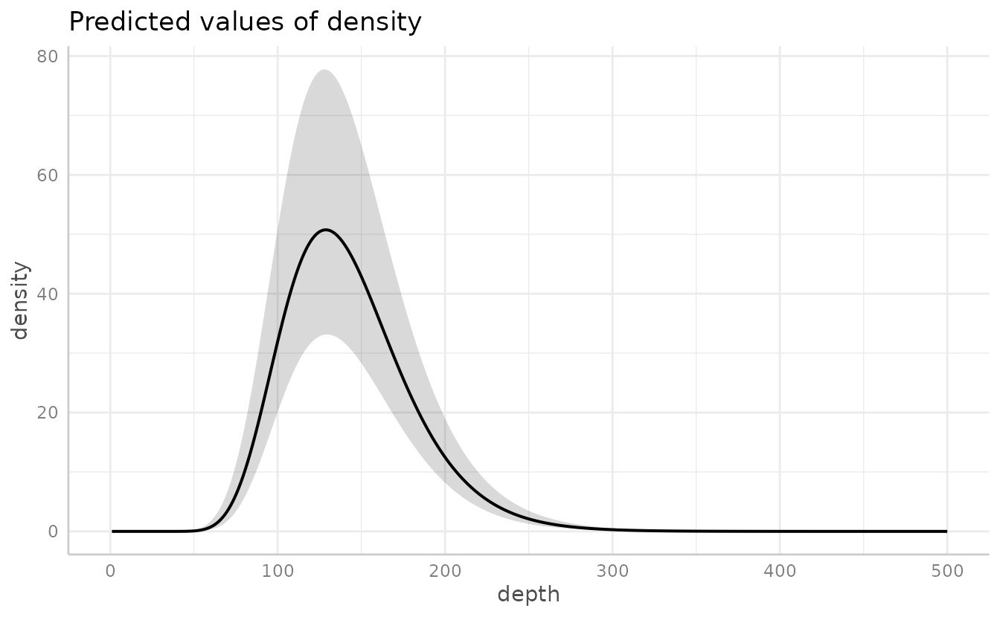

### Time-varying effects

We could also let the effect of depth vary through time. We set up the
time-varying coefficients to follow an AR1 process by setting
`time_varying_type = "ar1"` (each year’s coefficient is correlated with
the previous year’s). With `"ar1"` or `"rw0"`, the fixed effects
represent the starting point of the time series and the time-varying
process represents deviations from this over time. If, instead, we had
used `time_varying_type = "rw"`, the first time step of the random
effect process would represent the initial year values and we would want
to omit the matching effects in the main formula. For example:

``` r
formula = density ~ 0,
time_varying = ~ 1 + depth_scaled + depth_scaled2,
time_varying_type = "rw"
```

We include a full length of time increments with `extra_time` to ensure
we estimate time-varying coefficient values for each year, including any
years that are missing from our data. For this example, we turn off the
spatiotemporal random effects because we were having convergence issues
with them turned on.

``` r
m4 <- sdmTMB(
  density ~ 1 + depth_scaled + depth_scaled2,
  data = pcod,
  time_varying = ~ 1 + depth_scaled + depth_scaled2,
  time_varying_type = "ar1",
  extra_time = seq(min(pcod$year), max(pcod$year)),
  mesh = mesh,
  family = tweedie(link = "log"),
  spatial = "on",
  time = "year",
  spatiotemporal = "off"
)
m4
#> Spatial model fit by ML ['sdmTMB']
#> Formula: density ~ 1 + depth_scaled + depth_scaled2
#> Mesh: mesh (isotropic covariance)
#> Time column: year
#> Data: pcod
#> Family: tweedie(link = 'log')
#>  
#> Conditional model:
#>               coef.est coef.se
#> (Intercept)       3.84    0.28
#> depth_scaled     -1.91    0.16
#> depth_scaled2    -1.72    0.18
#> 
#> Time-varying parameters:
#>                    coef.est coef.se
#> (Intercept)-2003       0.00    0.08
#> (Intercept)-2004       0.21    0.08
#> (Intercept)-2005       0.17    0.08
#> (Intercept)-2006      -0.03    0.16
#> (Intercept)-2007      -0.25    0.09
#> (Intercept)-2008      -0.15    0.21
#> (Intercept)-2009      -0.25    0.08
#> (Intercept)-2010      -0.03    0.16
#> (Intercept)-2011       0.15    0.08
#> (Intercept)-2012       0.05    0.17
#> (Intercept)-2013       0.03    0.08
#> (Intercept)-2014       0.04    0.17
#> (Intercept)-2015       0.12    0.08
#> (Intercept)-2016       0.02    0.16
#> (Intercept)-2017      -0.06    0.08
#> depth_scaled-2003      0.00    0.04
#> depth_scaled-2004      0.00    0.04
#> depth_scaled-2005     -0.01    0.05
#> depth_scaled-2006      0.00    0.05
#> depth_scaled-2007     -0.01    0.07
#> depth_scaled-2008      0.00    0.04
#> depth_scaled-2009      0.01    0.06
#> depth_scaled-2010      0.00    0.05
#> depth_scaled-2011      0.01    0.05
#> depth_scaled-2012      0.00    0.04
#> depth_scaled-2013      0.00    0.04
#> depth_scaled-2014      0.00    0.05
#> depth_scaled-2015      0.03    0.11
#> depth_scaled-2016      0.00    0.04
#> depth_scaled-2017     -0.02    0.10
#> depth_scaled2-2003    -0.05    0.22
#> depth_scaled2-2004    -0.04    0.19
#> depth_scaled2-2005    -0.11    0.22
#> depth_scaled2-2006     0.00    0.42
#> depth_scaled2-2007    -0.02    0.24
#> depth_scaled2-2008     0.01    0.50
#> depth_scaled2-2009     0.69    0.19
#> depth_scaled2-2010     0.00    0.42
#> depth_scaled2-2011    -0.50    0.23
#> depth_scaled2-2012     0.00    0.42
#> depth_scaled2-2013     0.56    0.17
#> depth_scaled2-2014     0.00    0.46
#> depth_scaled2-2015    -0.06    0.23
#> depth_scaled2-2016     0.00    0.46
#> depth_scaled2-2017    -0.45    0.25
#> rho-(Intercept)        0.34    0.39
#> rho-depth_scaled       0.00    1.19
#> rho-depth_scaled2      0.01    0.40
#> 
#> Dispersion parameter: 12.37
#> Tweedie p: 1.58
#> Matérn range: 15.41
#> Spatial SD: 1.75
#> ML criterion at convergence: 6361.987
#> 
#> See ?tidy.sdmTMB to extract these values as a data frame.
```

To plot these, we make a data frame that contains all combinations of
the time-varying covariate and time. This is easily created using
[`expand.grid()`](https://rdrr.io/r/base/expand.grid.html) or
[`tidyr::expand_grid()`](https://tidyr.tidyverse.org/reference/expand_grid.html).

``` r
nd <- expand.grid(
  depth_scaled = seq(min(pcod$depth_scaled) + 0.2,
    max(pcod$depth_scaled) - 0.2,
    length.out = 50
  ),
  year = unique(pcod$year) # all years
)
nd$depth_scaled2 <- nd$depth_scaled^2

p <- predict(m4, newdata = nd, se_fit = TRUE, re_form = NA)

ggplot(p, aes(depth_scaled, exp(est),
  ymin = exp(est - 1.96 * est_se),
  ymax = exp(est + 1.96 * est_se),
  group = as.factor(year)
)) +
  geom_line(aes(colour = year), lwd = 1) +
  geom_ribbon(aes(fill = year), alpha = 0.1) +
  scale_colour_viridis_c() +
  scale_fill_viridis_c() +
  scale_x_continuous(labels = function(x) round(exp(x * pcod$depth_sd[1] + pcod$depth_mean[1]))) +
  coord_cartesian(expand = F) +
  labs(x = "Depth (m)", y = "Biomass density (kg/km2)")
```

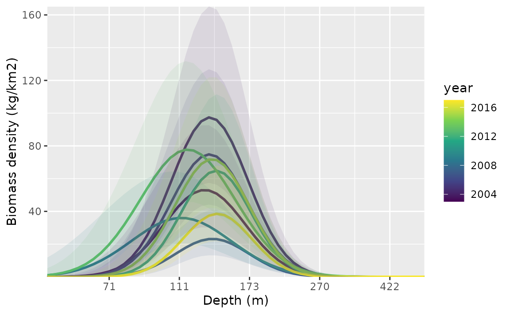
