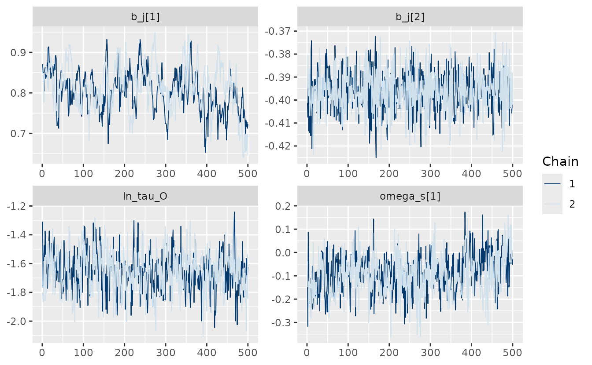
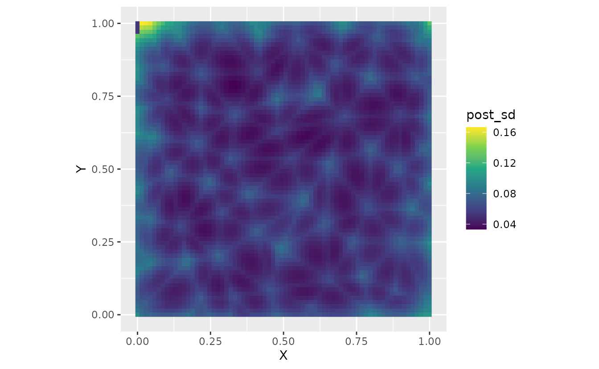
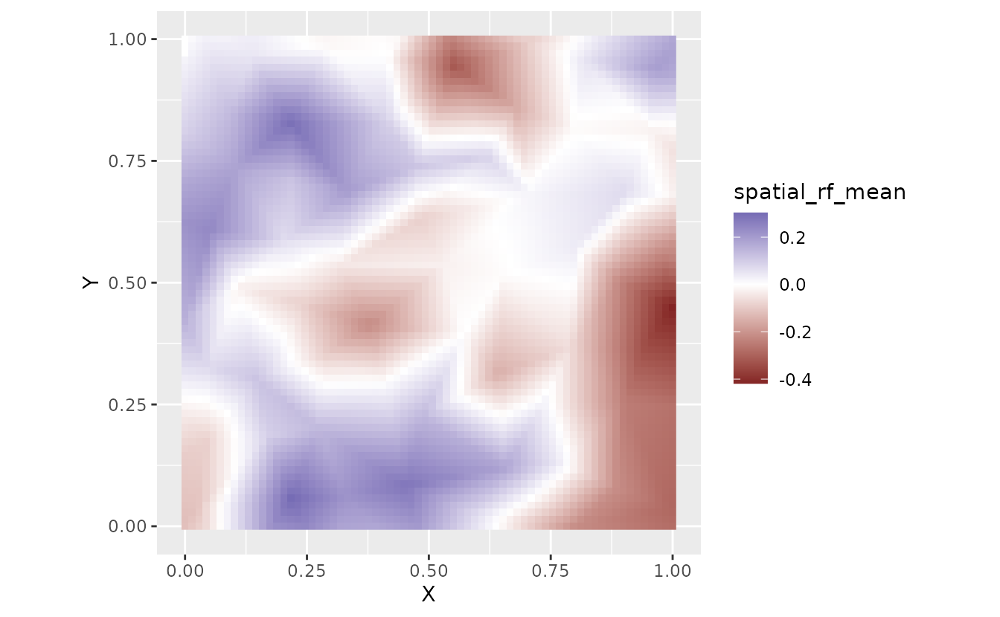

# Bayesian estimation with sdmTMB

**If the code in this vignette has not been evaluated, a rendered
version is available on the [documentation
site](https://sdmTMB.github.io/sdmTMB/index.html) under ‘Articles’.**

``` r
library(ggplot2)
library(dplyr)
library(sdmTMB)
library(rstan) # for plot() method
options(mc.cores = parallel::detectCores()) # use rstan parallel processing
```

Bayesian estimation is possible with sdmTMB by passing fitted models to
[`tmbstan::tmbstan()`](https://rdrr.io/pkg/tmbstan/man/tmbstan.html)
(Monnahan & Kristensen 2018). All sampling is then done using Stan (Stan
Development Team 2021), and output is returned as a `stanfit` object.

Why might you want to pass an sdmTMB model to Stan?

- to obtain probabilistic inference on parameters
- to avoid the Laplace approximation on the random effects
- to robustly quantify uncertainty on derived quantities not already
  calculated in the model
- in some cases, models that struggle to converge with maximum
  likelihood can be adequately sampled with MCMC given carefully chosen
  priors (e.g., Monnahan *et al.* 2021)

## Simulating data

Here we will demonstrate using a simulated dataset.

``` r
set.seed(123)
predictor_dat <- data.frame(
  X = runif(500), Y = runif(500),
  a1 = rnorm(500)
)
mesh <- make_mesh(predictor_dat, xy_cols = c("X", "Y"), cutoff = 0.1)
# plot(mesh)
# mesh$mesh$n
sim_dat <- sdmTMB_simulate(
  formula = ~a1,
  data = predictor_dat,
  mesh = mesh,
  family = gaussian(),
  range = 0.3,
  phi = 0.2,
  sigma_O = 0.2,
  seed = 123,
  B = c(0.8, -0.4) # B0 = intercept, B1 = a1 slope
)
```

Visualize our simulated data:

``` r
ggplot(sim_dat, aes(X, Y, colour = observed)) +
  geom_point() +
  scale_color_viridis_c()
```


## Fitting the model with marginal likelihood

First, fit a spatial random field GLMM with maximum likelihood:

``` r
fit <- sdmTMB(
  observed ~ a1,
  data = sim_dat,
  mesh = mesh,
  family = gaussian(),
  spatial = "on"
)
fit
#> Spatial model fit by ML ['sdmTMB']
#> Formula: observed ~ a1
#> Mesh: mesh (isotropic covariance)
#> Data: sim_dat
#> Family: gaussian(link = 'identity')
#>  
#> Conditional model:
#>             coef.est coef.se
#> (Intercept)      0.8    0.06
#> a1              -0.4    0.01
#> 
#> Dispersion parameter: 0.20
#> Matérn range: 0.32
#> Spatial SD: 0.17
#> ML criterion at convergence: -65.939
#> 
#> See ?tidy.sdmTMB to extract these values as a data frame.
```

## Adding priors

In that first model fit we did not use any priors (with maximum
likelihood estimation, these also can be thought of as penalties on the
likelihood). For this first model, the priors are implied as uniform on
the internal parameter space. However, sdmTMB provides the option of
applying additional priors. Here we will show an example of applying a
Normal(0, 5) (mean, SD) prior on the intercept and a Normal(0, 1) prior
on the slope parameter. We could guess at the model matrix structure
based on our formula, but we can verify it by looking at the internal
model matrix from the previous fit (using `do_fit = FALSE` would save
time if you didn’t want to fit it the first time).

``` r
head(fit$tmb_data$X_ij[[1]])
#>   (Intercept)          a1
#> 1           1 -0.60189285
#> 2           1 -0.99369859
#> 3           1  1.02678506
#> 4           1  0.75106130
#> 5           1 -1.50916654
#> 6           1 -0.09514745
```

Each column corresponds to the order of the `b` priors:

``` r
fit <- sdmTMB(
  observed ~ a1,
  data = sim_dat,
  mesh = mesh,
  family = gaussian(),
  spatial = "on",
  priors = sdmTMBpriors(
    # location = vector of means; scale = vector of standard deviations:
    b = normal(location = c(0, 0), scale = c(5, 2)),
  )
)
fit
#> Spatial model fit by ML ['sdmTMB']
#> Formula: observed ~ a1
#> Mesh: mesh (isotropic covariance)
#> Data: sim_dat
#> Family: gaussian(link = 'identity')
#>  
#> Conditional model:
#>             coef.est coef.se
#> (Intercept)      0.8    0.06
#> a1              -0.4    0.01
#> 
#> Dispersion parameter: 0.20
#> Matérn range: 0.32
#> Spatial SD: 0.17
#> ML criterion at convergence: -62.846
#> 
#> See ?tidy.sdmTMB to extract these values as a data frame.
```

## Fixing a spatial correlation parameter to improve convergence

Sometimes some of the spatial correlation parameters can be challenging
to estimate with Stan. One option is to apply penalized complexity (PC)
priors with
[`sdmTMBpriors()`](https://sdmTMB.github.io/sdmTMB/reference/priors.md)
to the Matérn parameters. Another option, which can also be used in
conjunction with the priors, is to fix one or more parameters at their
maximum likelihood estimate (MLE) values. Frequently, fixing the
parameter `ln_kappa` can help convergence (e.g., Monnahan *et al.*
2021). This estimated parameter is transformed into the range estimate,
so it controls the rate of spatial correlation decay.

Now we will rebuild the fitted object with fixed (‘mapped’) `ln_kappa`
parameters using the [`update()`](https://rdrr.io/r/stats/update.html)
function. We’ll use `do_fit = FALSE` to avoid actually fitting the
updated model since it’s not necessary.

``` r
# grab the internal parameter list at estimated values:
pars <- sdmTMB::get_pars(fit)
# create a 'map' vector for TMB
# factor NA values cause TMB to fix or map the parameter at the starting value:
kappa_map <- factor(rep(NA, length(pars$ln_kappa)))

# rebuild model updating some elements:
fit_mle <- update(
  fit,
  control = sdmTMBcontrol(
    start = list(
      ln_kappa = pars$ln_kappa #<
    ),
    map = list(
      ln_kappa = kappa_map #<
    )
  ),
  do_fit = FALSE #<
)
#> ℹ Initiating `ln_kappa` at specified starting value(s) of:
#> 2.173, 2.173
#> ℹ Fixing or mirroring `ln_kappa`
```

## Jacobian adjustments

Adding priors / penalties and fixing spatial parameters represent
strategies to help successful convergence for maximum likelihood
estimation. If we want to do true Bayesian sampling we need to make one
more adjustment to our function call: accounting for non-linear
transformations of parameters with Jacobian adjustments.

What are Jacobian adjustments and why do we need them? Jacobian
adjustments are necessary when the parameters of a model are transformed
in a way that changes their scale or distribution. A good example of
this is the estimation of variance parameters. Whether we’re interested
in spatial, spatiotemporal, or residual variation, the quantity of
interest is usually the variance or standard deviation $\sigma$. These
quantities are constrained to be greater than 0, so a widely used
estimation strategy is to estimate them in log space, which is not
constrained. With ‘ln_sigma’ estimated, ‘sigma = exp(ln_sigma)’ can be
calculated internal to a model and used to calculate the likelihood.
There are a number of helpful references detailing the math behind this
in greater detail including the [Stan
manual](https://mc-stan.org/docs/stan-users-guide/reparameterization.html#changes-of-variables).
Without equations, the Jacobian adjustment can be thought of as properly
stretching the posterior distribution of parameters to account for the
transformation of variables.

In `sdmTMB`, we can turn these Jacobian adjustments on with the flag
`bayesian = TRUE`. Applying this to our `fit_mle` object,

``` r
fit_bayes <- update(fit_mle,
  bayesian = TRUE
)
#> ℹ Initiating `ln_kappa` at specified starting value(s) of:
#> 2.173, 2.173
#> ℹ Fixing or mirroring `ln_kappa`
```

It is important to emphasize that this `bayesian` flag needs to be
enabled to any model passed to Stan; MCMC estimation without it will
lead to biased parameter estimates.

## Passing the model to tmbstan

Now we can pass the `$tmb_obj` element of our model to
[`tmbstan::tmbstan()`](https://rdrr.io/pkg/tmbstan/man/tmbstan.html). We
are only using 1000 iterations and 2 chains so this vignette builds
quickly. In practice, you will likely want to use more (e.g., 2000
iterations, 4 chains).

``` r
fit_stan <- tmbstan::tmbstan(
  fit_bayes$tmb_obj,
  iter = 1000, chains = 2,
  seed = 8217 # ensures repeatability
)
```

Sometimes you may need to adjust the sampler settings such as:

``` r
tmbstan::tmbstan(
  ...,
  control = list(adapt_delta = 0.9, max_treedepth = 12)
)
```

See the Details section in
[`?rstan::stan`](https://mc-stan.org/rstan/reference/stan.html).

You can also ‘thin’ samples via the `thin` argument if working with
model predictions becomes cumbersome given a large number of required
samples.

We can look at the model:

``` r
fit_stan
#> Inference for Stan model: sdmTMB.
#> 2 chains, each with iter=1000; warmup=500; thin=1; 
#> post-warmup draws per chain=500, total post-warmup draws=1000.
#> 
#>               mean se_mean   sd   2.5%    25%    50%    75%  97.5% n_eff Rhat
#> b_j[1]        0.81    0.01 0.05   0.69   0.77   0.81   0.84   0.92    71 1.03
#> b_j[2]       -0.40    0.00 0.01  -0.41  -0.40  -0.40  -0.39  -0.38  1923 1.00
#> ln_tau_O     -1.66    0.01 0.14  -1.93  -1.75  -1.65  -1.57  -1.37   384 1.00
#> ln_phi       -1.63    0.00 0.04  -1.70  -1.65  -1.63  -1.60  -1.56  1147 1.00
#> omega_s[1]   -0.09    0.01 0.09  -0.26  -0.15  -0.09  -0.04   0.08   148 1.02
#> omega_s[2]   -0.06    0.01 0.09  -0.23  -0.12  -0.06   0.00   0.11   168 1.01
#> omega_s[3]    0.01    0.01 0.09  -0.16  -0.05   0.01   0.07   0.20   228 1.01
#> omega_s[4]   -0.21    0.01 0.09  -0.38  -0.27  -0.21  -0.15  -0.02   193 1.01
#> omega_s[5]   -0.34    0.01 0.10  -0.53  -0.41  -0.34  -0.27  -0.14   324 1.00
#> omega_s[6]   -0.09    0.01 0.10  -0.29  -0.15  -0.09  -0.01   0.12   224 1.01
#> omega_s[7]   -0.03    0.01 0.08  -0.19  -0.09  -0.03   0.02   0.15   142 1.02
#> omega_s[8]   -0.23    0.01 0.09  -0.41  -0.29  -0.23  -0.17  -0.05   210 1.01
#> omega_s[9]   -0.32    0.01 0.09  -0.49  -0.38  -0.32  -0.26  -0.15   206 1.01
#> omega_s[10]   0.28    0.01 0.09   0.12   0.22   0.28   0.34   0.45   173 1.01
#> omega_s[11]  -0.16    0.01 0.09  -0.33  -0.22  -0.16  -0.10   0.02   169 1.01
#> omega_s[12]   0.00    0.01 0.10  -0.19  -0.07   0.00   0.06   0.20   321 1.01
#> omega_s[13]   0.18    0.01 0.08   0.04   0.13   0.18   0.24   0.34   157 1.02
#> omega_s[14]  -0.09    0.01 0.10  -0.28  -0.16  -0.09  -0.03   0.10   225 1.01
#> omega_s[15]   0.22    0.01 0.09   0.04   0.16   0.22   0.27   0.38   175 1.01
#> omega_s[16]  -0.02    0.01 0.09  -0.20  -0.08  -0.02   0.04   0.15   194 1.01
#> omega_s[17]  -0.15    0.01 0.09  -0.33  -0.21  -0.15  -0.09   0.03   266 1.00
#> omega_s[18]  -0.29    0.01 0.11  -0.49  -0.36  -0.29  -0.22  -0.09   254 1.00
#> omega_s[19]  -0.01    0.01 0.09  -0.19  -0.07   0.00   0.06   0.18   179 1.01
#> omega_s[20]   0.02    0.01 0.08  -0.15  -0.04   0.02   0.07   0.18   156 1.01
#> omega_s[21]   0.07    0.01 0.08  -0.07   0.01   0.07   0.13   0.24   163 1.01
#> omega_s[22]  -0.02    0.01 0.10  -0.22  -0.09  -0.02   0.06   0.18   219 1.01
#> omega_s[23]   0.12    0.01 0.09  -0.04   0.06   0.11   0.17   0.30   169 1.02
#> omega_s[24]   0.20    0.01 0.10   0.00   0.13   0.19   0.26   0.41   264 1.01
#> omega_s[25]   0.07    0.01 0.08  -0.10   0.02   0.07   0.12   0.23   146 1.01
#> omega_s[26]  -0.01    0.01 0.10  -0.21  -0.08  -0.01   0.06   0.18   241 1.01
#> omega_s[27]  -0.11    0.01 0.09  -0.28  -0.17  -0.11  -0.05   0.06   224 1.01
#> omega_s[28]   0.11    0.01 0.10  -0.07   0.05   0.11   0.18   0.32   247 1.01
#> omega_s[29]   0.29    0.01 0.09   0.12   0.23   0.29   0.35   0.47   189 1.01
#> omega_s[30]  -0.04    0.01 0.09  -0.21  -0.10  -0.04   0.01   0.13   202 1.01
#> omega_s[31]   0.09    0.01 0.08  -0.06   0.04   0.09   0.15   0.25   180 1.01
#> omega_s[32]   0.05    0.01 0.11  -0.17  -0.02   0.05   0.12   0.26   359 1.01
#> omega_s[33]   0.07    0.01 0.10  -0.12   0.01   0.07   0.14   0.28   241 1.00
#> omega_s[34]   0.04    0.01 0.09  -0.13  -0.02   0.04   0.10   0.22   223 1.01
#> omega_s[35]   0.07    0.01 0.09  -0.11   0.01   0.07   0.13   0.24   219 1.01
#> omega_s[36]   0.14    0.01 0.09  -0.04   0.07   0.14   0.20   0.32   240 1.01
#> omega_s[37]   0.16    0.01 0.11  -0.05   0.08   0.16   0.23   0.38   331 1.00
#> omega_s[38]   0.12    0.01 0.09  -0.05   0.05   0.12   0.17   0.30   222 1.01
#> omega_s[39]  -0.22    0.01 0.09  -0.40  -0.28  -0.23  -0.16  -0.03   212 1.01
#> omega_s[40]  -0.03    0.01 0.09  -0.21  -0.09  -0.03   0.04   0.17   163 1.01
#> omega_s[41]   0.18    0.01 0.09   0.01   0.13   0.18   0.24   0.35   149 1.02
#> omega_s[42]   0.20    0.01 0.09   0.03   0.14   0.20   0.26   0.38   198 1.01
#> omega_s[43]   0.14    0.01 0.10  -0.04   0.07   0.14   0.21   0.34   277 1.01
#> omega_s[44]   0.13    0.01 0.09  -0.05   0.07   0.13   0.19   0.33   192 1.01
#> omega_s[45]   0.09    0.01 0.10  -0.12   0.02   0.09   0.16   0.29   272 1.01
#> omega_s[46]   0.06    0.01 0.09  -0.11  -0.01   0.05   0.12   0.24   217 1.01
#> omega_s[47]   0.30    0.01 0.09   0.13   0.24   0.30   0.37   0.48   188 1.01
#> omega_s[48]  -0.25    0.01 0.10  -0.44  -0.31  -0.24  -0.18  -0.07   261 1.00
#> omega_s[49]   0.09    0.01 0.10  -0.11   0.03   0.09   0.16   0.29   251 1.01
#> omega_s[50]  -0.09    0.01 0.08  -0.24  -0.14  -0.09  -0.04   0.07   161 1.01
#> omega_s[51]   0.24    0.01 0.11   0.03   0.17   0.24   0.31   0.47   238 1.00
#> omega_s[52]  -0.22    0.01 0.11  -0.43  -0.29  -0.21  -0.15  -0.02   279 1.00
#> omega_s[53]   0.03    0.01 0.10  -0.14  -0.03   0.04   0.09   0.22   236 1.01
#> omega_s[54]   0.03    0.01 0.09  -0.14  -0.04   0.02   0.09   0.21   179 1.02
#> omega_s[55]  -0.09    0.01 0.11  -0.30  -0.16  -0.09  -0.02   0.13   467 1.00
#> omega_s[56]  -0.42    0.01 0.10  -0.62  -0.49  -0.42  -0.34  -0.22   241 1.01
#> omega_s[57]   0.00    0.01 0.11  -0.21  -0.08   0.01   0.08   0.21   288 1.01
#> omega_s[58]  -0.21    0.01 0.10  -0.40  -0.28  -0.21  -0.16  -0.02   197 1.01
#> omega_s[59]   0.04    0.01 0.23  -0.40  -0.12   0.04   0.19   0.49   859 1.00
#> omega_s[60]  -0.22    0.01 0.26  -0.71  -0.40  -0.21  -0.05   0.31  1225 1.00
#> omega_s[61]  -0.27    0.01 0.24  -0.73  -0.43  -0.27  -0.11   0.20   637 1.00
#> omega_s[62]  -0.27    0.01 0.24  -0.73  -0.42  -0.27  -0.10   0.19   521 1.00
#> omega_s[63]  -0.27    0.01 0.23  -0.70  -0.43  -0.27  -0.13   0.18   645 1.00
#> omega_s[64]   0.07    0.01 0.23  -0.37  -0.09   0.08   0.23   0.51   972 1.00
#> omega_s[65]   0.17    0.01 0.22  -0.25   0.02   0.17   0.33   0.59   808 1.00
#> omega_s[66]   0.16    0.01 0.22  -0.28   0.02   0.16   0.30   0.57   676 1.00
#> omega_s[67]  -0.03    0.01 0.22  -0.45  -0.17  -0.02   0.11   0.39   759 1.00
#> omega_s[68]  -0.01    0.01 0.25  -0.49  -0.19  -0.01   0.16   0.44   927 1.00
#> omega_s[69]   0.00    0.01 0.22  -0.42  -0.14   0.01   0.15   0.41   745 1.00
#> omega_s[70]   0.00    0.01 0.21  -0.44  -0.13   0.00   0.14   0.41   732 1.00
#> omega_s[71]   0.17    0.01 0.22  -0.29   0.03   0.18   0.31   0.57   642 1.00
#> omega_s[72]  -0.11    0.01 0.24  -0.62  -0.27  -0.11   0.05   0.35   859 1.00
#> omega_s[73]  -0.14    0.01 0.22  -0.59  -0.29  -0.14   0.00   0.26   545 1.00
#> omega_s[74]  -0.13    0.01 0.21  -0.55  -0.28  -0.12   0.01   0.26   572 1.00
#> omega_s[75]  -0.38    0.01 0.22  -0.80  -0.52  -0.38  -0.24   0.05   958 1.00
#> omega_s[76]   0.09    0.01 0.19  -0.26  -0.04   0.09   0.21   0.48   912 1.01
#> omega_s[77]   0.09    0.01 0.20  -0.30  -0.04   0.08   0.22   0.49   710 1.00
#> omega_s[78]  -0.06    0.01 0.21  -0.45  -0.20  -0.06   0.08   0.39   998 1.00
#> omega_s[79]   0.04    0.01 0.15  -0.27  -0.06   0.04   0.15   0.34   638 1.00
#> omega_s[80]  -0.18    0.01 0.23  -0.64  -0.33  -0.17  -0.02   0.23  1011 1.00
#> omega_s[81]  -0.07    0.01 0.19  -0.43  -0.20  -0.08   0.06   0.29   844 1.00
#> omega_s[82]  -0.15    0.01 0.20  -0.55  -0.29  -0.14  -0.02   0.26   834 1.00
#> omega_s[83]  -0.02    0.01 0.23  -0.46  -0.17  -0.02   0.14   0.41   978 1.00
#> omega_s[84]   0.11    0.01 0.20  -0.28  -0.02   0.11   0.24   0.50  1071 1.00
#> omega_s[85]  -0.30    0.01 0.21  -0.71  -0.44  -0.30  -0.16   0.12  1112 1.00
#> lp__        136.24    0.54 9.17 118.78 130.29 136.85 142.47 153.21   284 1.00
#> 
#> Samples were drawn using NUTS(diag_e) at Sat Nov 22 21:53:05 2025.
#> For each parameter, n_eff is a crude measure of effective sample size,
#> and Rhat is the potential scale reduction factor on split chains (at 
#> convergence, Rhat=1).
```

The `Rhat` values look reasonable (\< 1.05). The `n_eff` (number of
effective samples) values mostly look reasonable (\> 100) for inference
about the mean for all parameters except the intercept (`b_j[1]`).
Furthermore, we can see correlation in the MCMC samples for `b_j[1]`. We
could try running for more iterations and chains and/or placing priors
on this and other parameters as described below (highly recommended).

Now we can use various functions to visualize the posterior:

``` r
plot(fit_stan)
#> 'pars' not specified. Showing first 10 parameters by default.
#> ci_level: 0.8 (80% intervals)
#> outer_level: 0.95 (95% intervals)
```


``` r
pars_plot <- c("b_j[1]", "b_j[2]", "ln_tau_O", "omega_s[1]")

bayesplot::mcmc_trace(fit_stan, pars = pars_plot)
```



``` r
bayesplot::mcmc_pairs(fit_stan, pars = pars_plot)
```


## Posterior predictive checks

We can perform posterior predictive checks to assess whether our model
can generate predictive data that are consistent with the observations.
For this, we can make use of
[`simulate.sdmTMB()`](https://sdmTMB.github.io/sdmTMB/reference/simulate.sdmTMB.md)
while passing in our Stan model.
[`simulate.sdmTMB()`](https://sdmTMB.github.io/sdmTMB/reference/simulate.sdmTMB.md)
will take draws from the joint parameter posterior and add observation
error. We need to ensure `nsim` is less than or equal to the total
number of post-warmup samples.

``` r
set.seed(19292)
samps <- sdmTMBextra::extract_mcmc(fit_stan)
s <- simulate(fit_mle, mcmc_samples = samps, nsim = 50)
bayesplot::pp_check(
  sim_dat$observed,
  yrep = t(s),
  fun = bayesplot::ppc_dens_overlay
)
```


See
[`?bayesplot::pp_check`](https://mc-stan.org/bayesplot/reference/pp_check.html).
The solid line represents the density of the observed data and the light
blue lines represent the density of 50 posterior predictive simulations.
In this case, the simulated data seem consistent with the observed data.

## Plotting predictions

We can make predictions with our Bayesian model by supplying the
posterior samples to the `mcmc_samples` argument in
[`predict.sdmTMB()`](https://sdmTMB.github.io/sdmTMB/reference/predict.sdmTMB.md).

``` r
pred <- predict(fit_mle, mcmc_samples = samps)
```

The output is a matrix where each row corresponds to a row of predicted
data and each column corresponds to a sample.

``` r
dim(pred)
#> [1]  500 1000
```

We can summarize these draws in various ways to visualize them:

``` r
sim_dat$post_mean <- apply(pred, 1, mean)
sim_dat$post_sd <- apply(pred, 1, sd)

ggplot(sim_dat, aes(X, Y, colour = post_mean)) +
  geom_point() +
  scale_color_viridis_c()
```


``` r

ggplot(sim_dat, aes(X, Y, colour = post_sd)) +
  geom_point() +
  scale_color_viridis_c()
```


Or predict on a grid for a given value of `a1`:

``` r
nd <- expand.grid(
  X = seq(0, 1, length.out = 70),
  Y = seq(0, 1, length.out = 70),
  a1 = 0
)
pred <- predict(fit_mle, newdata = nd, mcmc_samples = samps)

nd$post_mean <- apply(pred, 1, mean)
nd$post_sd <- apply(pred, 1, sd)

ggplot(nd, aes(X, Y, fill = post_mean)) +
  geom_raster() +
  scale_fill_viridis_c() +
  coord_fixed()
```


``` r

ggplot(nd, aes(X, Y, fill = post_sd)) +
  geom_raster() +
  scale_fill_viridis_c() +
  coord_fixed()
```



## Extracting parameter posterior samples

We can extract posterior samples with
[`rstan::extract()`](https://mc-stan.org/rstan/reference/stanfit-method-extract.html),

``` r
post <- rstan::extract(fit_stan)
```

The result is a list where each element corresponds to a parameter or
set of parameters:

``` r
names(post)
#> [1] "b_j"      "ln_tau_O" "ln_phi"   "omega_s"  "lp__"
hist(post$b_j[, 1])
```


As an example of calculating a derived parameter, here we will calculate
the marginal spatial random field standard deviation:

``` r
ln_kappa <- get_pars(fit_mle)$ln_kappa[1] # 2 elements since 2nd would be for spatiotemporal
ln_tau_O <- post$ln_tau_O
sigma_O <- 1 / sqrt(4 * pi * exp(2 * ln_tau_O + 2 * ln_kappa))
hist(sigma_O)
```


## Extracting the posterior of other predicted elements

By default
[`predict.sdmTMB()`](https://sdmTMB.github.io/sdmTMB/reference/predict.sdmTMB.md)
returns the overall prediction in link space when a tmbstan model is
passed in. If instead we want some other element that we might find in
the usual data frame returned by
[`predict.sdmTMB()`](https://sdmTMB.github.io/sdmTMB/reference/predict.sdmTMB.md)
when applied to a regular sdmTMB model, we can specify that through the
`sims_var` argument.

For example, let’s extract the spatial random field values `"omega_s"`.
Other options are documented in `?predict.sdmTMB()`.

``` r
fit_pred <- predict(
  fit_mle,
  newdata = nd,
  mcmc_samples = samps,
  sims_var = "omega_s" #<
)

nd$spatial_rf_mean <- apply(fit_pred, 1, mean)
nd$spatial_rf_sd <- apply(fit_pred, 1, sd)

ggplot(nd, aes(X, Y, fill = spatial_rf_mean)) +
  geom_raster() +
  scale_fill_gradient2() +
  coord_fixed()
```



``` r

ggplot(nd, aes(X, Y, fill = spatial_rf_sd)) +
  geom_raster() +
  scale_fill_viridis_c() +
  coord_fixed()
```


## References

Monnahan, C. & Kristensen, K. (2018). [No-U-turn sampling for fast
bayesian inference in ADMB and TMB: Introducing the adnuts and tmbstan R
packages](https://doi.org/10.1371/journal.pone.0197954). *PloS one*,
**13**.

Monnahan, C.C., Thorson, J.T., Kotwicki, S., Lauffenburger, N., Ianelli,
J.N. & Punt, A.E. (2021). [Incorporating vertical distribution in index
standardization accounts for spatiotemporal availability to acoustic and
bottom trawl gear for semi-pelagic
species](https://doi.org/10.1093/icesjms/fsab085) (O.R. Godo, Ed.).
*ICES Journal of Marine Science*, **78**, 1826–1839.

Stan Development Team. (2021). RStan: The R interface to Stan. Retrieved
from <https://mc-stan.org/>
