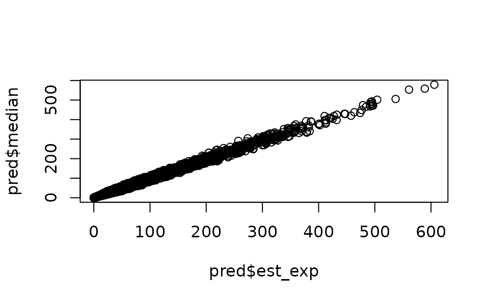

# Fitting delta (hurdle) models with sdmTMB

**If the code in this vignette has not been evaluated, a rendered
version is available on the [documentation
site](https://sdmTMB.github.io/sdmTMB/index.html) under ‘Articles’.**

``` r
library(ggplot2)
library(dplyr)
library(sdmTMB)
```

sdmTMB has the capability for built-in hurdle models (also called delta
models). These are models with one model for zero vs. non-zero data and
another component for the positive component. Hurdle models could also
be implemented by fitting the two components separately and combining
the predictions.

Hurdle models are more appropriate than something like a Tweedie when
there are differences in the processes controlling presence
vs. abundance, or when greater flexibility to account for dispersion is
required.

Built-in hurdle models can be specified with the `family` argument
within the
[`sdmTMB()`](https://sdmTMB.github.io/sdmTMB/reference/sdmTMB.md)
function. Current options include:

1.  Delta-Gamma: `family = delta_gamma(link1 = "logit", link2 = "log")`.
    This fits a binomial presence-absence model (i.e.,
    `binomial(link = "logit")`) and then a model for the positive
    catches only with a Gamma observation distribution and a log link
    (i.e., `Gamma(link = "log")`). Here and with other delta models, the
    `link1` and `link2` can be omitted and left at their default values.

2.  Delta-lognormal: `family = delta_lognormal()`. This fits a binomial
    presence-absence model (i.e., `binomial(link = "logit")`) and then a
    model for the positive catches only with a lognormal observation
    distribution and a log link (i.e., `lognormal(link = "log")`

3.  Poisson-link delta-Gamma or delta-lognormal. See the [Poisson-link
    delta model
    vignette](https://sdmTMB.github.io/sdmTMB/articles/poisson-link.html).

4.  Delta-truncated-negative-binomial:
    `family = delta_truncated_nbinom1()` or
    `family = delta_truncated_nbinom2()`. This fits a binomial
    presence-absence model (`binomial(link = "logit")`) and a
    `truncated_nbinom1(link = "log")` or
    `truncated_nbinom1(link = "log")` distribution for positive catches.

To summarize the built-in delta models and the separate components:

| Model Type      | Built-in delta function                                                              | Presence-absence model     | Positive catch model              |
|-----------------|--------------------------------------------------------------------------------------|----------------------------|-----------------------------------|
| Delta-gamma     | [`delta_gamma()`](https://sdmTMB.github.io/sdmTMB/reference/families.md)             | `binomial(link = "logit")` | `Gamma(link = "log")`             |
| Delta-lognormal | [`delta_lognormal()`](https://sdmTMB.github.io/sdmTMB/reference/families.md)         | `binomial(link = "logit")` | `lognormal(link = "log")`         |
| Delta-NB1       | [`delta_truncated_nbinom1()`](https://sdmTMB.github.io/sdmTMB/reference/families.md) | `binomial(link = "logit")` | `truncated_nbinom1(link = "log")` |
| Delta-NB2       | [`delta_truncated_nbinom2()`](https://sdmTMB.github.io/sdmTMB/reference/families.md) | `binomial(link = "logit")` | `truncated_nbinom2(link = "log")` |

## Example with built-in delta model

Here, we will show an example of fitting using the built-in delta
functionality, as well as how to build each model component separately
and then combine. The built-in approach is convenient, allows for
parameters to be shared across components, and allows for calculation of
derived quantities such as standardized indexes
([`get_index()`](https://sdmTMB.github.io/sdmTMB/reference/get_index.md))
with internally calculated standard errors.

We will use a dataset built into the sdmTMB package: trawl survey data
for Pacific Cod in Queen Charlotte Sound, British Columbia, Canada. The
density units are kg/km². Here, X and Y are coordinates in UTM zone 9.

We will first create a mesh that we will use for all the models.

``` r
pcod_mesh <- make_mesh(pcod, c("X", "Y"), cutoff = 15)
```

Then we can fit a model of Pacific cod density using a delta-gamma
model, including a smoothed effect of depth.

``` r
fit_dg <- sdmTMB(density ~ 1 + s(depth),
  data = pcod,
  mesh = pcod_mesh,
  time = "year",
  family = delta_gamma()
)
```

The default in built-in delta models is for the formula, spatial and
spatiotemporal structure, and anisotropy to be shared between the two
model components. However, some elements (`formula`, `spatial`,
`spatiotemporal`, and `share_range`) can also be specified independently
for each model using a list format within the function argument (see
examples below). The first element of the list is for the binomial
component and the second element is for the positive component (e.g.,
Gamma). Some elements must be shared for now (e.g., smoothers, spatially
varying coefficients, and time-varying coefficients).

To specify the settings for spatial and spatiotemporal effects in each
model component, create a list of settings within the `spatial` and
`spatiotemporal` arguments. For example,
`spatial = list("on", "off"), spatiotemporal = list("off", "rw")`.

We could similarly specify a different formula for each component of the
model, using `list(y ~ x1, y ~ x2)` For instance, we could include the
effect of depth for only the positive model, and remove it for the
presence-absence model.

However, there are currently limitations if specifying separate formulas
for each model component. The two formulas *cannot* have:

- smoothers
- threshold effects
- random intercepts

For now, these must be specified through a single formula that is shared
across the two models.

Each model component can similarly have separate settings for
`share_range`, which determines whether there is a shared spatial and
spatiotemporal range parameter (`TRUE`) or independent range parameters
(`FALSE`), by using a list.

Lastly, whether or not anisotropy is included in the model is determined
with the logical argument `anisotropy` (i.e., `TRUE` or `FALSE`), and
cannot be separately specified for each model. If anisotropy is
included, it is by default shared across the two model components.
However it can be made unique in each model component by using
`sdmTMBcontrol(map = ...)` and adding the argument `control` when
fitting the model. This ‘maps’ the anisotropy parameters be unique
across model components.

Once we fit the delta model, we can evaluate and plot the output,
diagnostics, and predictions similar to other sdmTMB models.

The printed model output will show estimates and standard errors of
parameters for each model separately.

``` r
print(fit_dg)
#> Spatiotemporal model fit by ML ['sdmTMB']
#> Formula: density ~ 1 + s(depth)
#> Mesh: pcod_mesh (isotropic covariance)
#> Time column: year
#> Data: pcod
#> Family: delta_gamma(link1 = 'logit', link2 = 'log')
#> 
#> Delta/hurdle model 1: -----------------------------------
#> Family: binomial(link = 'logit') 
#> Conditional model:
#>             coef.est coef.se
#> (Intercept)    -0.34    0.61
#> sdepth          1.28    2.91
#> 
#> Smooth terms:
#>              Std. Dev.
#> sd__s(depth)     14.38
#> 
#> Matérn range: 61.41
#> Spatial SD: 1.71
#> Spatiotemporal IID SD: 0.81
#> 
#> Delta/hurdle model 2: -----------------------------------
#> Family: Gamma(link = 'log') 
#> Conditional model:
#>             coef.est coef.se
#> (Intercept)     3.67    0.12
#> sdepth          0.31    1.29
#> 
#> Smooth terms:
#>              Std. Dev.
#> sd__s(depth)      5.41
#> 
#> Dispersion parameter: 1.03
#> Matérn range: 14.80
#> Spatial SD: 0.69
#> Spatiotemporal IID SD: 1.45
#> 
#> ML criterion at convergence: 6126.400
#> 
#> See ?tidy.sdmTMB to extract these values as a data frame.
```

Using the [`tidy()`](https://generics.r-lib.org/reference/tidy.html)
function will turn the sdmTMB model output into a data frame, with the
argument `model=1` or `model=2` to specify which model component to
extract as a dataframe. See
[`tidy.sdmTMB()`](https://sdmTMB.github.io/sdmTMB/reference/tidy.sdmTMB.md)
for additional arguments and options.

``` r
tidy(fit_dg) # model = 1 is default
#> # A tibble: 2 × 5
#>   term        estimate std.error conf.low conf.high
#>   <chr>          <dbl>     <dbl>    <dbl>     <dbl>
#> 1 (Intercept)   -0.343     0.614    -1.55     0.860
#> 2 sdepth         1.28      2.91     -4.42     6.98
tidy(fit_dg, model = 1)
#> # A tibble: 2 × 5
#>   term        estimate std.error conf.low conf.high
#>   <chr>          <dbl>     <dbl>    <dbl>     <dbl>
#> 1 (Intercept)   -0.343     0.614    -1.55     0.860
#> 2 sdepth         1.28      2.91     -4.42     6.98
tidy(fit_dg, model = 1, "ran_pars", conf.int = TRUE)
#> # A tibble: 4 × 6
#>   model term         estimate std.error conf.low conf.high
#>   <dbl> <chr>           <dbl>     <dbl>    <dbl>     <dbl>
#> 1     1 range          61.4      14.1     39.2       96.3 
#> 2     1 sigma_O         1.71      0.265    1.26       2.32
#> 3     1 sigma_E         0.806     0.142    0.570      1.14
#> 4     1 sd__s(depth)   14.4      NA        7.93      26.1
tidy(fit_dg, model = 2)
#> # A tibble: 2 × 5
#>   term        estimate std.error conf.low conf.high
#>   <chr>          <dbl>     <dbl>    <dbl>     <dbl>
#> 1 (Intercept)     3.67     0.120     3.44      3.91
#> 2 sdepth          0.31     1.29     -2.22      2.84
tidy(fit_dg, model = 2, "ran_pars", conf.int = TRUE)
#> # A tibble: 5 × 6
#>   model term         estimate std.error conf.low conf.high
#>   <dbl> <chr>           <dbl>     <dbl>    <dbl>     <dbl>
#> 1     2 range          14.8      5.02      7.62      28.8 
#> 2     2 phi             1.03     0.0502    0.939      1.14
#> 3     2 sigma_O         0.691    0.228     0.361      1.32
#> 4     2 sigma_E         1.45     0.336     0.919      2.28
#> 5     2 sd__s(depth)    5.41    NA         2.43      12.1
```

For built-in delta models, the default function will return estimated
response and parameters for each grid cell for each model separately,
notated with a 1 (for the presence/absence model) or 2 (for the positive
catch model) in the column name. See
[`predict.sdmTMB()`](https://sdmTMB.github.io/sdmTMB/reference/predict.sdmTMB.md)
for a description of values in the data frame.

``` r
grid_yrs <- replicate_df(qcs_grid, "year", unique(pcod$year))
p <- predict(fit_dg, newdata = grid_yrs)
str(p)
#> 'data.frame':    65826 obs. of  16 variables:
#>  $ X            : num  456 458 460 462 464 466 468 470 472 474 ...
#>  $ Y            : num  5636 5636 5636 5636 5636 ...
#>  $ depth        : num  347 223 204 183 183 ...
#>  $ depth_scaled : num  1.561 0.57 0.363 0.126 0.122 ...
#>  $ depth_scaled2: num  2.4361 0.3246 0.132 0.0158 0.0149 ...
#>  $ year         : int  2003 2003 2003 2003 2003 2003 2003 2003 2003 2003 ...
#>  $ est1         : num  -5.804 -0.796 0.021 0.87 0.98 ...
#>  $ est2         : num  3.2 3.71 4.02 4.39 4.43 ...
#>  $ est_non_rf1  : num  -5.508 -0.598 0.12 0.871 0.882 ...
#>  $ est_non_rf2  : num  2.83 3.31 3.59 3.94 3.94 ...
#>  $ est_rf1      : num  -0.296138 -0.197484 -0.09883 -0.000177 0.098477 ...
#>  $ est_rf2      : num  0.368 0.398 0.428 0.459 0.489 ...
#>  $ omega_s1     : num  -0.00543 0.09317 0.19178 0.29039 0.38899 ...
#>  $ omega_s2     : num  0.108 0.119 0.129 0.139 0.15 ...
#>  $ epsilon_st1  : num  -0.291 -0.291 -0.291 -0.291 -0.291 ...
#>  $ epsilon_st2  : num  0.26 0.28 0.299 0.319 0.339 ...
```

We can use predictions from the built-in delta model (making sure that
`return_tmb_object=TRUE`) to get the index values using the
[`get_index()`](https://sdmTMB.github.io/sdmTMB/reference/get_index.md)
function. This can be used with predictions that include both the first
and second models (i.e., using the default and specifying no `model`
argument) or with predictions generated using `model=NA`. The
[`get_index()`](https://sdmTMB.github.io/sdmTMB/reference/get_index.md)
function will automatically combine predictions from the first and
second model in calculating the index values. For more on modelling for
the purposes of creating an index see the vignette on [Index
standardization with
sdmTMB](https://sdmTMB.github.io/sdmTMB/articles/index-standardization.html).

``` r
p2 <- predict(fit_dg, newdata = grid_yrs, return_tmb_object = TRUE)
ind_dg <- get_index(p2, bias_correct = FALSE)
```

We can plot conditional effects of covariates (such as depth in the
example model) using the package `visreg` by specifying each model
component with `model=1` for the presence-absence model or `model=2` for
the positive catch model. Currently, plotting effects of built-in delta
models with `ggeffects` is not supported. See the vignette on using
[visreg](https://sdmTMB.github.io/sdmTMB/articles/visreg.html) with
sdmTMB for more information.

``` r
visreg_delta(fit_dg, xvar = "depth", model = 1, gg = TRUE)
#> These are residuals for delta model component 1. Use the `model` argument to
#> select the other component.
#> Warning: `aes_string()` was deprecated in ggplot2 3.0.0.
#> ℹ Please use tidy evaluation idioms with `aes()`.
#> ℹ See also `vignette("ggplot2-in-packages")` for more information.
#> ℹ The deprecated feature was likely used in the visreg package.
#>   Please report the issue at <https://github.com/pbreheny/visreg/issues>.
#> This warning is displayed once every 8 hours.
#> Call `lifecycle::last_lifecycle_warnings()` to see where this warning was
#> generated.
#> Warning: Using `size` aesthetic for lines was deprecated in ggplot2 3.4.0.
#> ℹ Please use `linewidth` instead.
#> ℹ The deprecated feature was likely used in the ggplot2 package.
#>   Please report the issue at <https://github.com/tidyverse/ggplot2/issues>.
#> This warning is displayed once every 8 hours.
#> Call `lifecycle::last_lifecycle_warnings()` to see where this warning was
#> generated.
```


``` r
visreg_delta(fit_dg, xvar = "depth", model = 2, gg = TRUE)
```

The built-in delta models can also be evaluated with the
[`residuals()`](https://rdrr.io/r/stats/residuals.html) functions in
sdmTMB. Similarly to generating predictions, we can specify which of the
model components we want to return residuals for using the `model`
argument and specifying `=1` or `=2`. See
[`residuals.sdmTMB()`](https://sdmTMB.github.io/sdmTMB/reference/residuals.sdmTMB.md)
for additional options for evaluating residuals in sdmTMB models.

We can also simulate new observations from a fitted delta model. As in
other functions, we can specify which model to simulate from using the
argument `model=1` for only presence/absence, `model=2` for only
positive catches, or `model=NA` for combined predictions. See
[`simulate.sdmTMB()`](https://sdmTMB.github.io/sdmTMB/reference/simulate.sdmTMB.md)
for more details on simulation options.

``` r
simulations <- simulate(fit_dg, nsim = 5, seed = 5090, model = NA)
```

## Delta models by fitting two components separately and combining predictions

Next, we will show an example of how to implement a delta-gamma model in
sdmTMB, but with each component fit separately and then combined. This
approach gives maximum flexibility for each model and lets you develop
them on at a time. It has limitations if you are calculating an index of
abundance or if you want to share some parameters.

``` r
glimpse(pcod)
#> Rows: 2,143
#> Columns: 12
#> $ year          <int> 2003, 2003, 2003, 2003, 2003, 2003, 2003, 2003, 2003, 20…
#> $ X             <dbl> 446.4752, 446.4594, 448.5987, 436.9157, 420.6101, 417.71…
#> $ Y             <dbl> 5793.426, 5800.136, 5801.687, 5802.305, 5771.055, 5772.2…
#> $ depth         <dbl> 201, 212, 220, 197, 256, 293, 410, 387, 285, 270, 381, 1…
#> $ density       <dbl> 113.138476, 41.704922, 0.000000, 15.706138, 0.000000, 0.…
#> $ present       <dbl> 1, 1, 0, 1, 0, 0, 0, 0, 0, 1, 0, 0, 0, 0, 0, 0, 0, 0, 0,…
#> $ lat           <dbl> 52.28858, 52.34890, 52.36305, 52.36738, 52.08437, 52.094…
#> $ lon           <dbl> -129.7847, -129.7860, -129.7549, -129.9265, -130.1586, -…
#> $ depth_mean    <dbl> 5.155194, 5.155194, 5.155194, 5.155194, 5.155194, 5.1551…
#> $ depth_sd      <dbl> 0.4448783, 0.4448783, 0.4448783, 0.4448783, 0.4448783, 0…
#> $ depth_scaled  <dbl> 0.3329252, 0.4526914, 0.5359529, 0.2877417, 0.8766077, 1…
#> $ depth_scaled2 <dbl> 0.11083919, 0.20492947, 0.28724555, 0.08279527, 0.768440…
```

``` r
mesh1 <- make_mesh(pcod, c("X", "Y"), cutoff = 20) # coarse for vignette speed
```

It is not necessary to use the same mesh for both models, but one can do
so by updating the first mesh to match the reduced data frame as shown
here:

``` r
dat2 <- subset(pcod, density > 0)
mesh2 <- make_mesh(dat2,
  xy_cols = c("X", "Y"),
  mesh = mesh1$mesh
)
```

This delta-gamma model is similar to the Tweedie model in the [Intro to
modelling with
sdmTMB](https://sdmTMB.github.io/sdmTMB/articles/basic-intro.html)
vignette, except that we will use `s()` for the depth effect.

``` r
m1 <- sdmTMB(
  formula = present ~ 0 + as.factor(year) + s(depth, k = 3),
  data = pcod,
  mesh = mesh1,
  time = "year", family = binomial(link = "logit"),
  spatiotemporal = "iid",
  spatial = "on"
)
m1
#> Spatiotemporal model fit by ML ['sdmTMB']
#> Formula: present ~ 0 + as.factor(year) + s(depth, k = 3)
#> Mesh: mesh1 (isotropic covariance)
#> Time column: year
#> Data: pcod
#> Family: binomial(link = 'logit')
#>  
#> Conditional model:
#>                     coef.est coef.se
#> as.factor(year)2003    -0.76    0.42
#> as.factor(year)2004    -0.40    0.42
#> as.factor(year)2005    -0.42    0.42
#> as.factor(year)2007    -1.40    0.42
#> as.factor(year)2009    -1.16    0.42
#> as.factor(year)2011    -1.56    0.42
#> as.factor(year)2013    -0.38    0.42
#> as.factor(year)2015    -0.65    0.42
#> as.factor(year)2017    -1.56    0.42
#> sdepth                 -5.66    0.50
#> 
#> Smooth terms:
#>              Std. Dev.
#> sd__s(depth)      85.9
#> 
#> Matérn range: 28.70
#> Spatial SD: 1.89
#> Spatiotemporal IID SD: 0.90
#> ML criterion at convergence: 1054.414
#> 
#> See ?tidy.sdmTMB to extract these values as a data frame.
```

One can use different covariates in each model, but in this case we will
just let the depth effect be more wiggly by not specifying `k = 3`.

``` r
m2 <- sdmTMB(
  formula = density ~ 0 + as.factor(year) + s(depth),
  data = dat2,
  mesh = mesh2,
  time = "year",
  family = Gamma(link = "log"),
  spatiotemporal = "iid",
  spatial = "on"
)
m2
#> Spatiotemporal model fit by ML ['sdmTMB']
#> Formula: density ~ 0 + as.factor(year) + s(depth)
#> Mesh: mesh2 (isotropic covariance)
#> Time column: year
#> Data: dat2
#> Family: Gamma(link = 'log')
#>  
#> Conditional model:
#>                     coef.est coef.se
#> as.factor(year)2003     4.06    0.20
#> as.factor(year)2004     4.22    0.20
#> as.factor(year)2005     4.19    0.20
#> as.factor(year)2007     3.38    0.20
#> as.factor(year)2009     3.71    0.21
#> as.factor(year)2011     4.51    0.21
#> as.factor(year)2013     4.02    0.19
#> as.factor(year)2015     4.13    0.20
#> as.factor(year)2017     3.84    0.22
#> sdepth                 -0.28    0.36
#> 
#> Smooth terms:
#>              Std. Dev.
#> sd__s(depth)      1.89
#> 
#> Dispersion parameter: 0.94
#> Matérn range: 0.01
#> Spatial SD: 727.41
#> Spatiotemporal IID SD: 2065.26
#> ML criterion at convergence: 5102.136
#> 
#> See ?tidy.sdmTMB to extract these values as a data frame.
#> 
#> **Possible issues detected! Check output of sanity().**
```

Next, we need some way of combining the predictions across the two
models. If all we need are point predictions, we can just multiply the
predictions from the two models after applying the inverse link:

``` r
pred <- grid_yrs # use the grid as template for saving our predictions
p_bin <- predict(m1, newdata = grid_yrs)
p_pos <- predict(m2, newdata = grid_yrs)
p_bin_prob <- m1$family$linkinv(p_bin$est)
p_pos_exp <- m2$family$linkinv(p_pos$est)
pred$est_exp <- p_bin_prob * p_pos_exp
```

But if a measure of uncertainty is required, we can simulate from the
joint parameter precision matrix using the
[`predict()`](https://rdrr.io/r/stats/predict.html) function with any
number of simulations selected (e.g., `sims = 500`). Because the
predictions come from simulated draws from the parameter covariance
matrix, the predictions will become more consistent with a larger number
of draws. However, a greater number of draws takes longer to calculate
and will use more memory (larger matrix), so fewer draws (~100) may be
fine for experimentation. A larger number (say ~1000) may be appropriate
for final model runs.

``` r
set.seed(28239)
p_bin_sim <- predict(m1, newdata = grid_yrs, nsim = 100)
p_pos_sim <- predict(m2, newdata = grid_yrs, nsim = 100)
p_bin_prob_sim <- m1$family$linkinv(p_bin_sim)
p_pos_exp_sim <- m2$family$linkinv(p_pos_sim)
p_combined_sim <- p_bin_prob_sim * p_pos_exp_sim
```

`p_combined_sim` is a matrix with a row for each row of data that was
predicted on and width `nsim`. You can process this matrix however you
would like. We can save median predictions and upper and lower 95%
confidence intervals:

``` r
pred$median <- apply(p_combined_sim, 1, median)
plot(pred$est_exp, pred$median)
```



``` r
ggplot(subset(pred, year == 2017), aes(X, Y, fill = median)) +
  geom_raster() +
  coord_fixed() +
  scale_fill_viridis_c(trans = "sqrt")
```


And we can calculate spatial uncertainty:

``` r
pred$cv <- apply(p_combined_sim, 1, function(x) sd(x) / mean(x))
ggplot(subset(pred, year == 2017), aes(X, Y, fill = cv)) + # 2017 as an example
  geom_raster() +
  coord_fixed() +
  scale_fill_viridis_c(trans = "log10")
```


