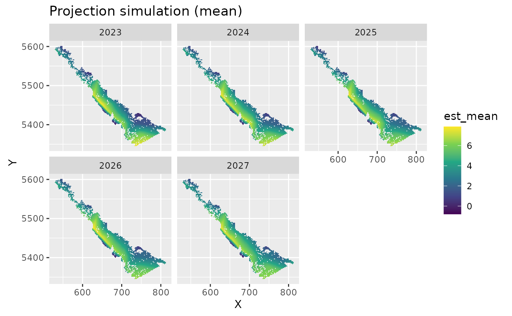

# Forecasting with sdmTMB

Here we will cover using sdmTMB for forecasting data in time or
extrapolating spatially to unsampled areas. These forecasting approaches
have multiple applications, including,

- predicting for future years
- interpolating over missed years
- extrapolating in space to unsampled areas (e.g., an area beyond the
  existing domain)
- interpolating in space within the existing spatial domain

## Forecasting: predicting for future time and interpolating over missed time slices

Predicting for future time and interpolating over missed time requires a
similar method, so we will cover them both here. To forecast in time,
either future or missed time, we need a model for time. As an example,
we can’t predict with years as factors below because the model won’t
know what value to assign to years without data.

The options for including time in the model include:

- AR(1) or random walk random fields
- Random walk intercepts
- Smoothers on the time variable (e.g., `s(year)`)
- Ignoring time (fixed)
- Some combination of these

We will use the Pacific cod data to show how to implement each of these
options.

First, we need to make our mesh.

``` r
mesh <- make_mesh(pcod, c("X", "Y"), cutoff = 20)
```

Next, we need to create a list of the years that we want to forecast or
interpolate. The DFO survey in this region only includes years 2003,
2004, 2005, 2007, 2009, 2011, 2013, 2015, and 2017.

``` r
data <- pcod
years <- unique(data$year)
```

To use the model to fill in Pacific cod density for the unsampled years,
we will create a list of the years we want added to fill in from
2003–2017. To predict for future years, we will also add in years for
after the observed data (i.e., after 2017) for however many years we
want to forecast into the future. For this example, we will predict on
years 2018–2025. We will name the vector of extra years `extra_years`.

``` r
extra_years <- c(
  2006, 2008, 2010, 2012, 2014, 2016, # missing years
  2018:2025 # predicted future years
)
```

Then, we will fit a model of Pacific cod density that includes depth
variables. The argument `extra_time` in the
[`sdmTMB()`](https://sdmTMB.github.io/sdmTMB/reference/sdmTMB.md)
function is how we will add in interpolation and forecasting. We also
will need to set the argument `time` to `time = "year"`.

In this example, we will choose to turn off spatial random fields
(`spatial = "off"`), so we are only including spatiotemporal random
fields.

We then have different options for including time in the model.

#### AR(1) spatiotemporal field

To include spatiotemporal variation as an AR(1) process, we can specify
`spatiotemporal = "AR1"`:

``` r
fit_ar1 <- sdmTMB(
  density ~ depth_scaled + depth_scaled2,
  time = "year",
  extra_time = extra_years, #<< our list of extra years to be included
  spatiotemporal = "AR1", #<< setting an AR(1) spatiotemporal process
  data = pcod,
  mesh = mesh,
  family = tweedie(link = "log"),
  spatial = "off",
  silent = FALSE #< monitor progress
)
```

#### Random walk spatiotemporal field

Or, we can set spatiotemporal variation to a random walk with
`spatiotemporal = "RW"`:

``` r
fit_rw <- sdmTMB(
  density ~ depth_scaled + depth_scaled2,
  time = "year",
  extra_time = extra_years, #<<
  spatiotemporal = "RW", #<<
  data = pcod,
  mesh = mesh,
  family = tweedie(link = "log"),
  spatial = "off",
  silent = FALSE
)
```

#### Random walk intercept + AR(1) fields

We can also model the intercept as a random walk by removing the
intercept from the main formula (adding `0` to the model equation) and
including the argument `time_varying = ~1`:

``` r
fit_rw_ar1 <- sdmTMB(
  density ~ 0 + depth_scaled + depth_scaled2, #<< remove intercept with 0
  time = "year",
  time_varying = ~1, #<< instead include the intercept here as a random walk
  extra_time = extra_years,
  spatiotemporal = "AR1", #<<
  data = pcod,
  mesh = mesh,
  family = tweedie(link = "log"),
  spatial = "off",
  silent = FALSE
)
```

#### Smoother on year + AR(1) fields

We can also add a smoother on year as a variable in the model equation
with `s(year)` in the model equation and keeping `spatiotemporal="AR1"`:

``` r
fit_sm <- sdmTMB(
  density ~ s(year, k = 5) + depth_scaled + depth_scaled2, #<< add smoother on year
  time = "year",
  extra_time = extra_years, #<<
  spatiotemporal = "AR1", #<<
  data = pcod,
  mesh = mesh,
  family = tweedie(link = "log"),
  spatial = "off",
  silent = FALSE
)
```

#### Deciding between methods

In deciding which method (AR(1), RW, etc) to use for including time in
the model, it is important to know that

- AR(1) field processes revert towards mean
- Random walk processes (in the mean or time varying parameters) do not
  revert towards the mean
- Smoothers should be used with caution, because they continue whatever
  the basis functions were doing
- Uncertainties in prediction for random walks, AR(1) processes, and
  smoothers (here, p-splines) increase the further away we get from data

## \`project()\`\` function for faster long-term forecasting

Because forecasting can be slow—especially for large datasets or for
projections far into the future, sdmTMB also includes a
[`project()`](https://sdmTMB.github.io/sdmTMB/reference/project.md)
function for doing projections via simulations. Using the built-in
`dogfish` dataset, we’ll first define the years for the historical
(fitting) and projection period. This is based off an approach first
developed in the `project_model()` function in VAST.

``` r
mesh <- make_mesh(dogfish, c("X", "Y"), cutoff = 30)
historical_years <- 2004:2022
to_project <- 5
future_years <- seq(max(historical_years) + 1, max(historical_years) + to_project)
all_years <- c(historical_years, future_years)
proj_grid <- replicate_df(wcvi_grid, "year", all_years)
```

Next, we’ll fit the model. We’ll use an AR(1) spatiotemporal field that
is responsible for future forecasts.

``` r
fit <- sdmTMB(
  catch_weight ~ 1,
  time = "year",
  offset = log(dogfish$area_swept),
  extra_time = historical_years, #< does *not* include projection years
  spatial = "on",
  spatiotemporal = "ar1",
  data = dogfish,
  mesh = mesh,
  family = tweedie(link = "log")
)
```

Finally, we’ll do the projections. We’ll only use 20 draws for speed and
simplicity, but you should increase this for real-world applications so
that you have stable results.

``` r
set.seed(1)
out <- project(fit, newdata = proj_grid, nsim = 20)
```

The `out` object now contains two objects: `out$est` and
`out$epsilon_est`, each with dimensions of the number of rows in the
prediction data (`proj_grid`) (rows) and number of draws for this
example (n = 20) (columns). The first (`est`) are the predictions (in
link space) and the second (`epsilon_est`) is the spatiotemporal random
effects. These can be summarized and visualized in several ways to show
trends in both the mean, as well as the confidence intervals.

For example, here are the projections:

``` r
proj_grid$est_mean <- apply(out$est, 1, mean)
ggplot(subset(proj_grid, year > 2022), aes(X, Y, fill = est_mean)) +
  geom_raster() +
  facet_wrap(~year) +
  coord_fixed() +
  scale_fill_viridis_c() +
  ggtitle("Projection simulation (mean)")
```



See the help file
[`?sdmTMB::project`](https://sdmTMB.github.io/sdmTMB/reference/project.md)
for additional examples.

## Interpolating in space to unsampled areas

We can also interpolate predicted values to unsampled areas within the
geographic extent of the data. For this example, we will use the data on
the locations of 3605 trees in a 1000 by 500 m rectangular sampling
region from the [the spatst.data
package](https://CRAN.R-project.org/package=spatstat.data)

First we will create a data frame of the x and y coordinates from the
tree dataset, and we can map the locations:

``` r
dat <- data.frame(
  x = spatstat.data::bei$x,
  y = spatstat.data::bei$y
)
ggplot(dat, aes(x, y)) +
  geom_point(col = "darkblue", alpha = 0.1) +
  coord_cartesian(expand = FALSE)
```


We first re-format the data to create density observations. We re-scale
the x and y coordinates, using the size of the scale value to control
the resolution (i.e., increasing the scale value will decrease the
resolution). Then we can add a column in our data frame of tree density
by adding the number of trees in each location that we created with the
scale function. Then, we create the mesh and can visualize it by
plotting.

``` r
# scale controls resolution
scale <- 50
dat$x <- scale * floor(dat$x / scale)
dat$y <- scale * floor(dat$y / scale)

dat <- dplyr::group_by(dat, x, y) %>%
  dplyr::summarise(n = n())

mesh <- make_mesh(
  dat,
  xy_cols = c("x", "y"),
  cutoff = 80 # min. distance between knots in X-Y units
)
plot(mesh)
```


Then, we can fit the model of tree density, with only an intercept and
only one time slice

``` r
fit <- sdmTMB(n ~ 1,
  data = dat,
  mesh = mesh,
  family = truncated_nbinom2(link = "log"),
)
```

Next, we can predict to unsampled areas within the geographic extent of
our data. We first expand the grid by adding in x and y coordinates
between existing coordinates in our dataset. Here, we will add in points
at intervals of 5 for x and y. This value controls the resolution of
predicted data. Increasing the value will decrease the resolution of
spatial predictions.

In this example, we include `se_fit = TRUE` in the predict function to
generate standard errors, though this can slow down computation time.

We can map the predicted tree density at each of our interpolated points
compared to the locations of our data to see the increased resolution by
forecasting with this method

``` r
# makes all combinations of x and y:
newdf <- expand.grid(
  x = seq(min(dat$x), max(dat$x), 5),
  y = seq(min(dat$y), max(dat$y), 5)
)
p <- predict(fit, newdata = newdf)

ggplot(p, aes(x, y)) +
  geom_raster(data = p, aes(x, y, fill = est)) +
  geom_point(data = dat, aes(x, y)) +
  labs(fill = "tree density") +
  scale_fill_viridis_c()
```


We can also use add the argument `nsim = 200` when predicting and then
summarize predicted densities from all simulations in a matrix

``` r
p2 <- predict(fit, newdata = newdf, nsim = 200)
newdf$p2 <- apply(p2, 1, mean)
ggplot(newdf, aes(x, y)) +
  geom_raster(data = newdf, aes(x, y, fill = p2)) +
  geom_point(data = dat, aes(x, y)) +
  labs(fill = "tree density") +
  scale_fill_viridis_c()
```


We can also visualize uncertainty in the forecasts by mapping the
standard error of predicted densities at each point in space. We see
that uncertainty is higher at vertices. This is because there are fewer
neighbors, e.g. [this
tutorial](https://ourcodingclub.github.io/tutorials/spatial-modelling-inla/)

``` r
newdf$est_se <- apply(p2, 1, sd)
ggplot() +
  geom_raster(data = newdf, aes(x = x, y = y, fill = est_se)) +
  coord_equal() +
  labs(col = "Standard error\nof spatiotemporal field") +
  scale_fill_viridis_c(option = "D")
#> Ignoring unknown labels:
#> • colour : "Standard error of spatiotemporal field"
```


#### Extrapolating outside the survey domain

We can also extrapolate spatially to outside of the geographic extent of
the data (ensuring we are not extrapolating outside the extent of our
mesh!) For instance, we can predict into a border area. To do so, we
expand the x and y coordinates to values above and below the extent of
the coordinates in the data. Here, we expand the geographic domain by
100 in all directions, and keep the resolution at 5.

Then, we can use the same model fit to predict to the expanded
geographic domain.


