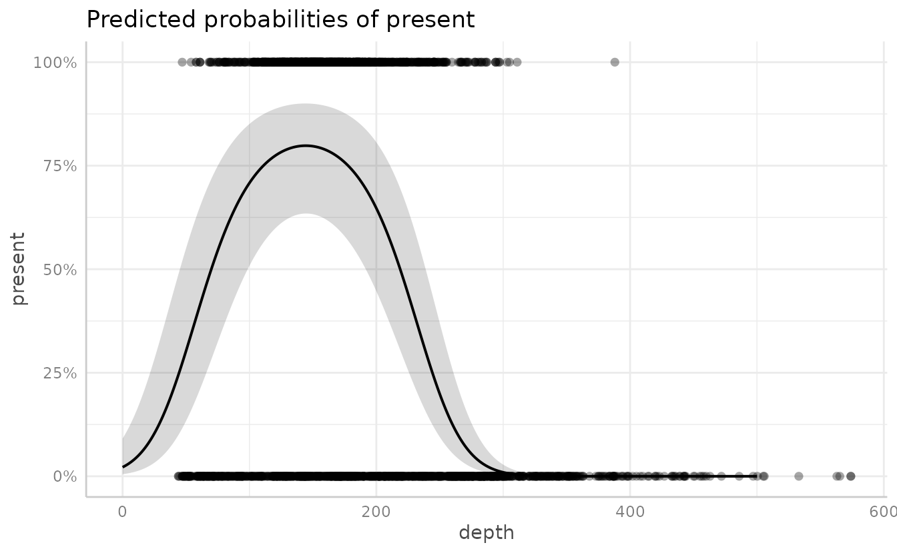
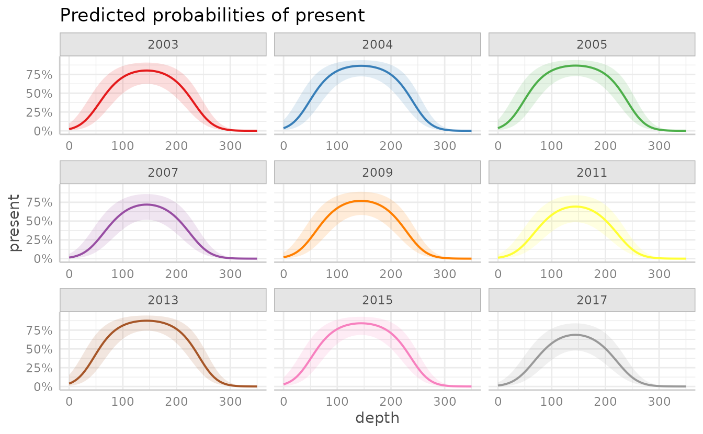
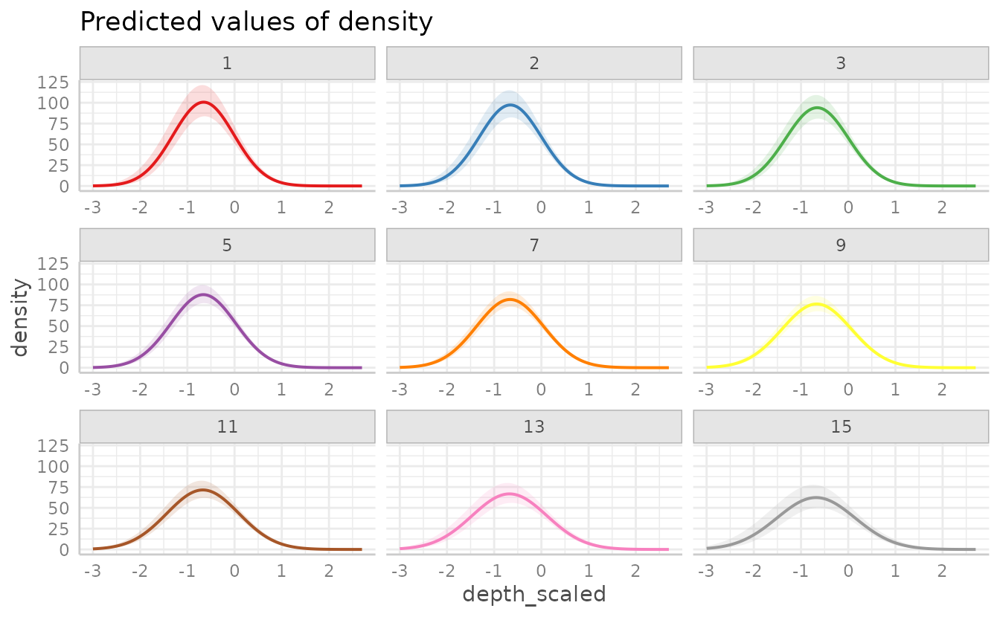
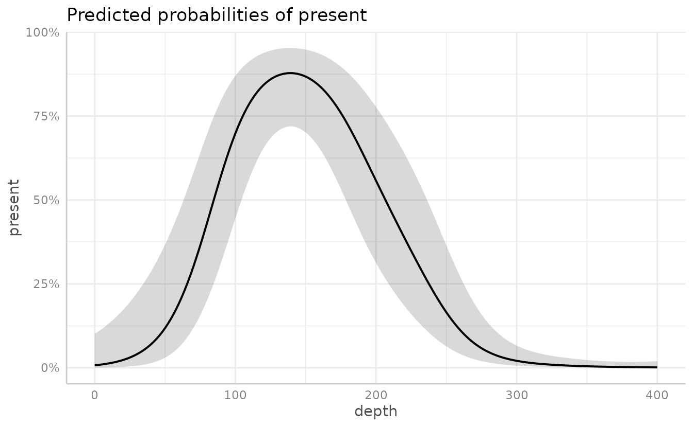
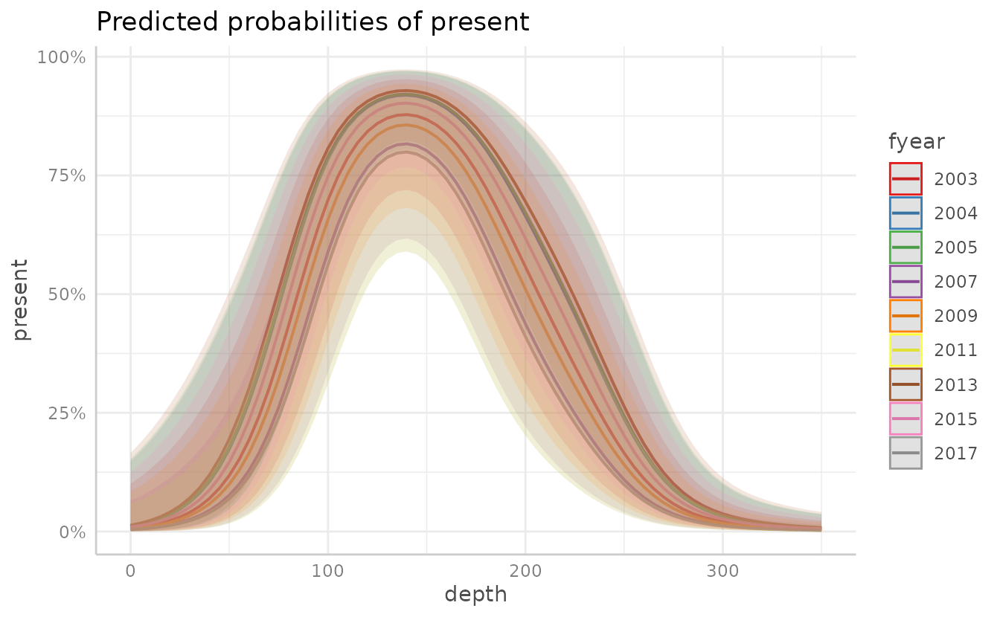

# Visualizing marginal effects in sdmTMB models with ggeffects

**If the code in this vignette has not been evaluated, a rendered
version is available on the [documentation
site](https://sdmTMB.github.io/sdmTMB/index.html) under ‘Articles’.**

The package [ggeffects](https://CRAN.R-project.org/package=ggeffects)
can be used to plot marginal effects of given predictor variables in
sdmTMB models.

A advantage to this approach over visreg, is that ggeffects calculates
marginal effects with the effects package using the parameter covariance
matrix. This is nearly instant compared to visreg, which has to
calculate conditional effects by calculating predictions with TMB.

A disadvantage to using ggeffects is that it will only work for regular
linear effects in the main model formula. I.e., it will not work with
smoothers (internally these are random effects) or breakpoint
(`breakpt()`) effects.

Another important distinction is that
[`ggeffects::ggeffect()`](https://strengejacke.github.io/ggeffects/reference/ggpredict.html)
is plotting **marginal** effects. This means the effects are
“marginalized” or “averaged” over the other fixed effects.
[`visreg::visreg()`](https://pbreheny.github.io/visreg/reference/visreg.html)
is plotting **conditional** effects. This means they are conditional on
the other predictors being set to certain values.

[`ggeffects::ggpredict()`](https://strengejacke.github.io/ggeffects/reference/ggpredict.html)
also does conditional effects, and this is explored at the end of this
vignette.

``` r
library(sdmTMB)
library(ggeffects)
```

## Example with Pacific cod presence

To start, we will use the Pacific cod example data. We will fit a model
of fish presence/absence with covariates of depth and a fixed effect of
year using a Tweedie distribution.

``` r
pcod$fyear <- as.factor(pcod$year)
mesh <- make_mesh(pcod, c("X", "Y"), cutoff = 20)
fit <- sdmTMB(present ~ poly(depth, 2) + fyear,
  data = pcod,
  mesh = mesh,
  spatial = "on",
  family = binomial()
)
```

We can then use
[`ggeffects::ggeffect()`](https://strengejacke.github.io/ggeffects/reference/ggpredict.html)
to see the effect of depth on the probability of Pacific cod being
present. We can control what range and interval of depths are predicted
within the function (e.g. `[0:500 by=1]`).

``` r
g <- ggeffect(fit, "depth [0:500 by=1]")
plot(g)
```


We can also plot the effects of each year.

``` r
g2 <- ggeffect(fit, "fyear")
plot(g2)
```


We can add in data points

``` r
plot(g, show_data = TRUE)
#> Data points may overlap. Use the `jitter` argument to add some amount of
#>   random variation to the location of data points and avoid overplotting.
```



We can also use `ggeffect` to plot multiple variables by listing them in
`terms = c()`, with the first term listed indicating the variable to be
plotted on the x-axis, and the remaining listed terms (up to four total)
indicating the groups. Adding `facet = TRUE` will show each year as a
separate plot, instead of overlain on one plot.

``` r
dat <- ggeffect(fit, terms = c("depth [0:350 by=5]", "fyear"))
plot(dat)
```


Adding `facet = TRUE` will show each year as a separate plot, instead of
overlain on one plot.

``` r
plot(dat, facet = TRUE)
```



We can also use make our own ggplot plot by calling the ggeffects object
`dat` as the data frame.

``` r
ggplot(dat, aes(x, predicted, colour = group)) +
  geom_line()
```


Plotting using with a continuous response (here `density`) rather than
presence-only is similar. For instance:

We can fit a model with an interaction of two continuous variables:

For plotting two continuous variables,
[`ggeffect()`](https://strengejacke.github.io/ggeffects/reference/ggpredict.html)
will make the non-target (2nd) variable discrete by selecting different
levels.

``` r
g5 <- ggeffect(fit3, terms = c("depth_scaled [-3:2.7 by=0.01]", "numeric_year"))
plot(g5)
```


``` r
plot(g5, facet = TRUE)
```



To specify the levels rather than letting
[`ggeffect()`](https://strengejacke.github.io/ggeffects/reference/ggpredict.html)
choose them, use brackets with the selected values within the term list,
for instance

``` r
g6 <- ggeffect(fit3, terms = c("depth_scaled [-3:2.7 by=0.01]", "numeric_year [1,7,15]"))
plot(g6)
```


## `ggpredict()`

[`ggeffects::ggpredict()`](https://strengejacke.github.io/ggeffects/reference/ggpredict.html)
can be used to make conditional effects plots of sdmTMB models,
including models with smoothers (but not currently including delta
models [due to a recent change in
ggeffects](https://github.com/sdmTMB/sdmTMB/issues/435)).

Here’s an example:

``` r
pcod$fyear <- as.factor(pcod$year)
mesh <- make_mesh(pcod, c("X", "Y"), cutoff = 20)
fit <- sdmTMB(present ~ s(depth) + fyear,
  data = pcod,
  mesh = mesh,
  spatial = "on",
  family = binomial()
)
```

``` r
g <- ggpredict(fit, "depth [0:400 by=2]")
#> Model contains splines or polynomial terms. Consider using `terms="depth
#>   [all]"` to get smooth plots. See also package-vignette 'Adjusted
#>   Predictions at Specific Values'.
plot(g)
```



``` r
g <- ggpredict(fit, terms = c("depth [0:350 by=5]", "fyear"))
#> Model contains splines or polynomial terms. Consider using `terms="depth
#>   [all]"` to get smooth plots. See also package-vignette 'Adjusted
#>   Predictions at Specific Values'.
plot(g)
```



``` r
plot(g, facet = TRUE)
```


We can extract the data to make our own plot:

``` r
df <- as.data.frame(g)
glimpse(df)
#> Rows: 639
#> Columns: 6
#> $ x         <dbl> 0, 0, 0, 0, 0, 0, 0, 0, 0, 5, 5, 5, 5, 5, 5, 5, 5, 5, 10, 10…
#> $ predicted <dbl> 0.007356842, 0.011520076, 0.011879286, 0.004558189, 0.006096…
#> $ std.error <dbl> 1.385601, 1.380047, 1.381375, 1.384950, 1.382717, 1.381915, …
#> $ conf.low  <dbl> 0.0004900719, 0.0007788444, 0.0008013158, 0.0003032307, 0.00…
#> $ conf.high <dbl> 0.10074152, 0.14839641, 0.15270207, 0.06465746, 0.08441030, …
#> $ group     <fct> 2003, 2004, 2005, 2007, 2009, 2011, 2013, 2015, 2017, 2003, …
```

``` r
ggplot(df, aes(
  x, predicted,
  ymin = conf.low,
  ymax = conf.high,
  colour = group, fill = group
)) +
  geom_ribbon(alpha = 0.4, colour = NA) +
  geom_line() +
  facet_wrap(vars(group)) +
  labs(x = "Depth (m)", y = "Predicted", colour = "Year", fill = "Year")
```


