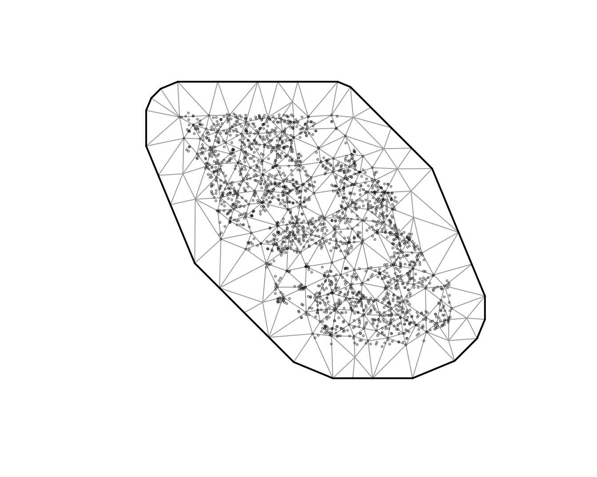

# Index standardization with sdmTMB

**If the code in this vignette has not been evaluated, a rendered
version is available on the [documentation
site](https://sdmTMB.github.io/sdmTMB/index.html) under ‘Articles’.**

``` r
library(ggplot2)
library(dplyr)
library(sdmTMB)
```

Let’s perform index standardization with the built-in data for Pacific
cod.

- The density units should be kg/km².
- Here, X and Y are coordinates in UTM zone 9.

``` r
glimpse(pcod)
#> Rows: 2,143
#> Columns: 12
#> $ year          <int> 2003, 2003, 2003, 2003, 2003, 2003, 2003, 2003, 2003, 20…
#> $ X             <dbl> 446.4752, 446.4594, 448.5987, 436.9157, 420.6101, 417.71…
#> $ Y             <dbl> 5793.426, 5800.136, 5801.687, 5802.305, 5771.055, 5772.2…
#> $ depth         <dbl> 201, 212, 220, 197, 256, 293, 410, 387, 285, 270, 381, 1…
#> $ density       <dbl> 113.138476, 41.704922, 0.000000, 15.706138, 0.000000, 0.…
#> $ present       <dbl> 1, 1, 0, 1, 0, 0, 0, 0, 0, 1, 0, 0, 0, 0, 0, 0, 0, 0, 0,…
#> $ lat           <dbl> 52.28858, 52.34890, 52.36305, 52.36738, 52.08437, 52.094…
#> $ lon           <dbl> -129.7847, -129.7860, -129.7549, -129.9265, -130.1586, -…
#> $ depth_mean    <dbl> 5.155194, 5.155194, 5.155194, 5.155194, 5.155194, 5.1551…
#> $ depth_sd      <dbl> 0.4448783, 0.4448783, 0.4448783, 0.4448783, 0.4448783, 0…
#> $ depth_scaled  <dbl> 0.3329252, 0.4526914, 0.5359529, 0.2877417, 0.8766077, 1…
#> $ depth_scaled2 <dbl> 0.11083919, 0.20492947, 0.28724555, 0.08279527, 0.768440…
```

First we will create our SPDE mesh. We will use a relatively course mesh
for a balance between speed and accuracy in this vignette (`cutoff = 10`
where cutoff is in the units of X and Y (km here) and represents the
minimum distance between points before a new mesh vertex is added). You
will likely want to use a higher resolution mesh for applied scenarios.
You will want to make sure that increasing the number of knots does not
change the conclusions.

``` r
pcod_spde <- make_mesh(pcod, c("X", "Y"), cutoff = 10)
plot(pcod_spde)
```



Let’s fit a GLMM. Note that if you want to use this model for index
standardization then you will likely want to include
`0 + as.factor(year)` or `-1 + as.factor(year)` so that there is a
factor predictor that represents the mean estimate for each time slice.

``` r
m <- sdmTMB(
  data = pcod, 
  formula = density ~ 0 + as.factor(year),
  time = "year", mesh = pcod_spde, family = tweedie(link = "log"))
```

We can inspect randomized quantile residuals:

``` r
pcod$resids <- residuals(m) # randomized quantile residuals
# Also see residuals(..., type = "mle-mcmc") which are better but slower
hist(pcod$resids)
```


``` r
qqnorm(pcod$resids)
abline(a = 0, b = 1)
```


``` r
ggplot(pcod, aes(X, Y, col = resids)) + scale_colour_gradient2() +
  geom_point() + facet_wrap(~year) + coord_fixed()
```


Now we want to predict on a fine-scale grid on the entire survey domain.
There is a grid built into the package for Queen Charlotte Sound named
`qcs_grid`. Our prediction grid also needs to have all the covariates
that we used in the model above.

``` r
glimpse(qcs_grid)
#> Rows: 7,314
#> Columns: 5
#> $ X             <dbl> 456, 458, 460, 462, 464, 466, 468, 470, 472, 474, 476, 4…
#> $ Y             <dbl> 5636, 5636, 5636, 5636, 5636, 5636, 5636, 5636, 5636, 56…
#> $ depth         <dbl> 347.08345, 223.33479, 203.74085, 183.29868, 182.99983, 1…
#> $ depth_scaled  <dbl> 1.56081222, 0.56976988, 0.36336929, 0.12570465, 0.122036…
#> $ depth_scaled2 <dbl> 2.436134794, 0.324637712, 0.132037240, 0.015801659, 0.01…
```

We can replicate our grid across all years:

``` r
grid_yrs <- replicate_df(qcs_grid, "year", unique(pcod$year))
```

Now make the predictions on new data.

``` r
predictions <- predict(m, newdata = grid_yrs, return_tmb_object = TRUE)
```

Let’s make a small function to make maps.

``` r
plot_map <- function(dat, column) {
  ggplot(dat, aes(X, Y, fill = {{ column }})) +
    geom_raster() +
    facet_wrap(~year) +
    coord_fixed()
}
```

There are four kinds of predictions that we get out of the model. First
we will show the predictions that incorporate all fixed effects and
random effects:

``` r
plot_map(predictions$data, exp(est)) +
  scale_fill_viridis_c(trans = "sqrt") +
  ggtitle("Prediction (fixed effects + all random effects)")
```


We can also look at just the fixed effects, here year:

``` r
plot_map(predictions$data, exp(est_non_rf)) +
  ggtitle("Prediction (fixed effects only)") +
  scale_fill_viridis_c(trans = "sqrt")
```


We can look at the spatial random effects that represent consistent
deviations in space through time that are not accounted for by our fixed
effects. In other words, these deviations represent consistent biotic
and abiotic factors that are affecting biomass density but are not
accounted for in the model.

``` r
plot_map(predictions$data, omega_s) +
  ggtitle("Spatial random effects only") +
  scale_fill_gradient2()
```


And finally we can look at the spatiotemporal random effects that
represent deviation from the fixed effect predictions and the spatial
random effect deviations. These represent biotic and abiotic factors
that are changing through time and are not accounted for in the model.

``` r
plot_map(predictions$data, epsilon_st) +
  ggtitle("Spatiotemporal random effects only") +
  scale_fill_gradient2()
```


When we ran our `predict.sdmTBM()` function, it also returned a report
from TMB in the output because we included `return_tmb_object = TRUE`.
We can then run our
[`get_index()`](https://sdmTMB.github.io/sdmTMB/reference/get_index.md)
function to extract the total biomass calculations and standard errors.

We will need to set the `area` argument to 4 km² since our grid cells
are 2 km x 2 km. If some grid cells were not fully in the survey domain
(or were on land), we could feed a vector of grid areas to the `area`
argument that matched the number of grid cells.

``` r
index <- get_index(predictions, area = 4, bias_correct = TRUE)
```

``` r
ggplot(index, aes(year, est)) + geom_line() +
  geom_ribbon(aes(ymin = lwr, ymax = upr), alpha = 0.4) +
  xlab('Year') + ylab('Biomass estimate (kg)')
```


These are our biomass estimates:

``` r
mutate(index, cv = sqrt(exp(se^2) - 1)) %>% 
  select(-log_est, -se) %>%
  knitr::kable(format = "pandoc", digits = c(0, 0, 0, 0, 2))
```

| year |     est |     lwr |     upr | se_natural | type  |  cv |
|-----:|--------:|--------:|--------:|-----------:|:------|----:|
| 2003 |  936176 |  653699 | 1340716 |   660600.7 | index |   0 |
| 2004 | 1832130 | 1359020 | 2469943 |  1352139.9 | index |   0 |
| 2005 | 1757227 | 1224189 | 2522360 |  1331654.2 | index |   0 |
| 2007 |  452112 |  328786 |  621698 |   317355.0 | index |   0 |
| 2009 |  722982 |  518713 | 1007692 |   499241.8 | index |   0 |
| 2011 | 1357885 | 1028851 | 1792147 |   992261.7 | index |   0 |
| 2013 | 1422648 | 1037721 | 1950358 |  1015518.9 | index |   0 |
| 2015 | 1487473 | 1116301 | 1982062 |  1073671.5 | index |   0 |
| 2017 |  750051 |  543622 | 1034867 |   528911.2 | index |   0 |

We can also calculate an index for part of the survey domain. We’ll make
an index for everything south of UTM 5700 by subsetting our prediction
grid. For more complicated spatial polygons you could intersect the
polygon on the prediction grid using something like
[`sf::st_intersects()`](https://r-spatial.github.io/sf/reference/geos_binary_pred.html).

``` r
qcs_grid_south <- grid_yrs[grid_yrs$Y < 5700, ]
predictions_south <- predict(m, newdata = qcs_grid_south, 
  return_tmb_object = TRUE)
index_south <- get_index(predictions_south, area = 4, bias_correct = TRUE)
head(index_south)
#>   year      est      lwr      upr  log_est        se se_natural  type
#> 1 2003 264679.9 156368.9 448013.9 12.48628 0.2685270   185738.6 index
#> 2 2004 602466.8 403037.0 900577.8 13.30879 0.2051079   436313.4 index
#> 3 2005 411739.0 263138.9 644256.8 12.92814 0.2284265   289069.4 index
#> 4 2007 184945.7 117598.4 290861.9 12.12782 0.2310178   130549.1 index
#> 5 2009 316483.8 203600.9 491952.5 12.66503 0.2250603   226418.1 index
#> 6 2011 432243.6 292909.8 637857.0 12.97674 0.1985366   328539.5 index
```

We can visually compare the two indexes:

``` r
mutate(index, region = "all") %>% 
  bind_rows(mutate(index_south, region = "south")) %>% 
  ggplot(aes(year, est)) + 
  geom_line(aes(colour = region)) +
  geom_ribbon(aes(ymin = lwr, ymax = upr, fill = region), alpha = 0.4)
```


