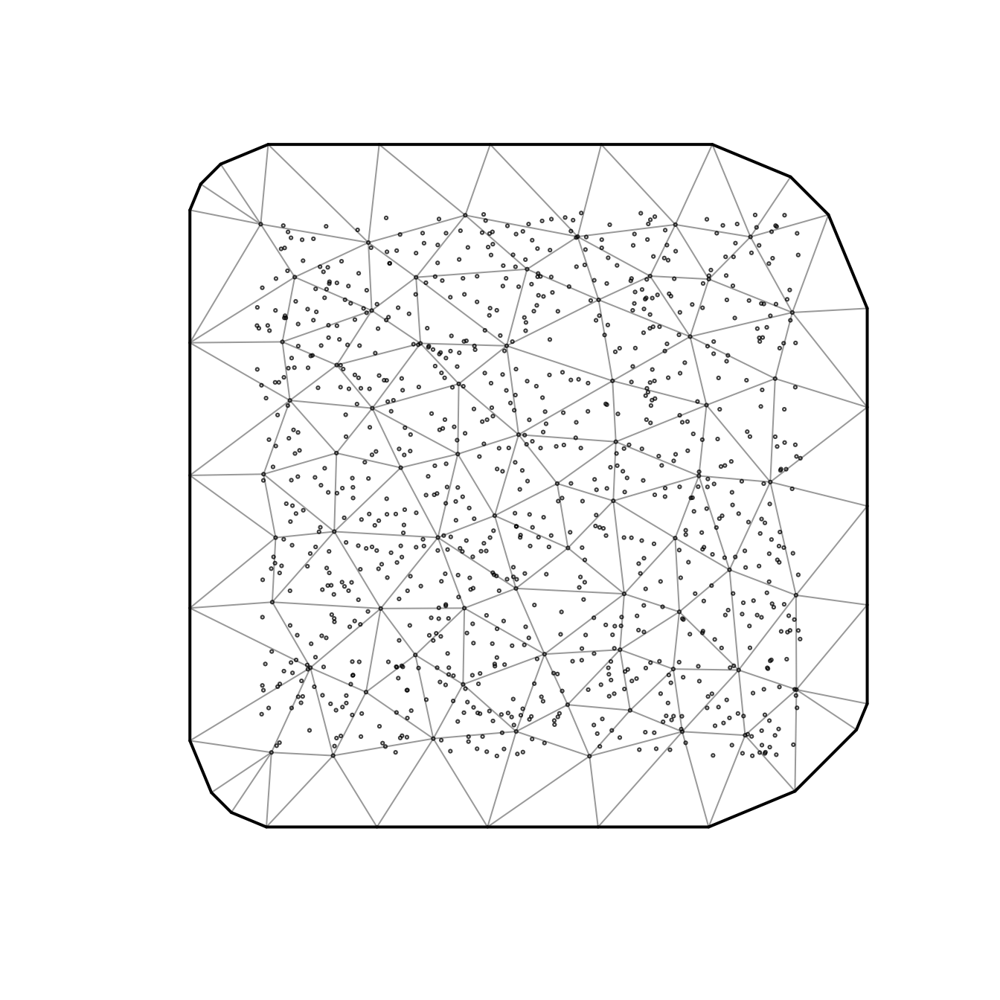

# Fitting multispecies models with sdmTMB

**If the code in this vignette has not been evaluated, a rendered
version is available on the [documentation
site](https://sdmTMB.github.io/sdmTMB/index.html) under ‘Articles’.**

``` r
library(sdmTMB)
```

For some applications, we might be interested in fitting a model that
includes multiple responses such as 2+ species, or multiple size or age
classes within a species. This is a form of multivariate model. The most
important step in fitting these models is understanding which parameters
are shared, and which parameters are species-specific.

Below, we illustrate a series of models. We’ll start by simulating a
2-species dataset. Each species is allowed to have unique spatial
standard deviations (`sigma_O`) as well as different year effects.

``` r
set.seed(1)
predictor_dat <- data.frame(
  X = runif(1000), Y = runif(1000),
  year = rep(1:5, each = 200)
)
predictor_dat$fyear <- as.factor(predictor_dat$year)
mesh <- make_mesh(predictor_dat, xy_cols = c("X", "Y"), cutoff = 0.1)
sim_dat_A <- sdmTMB_simulate(
  formula = ~ 0 + fyear,
  data = predictor_dat,
  time = "year",
  mesh = mesh,
  range = 0.2,
  family = gaussian(),
  seed = 42,
  sigma_O = 0.2,
  phi = 0.1,
  sigma_E = 0.3,
  B = runif(5, min = 5, max = 8) # 5 random year effects
)
sim_dat_A$species <- "A"
sim_dat_B <- sdmTMB_simulate(
  formula = ~ 0 + fyear,
  data = predictor_dat,
  time = "year",
  mesh = mesh,
  range = 0.2,
  family = gaussian(),
  seed = 43,
  sigma_O = 0.3,
  phi = 0.1,
  sigma_E = 0.3,
  B = runif(5, min = 5, max = 8) # 5 random year effects
)
sim_dat_B$species <- "B"
sim_dat <- rbind(sim_dat_A, sim_dat_B)
sim_dat$fyear <- factor(sim_dat$year)
```

We’ll start by making an SPDE mesh across the full dataset.

``` r
mesh <- make_mesh(sim_dat, c("X", "Y"), cutoff = 0.1)
plot(mesh)
```



### Model 1: species-specific intercepts

As a first model, we can include species-specific year effects. This can
be done in a couple ways. One option would be to estimate the
`species * year` interaction, letting the year effects for each species
be independent. Here, all other parameters and random effect values
(range, spatial field, spatial variance, spatiotemporal fields,
spatiotemporal variances) are shared.

``` r
fit <- sdmTMB(
  observed ~ fyear * species,
  data = sim_dat,
  time = "year",
  spatiotemporal = "iid",
  mesh = mesh,
  family = gaussian()
)
fit
#> Spatiotemporal model fit by ML ['sdmTMB']
#> Formula: observed ~ fyear * species
#> Mesh: mesh (isotropic covariance)
#> Time column: year
#> Data: sim_dat
#> Family: gaussian(link = 'identity')
#>  
#> Conditional model:
#>                 coef.est coef.se
#> (Intercept)         7.59    0.05
#> fyear2              0.36    0.05
#> fyear3              0.02    0.05
#> fyear4             -1.19    0.05
#> fyear5             -1.93    0.05
#> speciesB           -1.49    0.03
#> fyear2:speciesB     0.02    0.04
#> fyear3:speciesB    -0.71    0.04
#> fyear4:speciesB     0.70    0.04
#> fyear5:speciesB     3.45    0.04
#> 
#> Dispersion parameter: 0.27
#> Matérn range: 0.19
#> Spatial SD: 0.17
#> Spatiotemporal IID SD: 0.14
#> ML criterion at convergence: 329.263
#> 
#> See ?tidy.sdmTMB to extract these values as a data frame.
```

### Model 2: species-specific spatial fields

We may be interested in fitting a model that lets the spatial patterning
differ by species. These kinds of models can be expressed using
spatially varying coefficients. Note that we use `spatial = off` because
this represents a global spatial intercept—turning this off is akin to
using a `-1` of `0` in a main formula including a factor. Both species
take their spatial fields from the `spatial_varying` field here.

``` r
fit <- sdmTMB(
  observed ~ fyear * species,
  data = sim_dat,
  mesh = mesh,
  family = gaussian(),
  spatial = "off",
  time = "year",
  spatiotemporal = "iid",
  spatial_varying = ~ 0 + factor(species)
)
fit
#> Spatiotemporal model fit by ML ['sdmTMB']
#> Formula: observed ~ fyear * species
#> Mesh: mesh (isotropic covariance)
#> Time column: year
#> Data: sim_dat
#> Family: gaussian(link = 'identity')
#>  
#> Conditional model:
#>                 coef.est coef.se
#> (Intercept)         7.60    0.06
#> fyear2              0.36    0.05
#> fyear3              0.04    0.05
#> fyear4             -1.22    0.05
#> fyear5             -1.94    0.05
#> speciesB           -1.51    0.08
#> fyear2:speciesB     0.02    0.03
#> fyear3:speciesB    -0.75    0.03
#> fyear4:speciesB     0.76    0.03
#> fyear5:speciesB     3.48    0.03
#> 
#> Dispersion parameter: 0.19
#> Matérn range: 0.18
#> Spatially varying coefficient SD (factor(species)A): 0.25
#> Spatially varying coefficient SD (factor(species)B): 0.30
#> Spatiotemporal IID SD: 0.16
#> ML criterion at convergence: -170.949
#> 
#> See ?tidy.sdmTMB to extract these values as a data frame.
```

You’ll notice that there are two rows of entries for `sigma_Z` our
spatially varying random field standard deviation:

``` r
tidy(fit, "ran_pars")
#> # A tibble: 5 × 5
#>   term    estimate std.error conf.low conf.high
#>   <chr>      <dbl>     <dbl>    <dbl>     <dbl>
#> 1 range      0.181   0.0250     0.139     0.238
#> 2 phi        0.189   0.00330    0.183     0.195
#> 3 sigma_E    0.162   0.0129     0.139     0.190
#> 4 sigma_Z    0.250   0.0268     0.203     0.308
#> 5 sigma_Z    0.302   0.0303     0.248     0.367
```

This means that our model is trying to estimate separate
species-specific variance terms for the species-specific spatial fields
(say *that* 10 times fast!). Here, that matches how we simulated the
data. In other contexts, especially if we ran into estimation issues, we
might want to share those SDs.

If we wanted to estimate species-specific spatial fields with a single
shared variance (meaning the net magnitude of the peaks and valleys in
the fields were similar but the wiggles themselves were species
specific), we could do that by specifying a custom map argument and
passing it into
[`sdmTMBcontrol()`](https://sdmTMB.github.io/sdmTMB/reference/sdmTMBcontrol.md).
Any shared factor levels in the `map` are gathered to have ‘mirrored’ or
shared parameter values. We assign these to `ln_tau_Z` because,
internally, this is the parameter that gets converted into the
spatially-varying field variances (the SDs of those fields are
`sigma_Z`).

This case is pretty simple, but for more complicated cases we could
figure out the structure of our needed `map` vector as follows:

``` r
colnames(model.matrix(~ 0 + factor(species), data = sim_dat))
#> [1] "factor(species)A" "factor(species)B"
```

So, we need a vector of length two with shared factor values:

``` r
map_list <- list(ln_tau_Z = factor(c(1, 1)))
```

Then, we can use our map list to share the spatially varying coefficient
SDs:

``` r
fit <- sdmTMB(
  observed ~ fyear * factor(species),
  data = sim_dat,
  mesh = mesh,
  family = gaussian(),
  spatial = "off",
  time = "year",
  spatiotemporal = "iid",
  spatial_varying = ~ 0 + factor(species),
  control = sdmTMBcontrol(map = map_list)
)
fit
#> Spatiotemporal model fit by ML ['sdmTMB']
#> Formula: observed ~ fyear * factor(species)
#> Mesh: mesh (isotropic covariance)
#> Time column: year
#> Data: sim_dat
#> Family: gaussian(link = 'identity')
#>  
#> Conditional model:
#>                         coef.est coef.se
#> (Intercept)                 7.60    0.06
#> fyear2                      0.35    0.05
#> fyear3                      0.04    0.05
#> fyear4                     -1.23    0.05
#> fyear5                     -1.94    0.05
#> factor(species)B           -1.51    0.08
#> fyear2:factor(species)B     0.02    0.03
#> fyear3:factor(species)B    -0.75    0.03
#> fyear4:factor(species)B     0.76    0.03
#> fyear5:factor(species)B     3.48    0.03
#> 
#> Dispersion parameter: 0.19
#> Matérn range: 0.18
#> Spatially varying coefficient SD (factor(species)A): 0.28
#> Spatially varying coefficient SD (factor(species)B): 0.28
#> Spatiotemporal IID SD: 0.16
#> ML criterion at convergence: -170.110
#> 
#> See ?tidy.sdmTMB to extract these values as a data frame.
```

Notice the spatially varying coefficient SD is now shared.

### Model 3: species-specific spatiotemporal fields

In all of the examples above, spatiotemporal fields are included, but
shared among species. As another example, we can extend the above
approaches to set up a model that includes spatiotemporal fields unique
to each species.

One approach to including separate spatiotemporal fields by species is
creating a new variable that is a concatenation of species and year (or
any given time step factor). For example, we can then implement this
form of species-specific spatiotemporal variation by changing the `time`
argument to be `time = "species_year"`.

``` r
sim_dat$species_year <- factor(paste(sim_dat$species, sim_dat$year))
map_list <- list(ln_tau_Z = factor(c(1, 1)))
fit <- sdmTMB(
  observed ~ fyear * factor(species),
  data = sim_dat,
  mesh = mesh,
  family = gaussian(),
  spatial = "on",
  time = "species_year",
  spatiotemporal = "iid",
  spatial_varying = ~ 0 + factor(species),
  control = sdmTMBcontrol(map = map_list)
)
fit
#> Spatiotemporal model fit by ML ['sdmTMB']
#> Formula: observed ~ fyear * factor(species)
#> Mesh: mesh (isotropic covariance)
#> Time column: species_year
#> Data: sim_dat
#> Family: gaussian(link = 'identity')
#>  
#> Conditional model:
#>                         coef.est coef.se
#> (Intercept)                 7.56    0.07
#> fyear2                      0.38    0.08
#> fyear3                      0.06    0.08
#> fyear4                     -1.19    0.08
#> fyear5                     -1.92    0.08
#> factor(species)B           -1.43    0.10
#> fyear2:factor(species)B    -0.03    0.11
#> fyear3:factor(species)B    -0.79    0.11
#> fyear4:factor(species)B     0.67    0.11
#> fyear5:factor(species)B     3.41    0.11
#> 
#> Dispersion parameter: 0.10
#> Matérn range: 0.16
#> Spatial SD: 0.06
#> Spatially varying coefficient SD (factor(species)A): 0.24
#> Spatially varying coefficient SD (factor(species)B): 0.24
#> Spatiotemporal IID SD: 0.31
#> ML criterion at convergence: -917.577
#> 
#> See ?tidy.sdmTMB to extract these values as a data frame.
```

### Model 4: species-specific spatiotemporal fields using the `spatial_varying` argument

We can fit the same model by using the `spatial_varying` argument. This
would give us the added flexibility of letting each species’
spatiotemporal field have its own variance if we wanted or if expanding
our model to have another category of independent random fields. E.g.,
we might also have age or length bins.

First, we’ll have the spatial fields share their variance and the
spatiotemporal fields share their variance:

``` r
# quick hack to force all levels of species and species:factor interactions in formula:
mm1 <- model.matrix(~ 0 + factor(species), sim_dat)
mm2 <- model.matrix(~ 0 + factor(year):factor(species), sim_dat)
mm <- cbind(mm1, mm2)
sim_dat2 <- cbind(sim_dat, mm)

# make our map vector:
n_sp <- ncol(mm1)
n_st <- ncol(mm2)
map_list2 <- list(ln_tau_Z = factor(
  c(rep(1, n_sp),
  rep(2, n_st))
))
map_list2
#> $ln_tau_Z
#>  [1] 1 1 2 2 2 2 2 2 2 2 2 2
#> Levels: 1 2

# hack together a model formula based on our hand constructed model matrix:
svc_formula <- as.formula(paste0("~ `", paste(colnames(mm), collapse = "` + `"), "`"))
svc_formula
#> ~`factor(species)A` + `factor(species)B` + `factor(year)1:factor(species)A` + 
#>     `factor(year)2:factor(species)A` + `factor(year)3:factor(species)A` + 
#>     `factor(year)4:factor(species)A` + `factor(year)5:factor(species)A` + 
#>     `factor(year)1:factor(species)B` + `factor(year)2:factor(species)B` + 
#>     `factor(year)3:factor(species)B` + `factor(year)4:factor(species)B` + 
#>     `factor(year)5:factor(species)B`

fit_svc <- sdmTMB(
  observed ~ fyear * factor(species),
  data = sim_dat2,
  mesh = mesh,
  family = gaussian(),
  spatial = "off",
  time = "year",
  spatiotemporal = "off",
  spatial_varying = svc_formula,
  control = sdmTMBcontrol(map = map_list2)
)
```

We now have exactly the same model, just specified differently:

``` r
logLik(fit)
#> 'log Lik.' 917.5774 (df=15)
logLik(fit_svc)
#> 'log Lik.' 917.5177 (df=14)
```

Say we wanted to let the spatial and spatiotemporal variances be
different for each species. We could do that by changing the map vector:

``` r
colnames(mm)
#>  [1] "factor(species)A"               "factor(species)B"              
#>  [3] "factor(year)1:factor(species)A" "factor(year)2:factor(species)A"
#>  [5] "factor(year)3:factor(species)A" "factor(year)4:factor(species)A"
#>  [7] "factor(year)5:factor(species)A" "factor(year)1:factor(species)B"
#>  [9] "factor(year)2:factor(species)B" "factor(year)3:factor(species)B"
#> [11] "factor(year)4:factor(species)B" "factor(year)5:factor(species)B"
map_list3 <- list(ln_tau_Z = factor(
  c(c(1, 2),
  rep(3, n_st/2),
  rep(4, n_st/2)
)))
# check:
data.frame(map_value = map_list3$ln_tau_Z, svc_term = colnames(mm))
#>    map_value                       svc_term
#> 1          1               factor(species)A
#> 2          2               factor(species)B
#> 3          3 factor(year)1:factor(species)A
#> 4          3 factor(year)2:factor(species)A
#> 5          3 factor(year)3:factor(species)A
#> 6          3 factor(year)4:factor(species)A
#> 7          3 factor(year)5:factor(species)A
#> 8          4 factor(year)1:factor(species)B
#> 9          4 factor(year)2:factor(species)B
#> 10         4 factor(year)3:factor(species)B
#> 11         4 factor(year)4:factor(species)B
#> 12         4 factor(year)5:factor(species)B

fit_svc_separate <- sdmTMB(
  observed ~ fyear * factor(species),
  data = sim_dat2,
  mesh = mesh,
  family = gaussian(),
  spatial = "off",
  time = "year",
  spatiotemporal = "off",
  spatial_varying = svc_formula,
  control = sdmTMBcontrol(map = map_list3)
)
fit_svc_separate
#> Spatial model fit by ML ['sdmTMB']
#> Formula: observed ~ fyear * factor(species)
#> Mesh: mesh (isotropic covariance)
#> Time column: year
#> Data: sim_dat2
#> Family: gaussian(link = 'identity')
#>  
#> Conditional model:
#>                         coef.est coef.se
#> (Intercept)                 7.56    0.07
#> fyear2                      0.38    0.08
#> fyear3                      0.06    0.08
#> fyear4                     -1.19    0.08
#> fyear5                     -1.92    0.08
#> factor(species)B           -1.43    0.10
#> fyear2:factor(species)B    -0.03    0.11
#> fyear3:factor(species)B    -0.79    0.11
#> fyear4:factor(species)B     0.67    0.11
#> fyear5:factor(species)B     3.42    0.11
#> 
#> Dispersion parameter: 0.10
#> Matérn range: 0.16
#> Spatially varying coefficient SD (`factor(species)A`): 0.21
#> Spatially varying coefficient SD (`factor(species)B`): 0.28
#> Spatially varying coefficient SD (`factor(year)1:factor(species)A`): 0.31
#> Spatially varying coefficient SD (`factor(year)2:factor(species)A`): 0.31
#> Spatially varying coefficient SD (`factor(year)3:factor(species)A`): 0.31
#> Spatially varying coefficient SD (`factor(year)4:factor(species)A`): 0.31
#> Spatially varying coefficient SD (`factor(year)5:factor(species)A`): 0.31
#> Spatially varying coefficient SD (`factor(year)1:factor(species)B`): 0.30
#> Spatially varying coefficient SD (`factor(year)2:factor(species)B`): 0.30
#> Spatially varying coefficient SD (`factor(year)3:factor(species)B`): 0.30
#> Spatially varying coefficient SD (`factor(year)4:factor(species)B`): 0.30
#> Spatially varying coefficient SD (`factor(year)5:factor(species)B`): 0.30
#> ML criterion at convergence: -918.900
#> 
#> See ?tidy.sdmTMB to extract these values as a data frame.
```

Now we have separate SDs for the spatial and spatiotemporal fields
across species.

But in this case, marginal AIC does not indicate an improvement from
this added flexibility:

``` r
AIC(fit_svc, fit_svc_separate)
#>                  df       AIC
#> fit_svc          14 -1807.035
#> fit_svc_separate 16 -1805.801
```

### Model 5: hack species into the time element for spatial models

If we only wanted to fit a spatial model but had several species (or
other groups), one approach is to pretend our species (or other group)
is the time element.

``` r
sim_dat$numeric_species <- as.numeric(factor(sim_dat$species)) # needs to be numeric
fit_fake_time <- sdmTMB(
  observed ~ 0 + factor(species),
  data = sim_dat,
  mesh = mesh,
  family = gaussian(),
  spatial = "off",
  time = "numeric_species", #< hack
  spatiotemporal = "iid" #< 'AR1' or 'RW' probably wouldn't make sense here
)
fit_fake_time
#> Spatiotemporal model fit by ML ['sdmTMB']
#> Formula: observed ~ 0 + factor(species)
#> Mesh: mesh (isotropic covariance)
#> Time column: numeric_species
#> Data: sim_dat
#> Family: gaussian(link = 'identity')
#>  
#> Conditional model:
#>                  coef.est coef.se
#> factor(species)A     7.01    0.08
#> factor(species)B     6.27    0.08
#> 
#> Dispersion parameter: 0.86
#> Matérn range: 0.33
#> Spatiotemporal IID SD: 0.21
#> ML criterion at convergence: 2568.873
#> 
#> See ?tidy.sdmTMB to extract these values as a data frame.
```

This is just a convenience though. We could instead do the same thing
using the `spatial_varying` argument making sure to ‘map’ the field
variances to be shared to match the above:

``` r
fit_svc3 <- sdmTMB(
  observed ~ 0 + factor(species),
  data = sim_dat,
  mesh = mesh,
  family = gaussian(),
  spatial = "off",
  spatial_varying = ~ 0 + factor(species),
  control = sdmTMBcontrol(map = list(ln_tau_Z = factor(c(1, 1))))
)
fit_svc3
#> Spatial model fit by ML ['sdmTMB']
#> Formula: observed ~ 0 + factor(species)
#> Mesh: mesh (isotropic covariance)
#> Data: sim_dat
#> Family: gaussian(link = 'identity')
#>  
#> Conditional model:
#>                  coef.est coef.se
#> factor(species)A     7.01    0.08
#> factor(species)B     6.27    0.08
#> 
#> Dispersion parameter: 0.86
#> Matérn range: 0.33
#> Spatially varying coefficient SD (factor(species)A): 0.21
#> Spatially varying coefficient SD (factor(species)B): 0.21
#> ML criterion at convergence: 2568.873
#> 
#> See ?tidy.sdmTMB to extract these values as a data frame.
```

We can prove they’re identical:

``` r
logLik(fit_fake_time)
#> 'log Lik.' -2568.873 (df=5)
logLik(fit_svc3)
#> 'log Lik.' -2568.873 (df=5)
```

### Putting it all together

These examples illustrate a number of ways that species-specific effects
can be included in `sdmTMB` models, and can be extended to other
categories/groups/cohorts within a species for which one wants to
control the amount of information shared between groups (e.g., age-,
size-, or stage-specific estimates). A brief summary of these approaches
can be summarized as:

| Form                                             | Implementation                                  |
|:-------------------------------------------------|:------------------------------------------------|
| Main effects                                     | Year-by-species interactions or smooths by year |
| Spatial effects                                  | Spatially varying coefficients                  |
| Spatial effects, shared variance                 | Spatially varying coefficients + map argument   |
| Spatiotemporal effects, shared variance          | Species-year factor as time variable            |
| Spatiotemporal effects, group-specific variances | Spatially varying coefficients + map argument   |
| Any set of spatial and spatiotemporal effects    | Spatially varying coefficients + map argument   |

### Further extensions

As long as you’re willing to treat spatiotemporal and group-level fields
(e.g., for different species or age cohorts) as independent, sdmTMB can
be used to fit models to these data. For example, this allows sdmTMB to
be used for standardization of age or length composition data as in
[Thorson and Haltuch (2018)
CJFAS](https://doi.org/10.1139/cjfas-2018-0015). The approach is to
similar to the above and we plan to write a separate vignette on the
topic.
