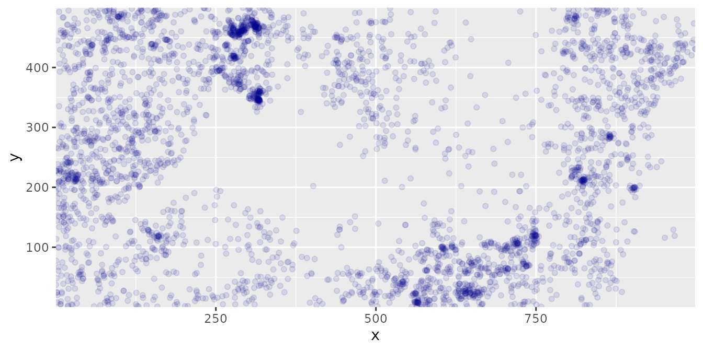
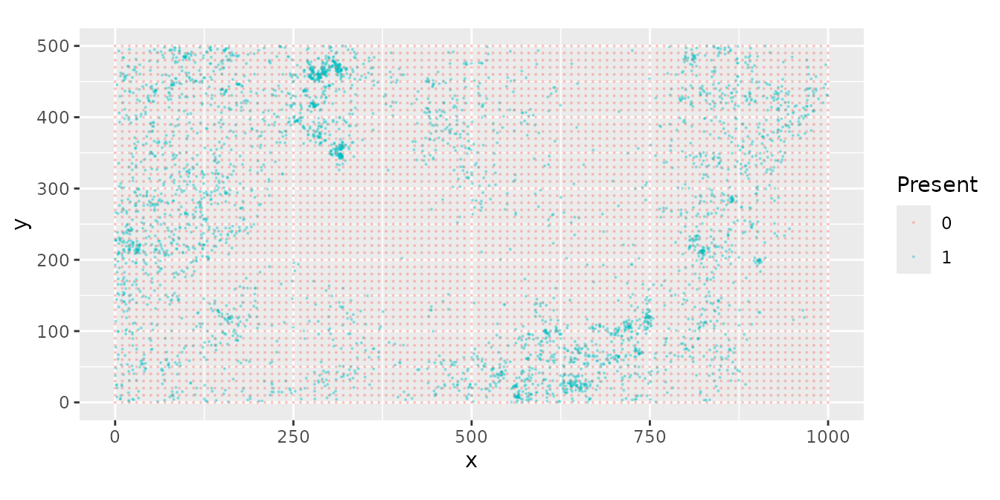
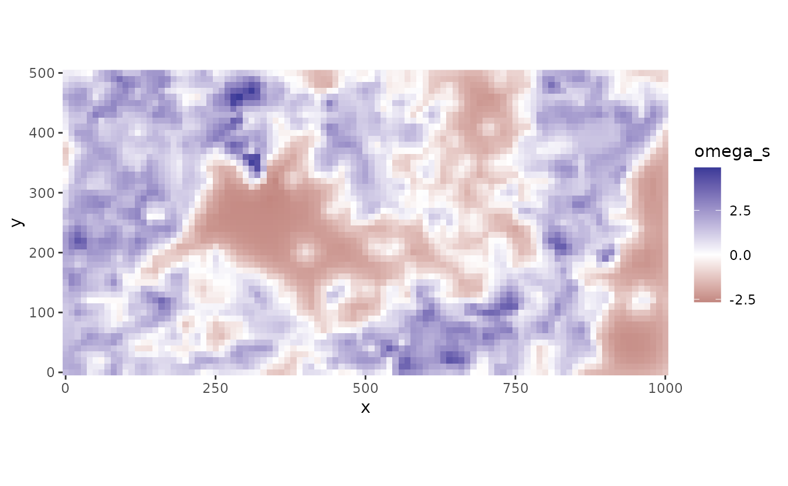
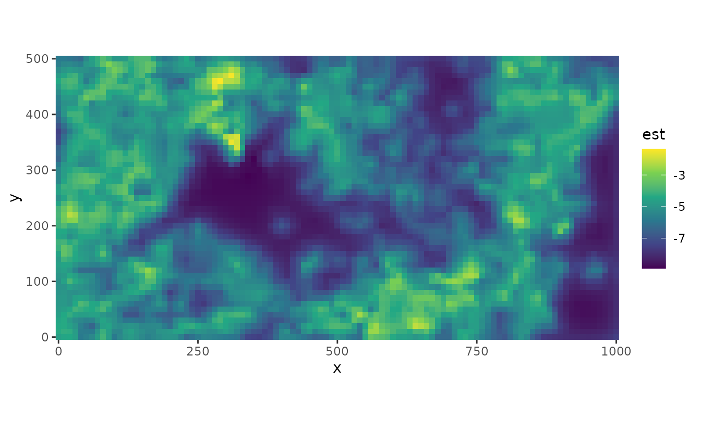
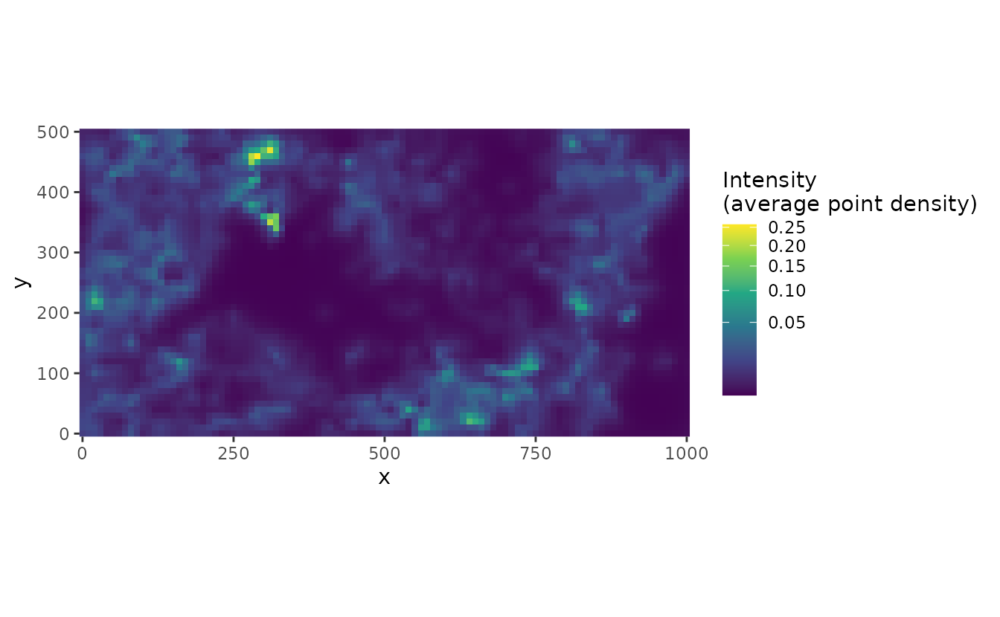

# Spatial Modeling of Presence-Only Data with sdmTMB

While some geostatistical datasets contain information on presences and
absences of species, others only include only locations where presence
is observed. While presence-only modelling is commonly used in ecology
and fisheries, there are also applications in other fields
(e.g. dynamics of rare diseases). There are several approaches for
analyzing these types of data—we illustrate two applications below, and
in both utilize simulated zeros (pseudo-absences).

``` r
library(dplyr)
library(sdmTMB)
library(ggplot2)
library(spatstat.data)
```

By adding pseudo-absences to presence-only data, we can estimate a
spatial range that isn’t sensitive to choice of raster or lattice
resolution.

As an example dataset, we will use data on the locations of 3605 trees
(species *Beilschmiedia pendula*) in a tropical rainforest from [the
spatst.data package](https://rdrr.io/cran/spatstat.data/man/bei.html)

## Data

### Presence data

These data come from the `spatstat` package, and consist of point
locations of 3605 trees on Barro Colorado Island (Panama). From
`spatstat`, *the data files kindly supplied by Rasmus Waagepetersen*

The data are stored in the `bei` dataframe,

``` r
dat <- data.frame(
  x = spatstat.data::bei$x,
  y = spatstat.data::bei$y
)
```

The distribution of trees is obviously not uniform and the middle of the
map has very few trees.



### Generate pseudo-absences

There are several approaches to generating pseudo-absences from these
data. We first use a method called quadrature points ([Renner et
al. 2015](https://doi.org/10.1111/2041-210X.12352)). For this method, we
have to decide:

1.  Distribution of zeroes  

- Regularly spaced (e.g. on a grid or lattice?)
- Random  
- Higher density where environmental variability is high (suggestion by
  Renner et al. 2015)

2.  How many zeroes to generate?  

- Large enough so that predictive performance does not change as more
  are added

Here, we will use a uniform grid strategy to create ~5000 points. To
test whether the number of pseudo-absences is sufficient, `res` can be
decreased, and model performance can be compared. For instance, to
increase the number of pseudo-absences to ~20,000 points, we could
change `res <- 5`. In this example, increasing the number of zeroes to
~20,000 only marginally improves model performance, so 5,000 zeroes is
sufficient.

``` r
res <- 10 # Determines resolution: lower value will increase number of zeroes generated

# zeros is generated on a grid for this example, but other strategies could be used
zeros <- expand.grid(
  x = seq(0, 1000, by = res),
  y = seq(0, 500, by = res)
)
```

Then, we combine the presence and pseudo-absence data, and use
`$present` to separate occurrences from pseudo-absences.

``` r
dat$present <- 1
zeros$present <- 0
all_dat <- rbind(dat, zeros)
```

Next we can create the mesh. The resolution of mesh can be changed with
the `cutoff` value, which determines the minimum distance between
locations in X-Y units. Increasing the cutoff will decrease the
resolution of the mesh. In this example, a higher resolution mesh of
`cutoff=15` marginally improved model performance over `cutoff=25`.

``` r
mesh <- make_mesh(
  all_dat,
  xy_cols = c("x", "y"),
  cutoff = 15 # min. distance between knots in X-Y units
)
```

The dimensions of the mesh (or number of vertices or knots) can be
accessed with `mesh$mesh$n`. A cutoff distance of 15 yields ~ 1399
knots, and a cutoff distance of 25 yields a mesh with 624 knots.

In the following plot, blue dots are data and red grid dots are
quadrature points.



## Model Options

### 1) Infinitely Weighted Logistic Regression (IWLR) and sdmTMB

Several approaches exist for estimating a model with pseudo-absences.
These are similar, but have different likelihood models. First, we can
use an Infinitely Weighted Logistic Regression [Fithian & Hastie
(2013)](https://doi.org/10.1214/13-AOAS667) for the model.

The first step is to calculate weights. Weights will be 1 for true
occurrences and a very large number (`nW`) for pseudo-absences.

``` r
nW <- 1.0e6
all_dat$wt <- nW^(1 - all_dat$present)
```

And use sdmTMB to fit the model.

``` r
fit <- sdmTMB(
  present ~ 1,
  data = all_dat,
  mesh = mesh,
  family = binomial(link = "logit"),
  weights = all_dat$wt
)
```

We can inspect the model output.

``` r
summary(fit)
#> Spatial model fit by ML ['sdmTMB']
#> Formula: present ~ 1
#> Mesh: mesh (isotropic covariance)
#> Data: all_dat
#> Family: binomial(link = 'logit')
#>  
#> Conditional model:
#>             coef.est coef.se
#> (Intercept)    -15.5    0.17
#> 
#> Matérn range: 57.49
#> Spatial SD: 1.73
#> ML criterion at convergence: 52267.406
#> 
#> See ?tidy.sdmTMB to extract these values as a data frame.
```

A criticism of this approach is that the intercept and log-likelihood
can be affected by `nW` ([Renner et
al. 2015](https://doi.org/10.1111/2041-210X.12352))

### 2) Downweighted Poisson Regression (DWPR)

Another option is the Downweighted Poisson Regression, which is similar
to IWLR but uses different weights and doesn’t have the same arbitrary
effects on intercept and likelihood

First we re-calculate weights (note they’re different than IWLR):

``` r
# small values at presence locations
all_dat$wt <- 1e-6

# pseudo-absences: area per quadrature point
tot_area <- diff(range(dat$x)) * diff(range(dat$y))
n_zeros <- length(which(all_dat$present == 0))

all_dat$wt <- ifelse(all_dat$present == 1,
  1e-6, tot_area / n_zeros
)
```

Then fit the model with the new weights and a Poisson distribution

``` r
fit <- sdmTMB(
  present / wt ~ 1,
  data = all_dat,
  mesh = mesh,
  family = poisson(link = "log"),
  weights = all_dat$wt
)
```

And inspect the output

``` r
summary(fit)
#> Spatial model fit by ML ['sdmTMB']
#> Formula: present/wt ~ 1
#> Mesh: mesh (isotropic covariance)
#> Data: all_dat
#> Family: poisson(link = 'log')
#>  
#> Conditional model:
#>             coef.est coef.se
#> (Intercept)    -6.26    0.17
#> 
#> Matérn range: 57.49
#> Spatial SD: 1.73
#> ML criterion at convergence: 65147.461
#> 
#> See ?tidy.sdmTMB to extract these values as a data frame.
```

We can plot the random spatial effects



We can predict spatial distribution both in link (log) space:



Or natural space:



To evaluate the predictive performance, there are multiple options for
binary data. AUC (Area Under the receiver operating characteristic
curve) is a common metric, where values near 0.5 are essentially random,
and values close to 1 indicate better predictive performance. We can use
the package
[ROCR](https://cran.rstudio.com/web/packages/ROCR/vignettes/ROCR.html).

``` r
all_dat$p <- predict(fit)$est # total predictions, logit
rocr <- ROCR::prediction(exp(all_dat$p), all_dat$present)
ROCR::performance(rocr, measure = "auc")@y.values[[1]]
```
