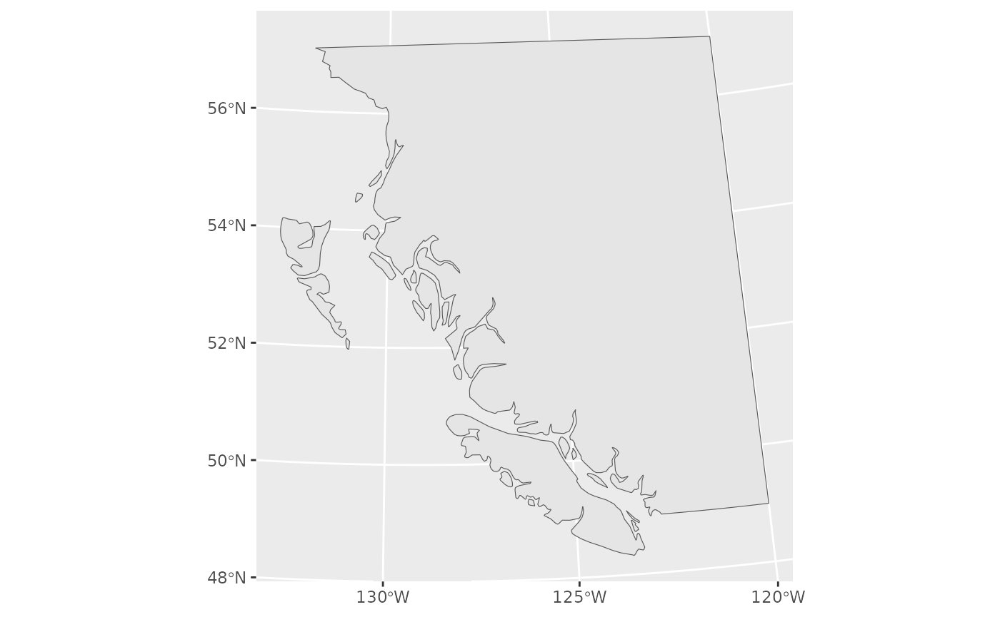
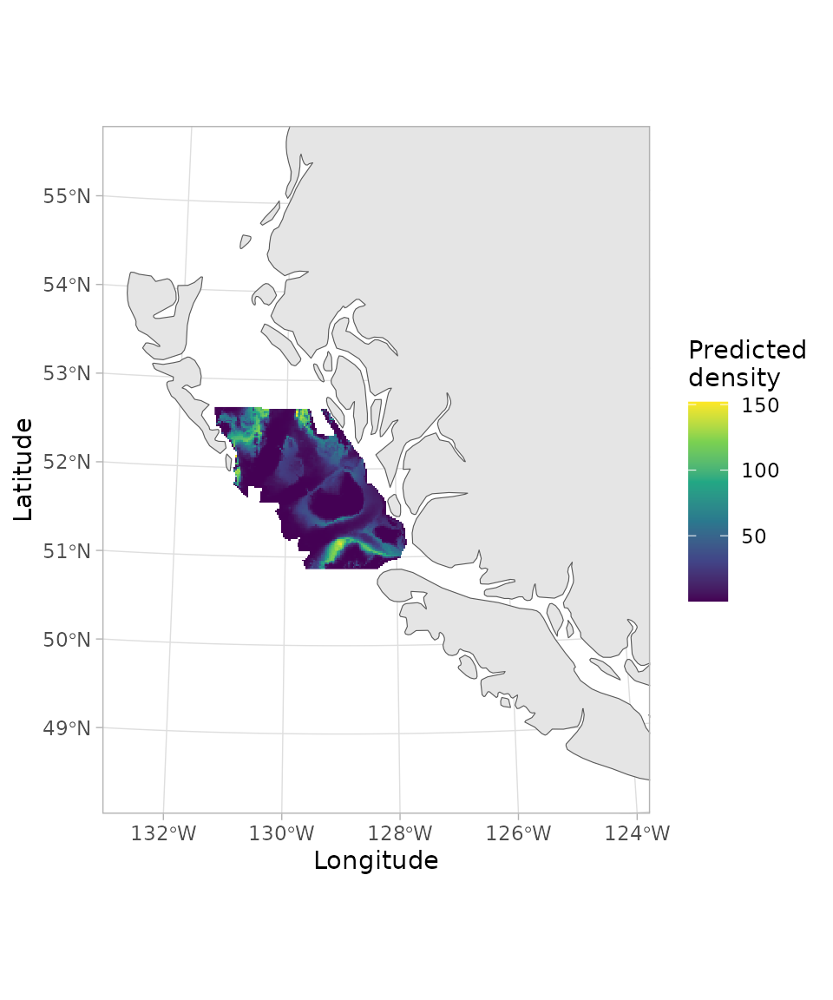

# Making pretty maps with sdmTMB output

**If the code in this vignette has not been evaluated, a rendered
version is available on the [documentation
site](https://sdmTMB.github.io/sdmTMB/index.html) under ‘Articles’.**

This vignette illustrates how to make gridded/raster maps of sdmTMB
output (or gridded data from any source) on a base map of class sf.

``` r
library(ggplot2)
library(sdmTMB)
```

First, we will download coastline data for our region. We will use a
medium resolution version. For applied situations on finer scales, you
may want to use `scale = "large"`.

``` r
map_data <- rnaturalearth::ne_countries(
  scale = "medium",
  returnclass = "sf", country = "canada")
# Crop the polygon for plotting and efficiency:
# st_bbox(map_data) # find the rough coordinates
bc_coast <- suppressWarnings(suppressMessages(
  sf::st_crop(map_data,
    c(xmin = -134, ymin = 46, xmax = -120, ymax = 57))))
```

Transform our map into UTM 9 coordinates, which is the equal-area
projection we fit in:

``` r
utm_zone9 <- 3156
bc_coast_proj <- sf::st_transform(bc_coast, crs = utm_zone9)
```

If you don’t know the crs number (3156 above), you can look it up by
googling it or looking on <https://epsg.io/>. For example,
<https://epsg.io/3156>.

Look at our base map:

``` r
ggplot(bc_coast_proj) + geom_sf()
```



Now we will fit a model and predict on a grid. The coordinates X and Y
are already UTM zone 9 coordinates (in km).

``` r
d <- subset(pcod, year == 2017)
pcod_spde <- make_mesh(d, c("X", "Y"), cutoff = 30)
m <- sdmTMB(density ~ 0 + depth_scaled + depth_scaled2,
  data = d, mesh = pcod_spde, family = tweedie(link = "log"))
p <- predict(m, newdata = qcs_grid)
```

We can use
[`sf::st_boundary()`](https://r-spatial.github.io/sf/reference/geos_unary.html)
to help find reasonable limits on our map (output not shown):

``` r
sf::st_boundary(bc_coast_proj)
```

Finally, we will combine our gridded predictions with the base map. We
will multiply the `X` and `Y` columns by 1000 because we worked in UTM
km for model fitting (to avoid computational issues with the scale of
the range parameter):

``` r
ggplot(bc_coast_proj) + geom_sf() +
  geom_raster(data = p, aes(x = X * 1000, y = Y * 1000, fill = exp(est))) +
  xlim(230957.7, 1157991 - 300000) +
  ylim(5366427, 6353456 - 200000) +
  scale_fill_viridis_c() +
  theme_light() +
  labs(fill = "Predicted\ndensity") +
  labs(x = "Longitude", y = "Latitude")
```


