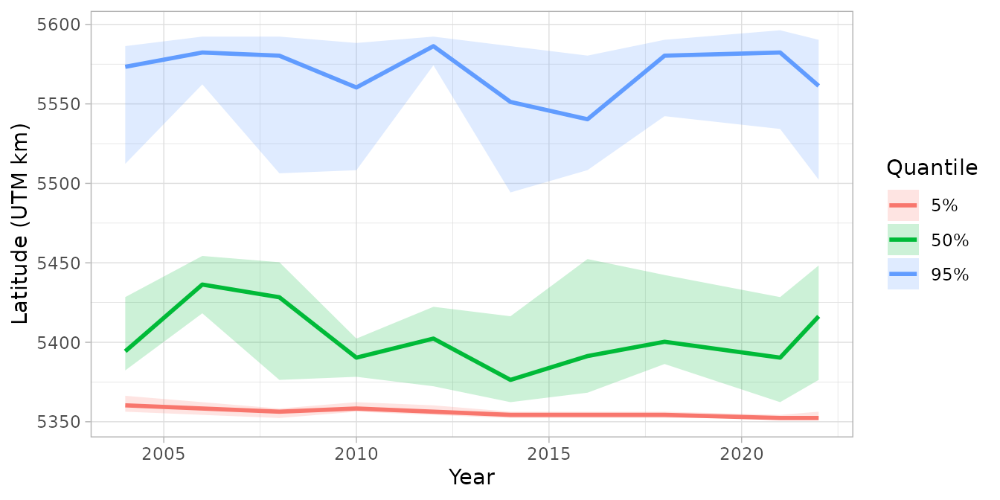
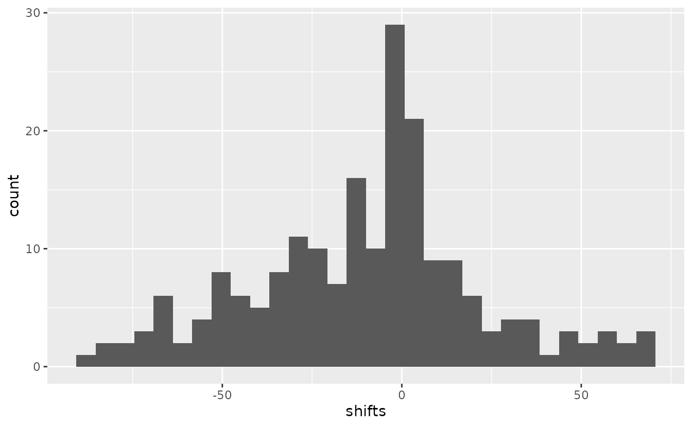

# Calculating range edges

**If the code in this vignette has not been evaluated, a rendered
version is available on the [documentation
site](https://sdmTMB.github.io/sdmTMB/index.html) under ‘Articles’.**

``` r
library(ggplot2)
library(dplyr)
library(sdmTMB)
```

## Introduction

Range edges are useful metrics for understanding species distributions
and how they change over time. The
[`get_range_edge()`](https://sdmTMB.github.io/sdmTMB/reference/get_range_edge.md)
function calculates range edges as density-weighted quantiles along a
spatial axis (e.g., latitude, longitude, or depth). This approach
follows methods used in Fredston et al. 2021 from VAST.

Range edges are calculated by:

1.  Ordering spatial locations along a user-specified axis
2.  Calculating the cumulative proportion of total density along that
    axis
3.  Finding positions where the cumulative proportion equals target
    quantiles
4.  Using simulation from the joint precision matrix to quantify
    uncertainty

In this vignette, we’ll demonstrate calculating range edges for Pacific
Spiny Dogfish (*Squalus suckleyi*) along the latitude axis on the west
coast of Vancouver Island.

## Data

We’ll use the built-in `dogfish` dataset, which contains
fisheries-independent trawl survey data from the west coast of Vancouver
Island. The data includes catch weights, presence/absence, depth, and
area swept.

``` r
glimpse(dogfish)
#> Rows: 1,458
#> Columns: 9
#> $ year         <int> 2004, 2004, 2004, 2004, 2004, 2004, 2004, 2004, 2004, 200…
#> $ longitude    <dbl> -125.1928, -125.8362, -125.7952, -125.6383, -125.7022, -1…
#> $ latitude     <dbl> 48.68167, 48.22183, 48.30733, 48.29017, 48.36000, 48.3645…
#> $ X            <dbl> 780.2098, 734.9809, 737.6287, 749.3395, 744.2715, 737.449…
#> $ Y            <dbl> 5399.066, 5345.797, 5355.425, 5354.015, 5361.570, 5361.78…
#> $ present      <int> 1, 0, 0, 1, 1, 1, 1, 0, 1, 1, 1, 1, 1, 1, 1, 1, 0, 0, 0, …
#> $ catch_weight <dbl> 22.7, 0.0, 0.0, 221.1, 439.8, 48.2, 13.5, 0.0, 47.9, 68.2…
#> $ area_swept   <dbl> 0.10288, 0.10288, 0.11574, 0.12217, 0.09645, 0.12217, 0.1…
#> $ depth        <dbl> 73, 455, 171, 137, 140, 145, 320, 279, 117, 70, 61, 77, 9…
```

For prediction, we’ll use the `wcvi_grid`, which provides a spatial grid
covering the survey area:

``` r
glimpse(wcvi_grid)
#> Rows: 2,689
#> Columns: 3
#> $ X     <dbl> 733.9852, 735.9852, 737.9852, 735.9852, 737.9852, 739.9852, 735.…
#> $ Y     <dbl> 5346.334, 5346.334, 5346.334, 5348.334, 5348.334, 5348.334, 5350…
#> $ depth <dbl> 447, 442, 433, 312, 295, 400, 287, 233, 352, 449, 402, 390, 382,…
```

## Fitting a spatiotemporal model

First, we’ll construct a mesh for the spatial random effects:

``` r
mesh <- make_mesh(dogfish, c("X", "Y"), cutoff = 10)
```

Next, we’ll fit a spatiotemporal model for dogfish density using a delta
generalized-gamma family (Dunic et al. 2025). This models the positive
catches with a generalized gamma distribution that works well for
Pacific Dogfish given their occasional giant outlying catch values. A
simpler Tweedie or delta-gamma family could have been used too. We’ll
include depth as a predictor using a quadratic effect:

``` r
fit <- sdmTMB(
  catch_weight ~ poly(log(depth), 2),
  data = dogfish,
  mesh = mesh,
  family = delta_gengamma(type = "poisson-link"),
  spatial = "on",
  time = "year",
  spatiotemporal = "IID"
)
sanity(fit)
#> ✔ Non-linear minimizer suggests successful convergence
#> ✔ Hessian matrix is positive definite
#> ✔ No extreme or very small eigenvalues detected
#> ✔ No gradients with respect to fixed effects are >= 0.001
#> ✔ No fixed-effect standard errors are NA
#> ✔ No standard errors look unreasonably large
#> ✔ No sigma parameters are < 0.01
#> ✔ No sigma parameters are > 100
#> ✔ Range parameters don't look unreasonably large
fit
#> Spatiotemporal model fit by ML ['sdmTMB']
#> Formula: catch_weight ~ poly(log(depth), 2)
#> Mesh: mesh (isotropic covariance)
#> Time column: year
#> Data: dogfish
#> Family: delta_gengamma(link1 = 'log', link2 = 'log', type = 'poisson-link')
#> 
#> Delta/hurdle model 1: -----------------------------------
#> Family: binomial(link = 'log') 
#> Conditional model:
#>                      coef.est coef.se
#> (Intercept)              0.17    0.38
#> poly(log(depth), 2)1    -9.28    4.42
#> poly(log(depth), 2)2   -30.68    3.23
#> 
#> Matérn range: 54.35
#> Spatial SD: 0.96
#> Spatiotemporal IID SD: 1.31
#> 
#> Delta/hurdle model 2: -----------------------------------
#> Family: gengamma(link = 'log') 
#> Conditional model:
#>                      coef.est coef.se
#> (Intercept)              2.71    0.29
#> poly(log(depth), 2)1    -5.53    3.06
#> poly(log(depth), 2)2    -7.98    2.54
#> 
#> Dispersion parameter: 1.08
#> Generalized gamma Q: -0.68
#> Matérn range: 86.75
#> Spatial SD: 0.24
#> Spatiotemporal IID SD: 0.46
#> 
#> ML criterion at convergence: 5523.459
#> 
#> See ?tidy.sdmTMB to extract these values as a data frame.
```

The model shows both spatial and spatiotemporal variation, with depth
having a strong relationship with dogfish density.

## Making predictions

To calculate range edges, we need to make predictions on a spatial grid
that covers the area of interest. We’ll replicate the `wcvi_grid` for
each year in the dataset and generate predictions with simulation:

``` r
# Create prediction grid for each year
years <- sort(unique(dogfish$year))
nd <- replicate_df(wcvi_grid, "year", years)

# Make predictions with simulations for uncertainty quantification
# Using nsim = 200 simulations from the joint precision matrix
# larger simulations will be more stable at the expense of speed and memory
set.seed(123)
pred <- predict(fit, newdata = nd, nsim = 200)
```

The [`predict()`](https://rdrr.io/r/stats/predict.html) function with
`nsim > 0` returns a matrix where each column represents one simulation
draw from the joint precision matrix.

## Calculating range edges

Now we can calculate range edges along the latitude axis (Y coordinate).
By default,
[`get_range_edge()`](https://sdmTMB.github.io/sdmTMB/reference/get_range_edge.md)
calculates the 2.5% and 97.5% quantiles, representing the lower and
upper range edges. Here, we’ll also add in the median (0.5) to find the
center of the distribution.

``` r
edges <- get_range_edge(pred, axis = nd$Y, quantiles = c(0.025, 0.50, 0.975))
head(edges)
#>   year quantile      est      lwr      upr        se
#> 1 2004    0.025 5360.334 5356.334 5366.334  2.847127
#> 2 2004    0.500 5392.334 5384.334 5416.334  8.386996
#> 3 2004    0.975 5570.334 5510.334 5590.334 22.087935
#> 4 2006    0.025 5358.334 5354.334 5362.334  1.853287
#> 5 2006    0.500 5436.334 5414.334 5458.334 10.086017
#> 6 2006    0.975 5582.334 5559.884 5590.384  9.733245
```

The output includes:

- `year`: the time slice
- `quantile`: the quantile value (0.025 for lower edge, 0.500 for the
  median, 0.975 for upper edge)
- `est`: the estimated position along the axis (latitude in this case)
- `lwr` and `upr`: 95% confidence intervals for each quantile
- `se`: standard error for each quantile

## Visualizing range edges

We can plot how the range edges change over time:

``` r
ggplot(edges, aes(year, est, colour = as.factor(quantile))) +
  geom_line(linewidth = 1) +
  geom_ribbon(
    aes(ymin = lwr, ymax = upr, fill = as.factor(quantile)),
    alpha = 0.2,
    colour = NA
  ) +
  labs(
    x = "Year",
    y = "Latitude (UTM km)",
    colour = "Quantile",
    fill = "Quantile"
  ) +
  scale_colour_discrete(labels = c("5%", "50%", "95%")) +
  scale_fill_discrete(labels = c("5%", "50%", "95%")) +
  theme_light()
```



This plot shows how the northern and southern range edges of dogfish
have shifted over time, with uncertainty bands reflecting sampling and
estimation uncertainty. The median line represents the center of the
distribution.

## Accessing simulation draws

For custom analyses, you can access the raw simulation draws:

``` r
edges_sims <- get_range_edge(pred, axis = nd$Y, return_sims = TRUE)
head(edges_sims)
#>   year quantile   .value .iteration
#> 1 2004    0.025 5362.334          1
#> 2 2004    0.025 5358.334          2
#> 3 2004    0.025 5358.334          3
#> 4 2004    0.025 5358.334          4
#> 5 2004    0.025 5356.334          5
#> 6 2004    0.025 5362.334          6
```

This returns all simulation draws in long format, which can be useful
for:

- Custom uncertainty quantification
- Calculating probabilities of range shifts
- Comparing range edges between models or scenarios

For example, we could calculate the probability that the upper range
edge (northern edge) has shifted northward between two time periods:

``` r
# Extract simulations for upper edge in first and last year
upper_first <- edges_sims |>
  filter(quantile == 0.975, year == min(year))

upper_last <- edges_sims |>
  filter(quantile == 0.975, year == max(year))

# Calculate shift for each simulation
shifts <- upper_last$.value - upper_first$.value[match(upper_last$.iteration, upper_first$.iteration)]

# Probability of northward shift
prob_north <- mean(shifts > 0)
cat("Probability of northward shift:", round(prob_north * 100, 1), "%\n")
#> Probability of northward shift: 41 %
```

We can plot that distibution:

``` r
ggplot(data.frame(shifts = shifts), aes(shifts)) + geom_histogram()
#> `stat_bin()` using `bins = 30`. Pick better value `binwidth`.
```



If anything, the northern range has contracted here, which is consistent
with previous research on this stock (Ward et al. 2024).

## Other axes

While we’ve demonstrated using latitude (Y), range edges can be
calculated along any spatial axis. Common choices include:

- **Longitude (X)**: for east-west range shifts
- **Depth**: for depth range edges (e.g., shallow vs. deep distribution
  limits)
- **Coastal distance**: for offshore/onshore distribution patterns
- **Temperature**: if you have environmental covariates in your
  prediction grid

Simply provide the appropriate vector to the `axis` argument.

## References

Dunic, J.C., Conner, J., Anderson, S.C., and Thorson, J.T. 2025. The
generalized gamma is a flexible distribution that outperforms
alternatives when modelling catch rate data. ICES Journal of Marine
Science 82(4): fsaf040. <https://doi.org/10.1093/icesjms/fsaf040>

Fredston, A. L., Pinsky, M., Selden, R. L., Szuwalski, C., Thorson, J.
T., Gaines, S. D., & Halpern, B. S. (2021). Range edges of North
American marine species are tracking temperature over decades. *Global
Change Biology*, 27(13), 3145-3156. <https://doi.org/10.1111/gcb.15614>

Ward, E.J., Anderson, S.C., Barnett, L.A.K., English, P.A., Berger,
H.M., Commander, C.J.C., Essington, T.E., Harvey, C.J., Hunsicker, M.E.,
Jacox, M.G., Johnson, K.F., Large, S., Liu, O.R., Richerson, K.E.,
Samhouri, J.F., Siedlecki, S.A., Shelton, A.O., Somers, K.A., and
Watson, J.T. 2024. Win, lose, or draw: Evaluating dynamic thermal niches
of northeast Pacific groundfish. PLOS Climate 3(11): e0000454. Public
Library of Science. <https://doi.org/10.1371/journal.pclm.0000454>
