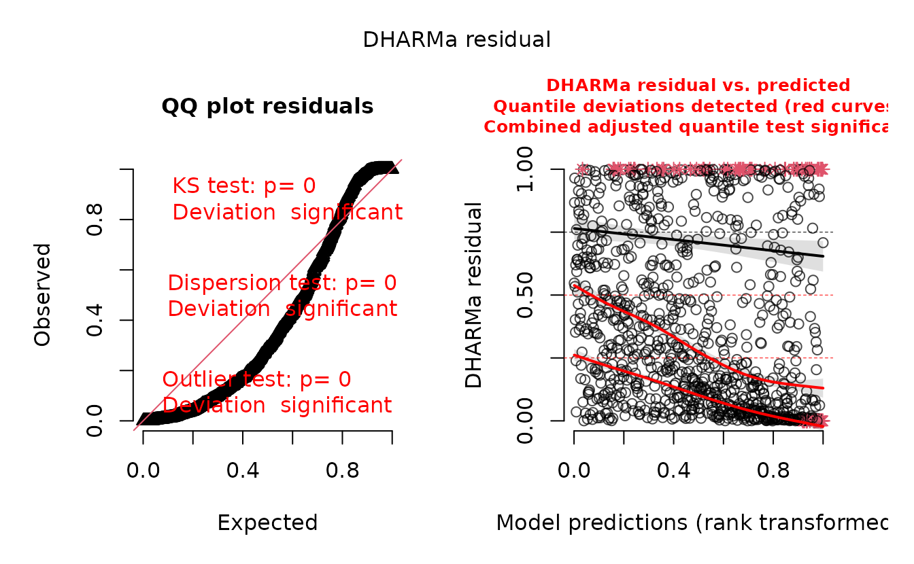
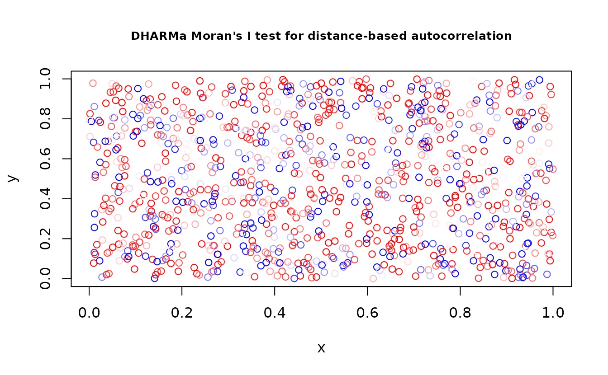
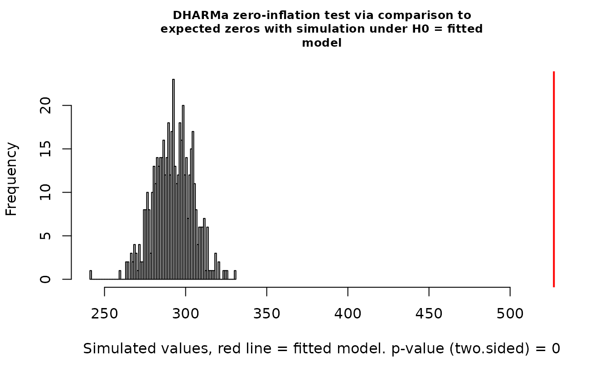
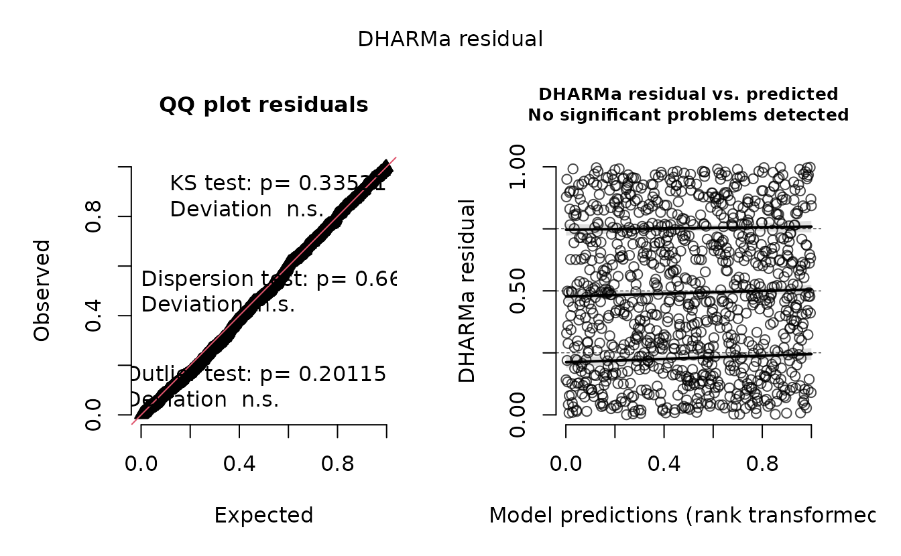
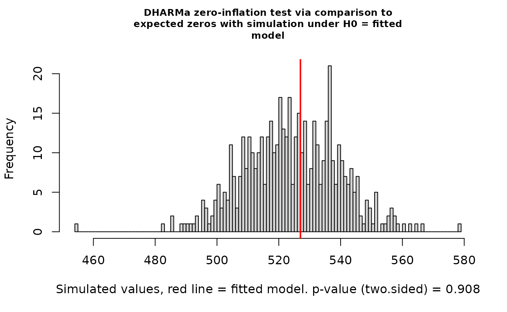
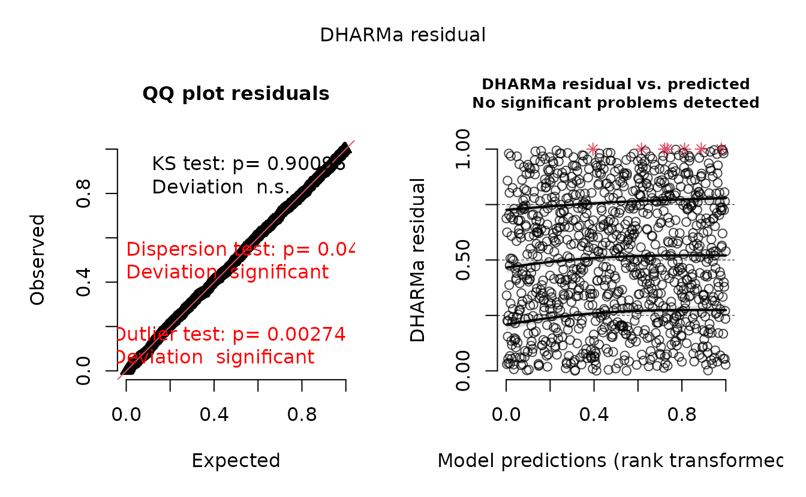
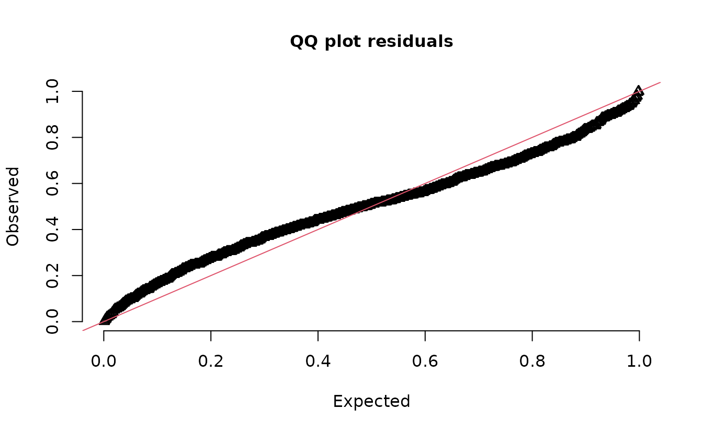
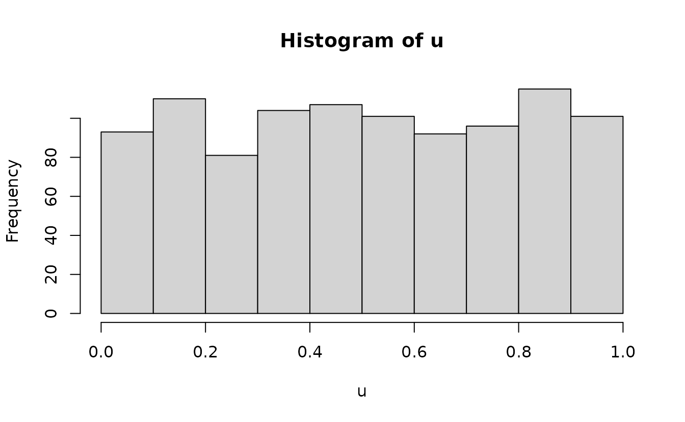
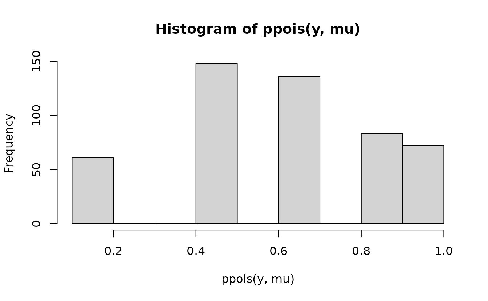
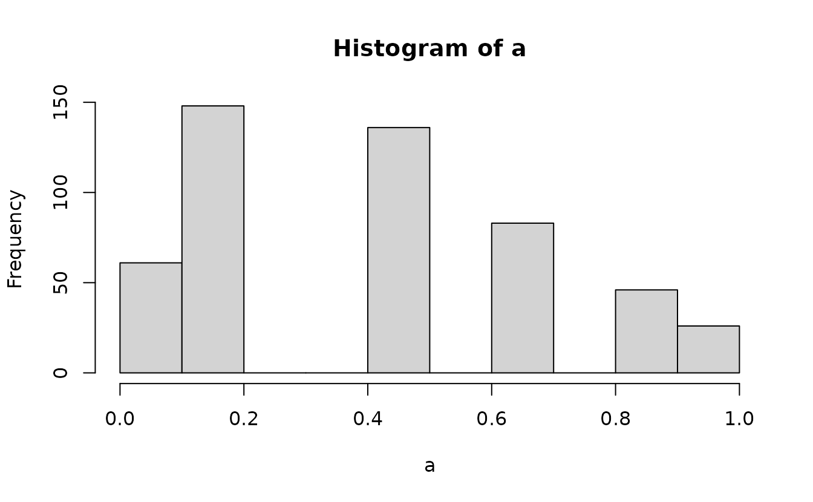

# Residual checking with sdmTMB

**If the code in this vignette has not been evaluated, a rendered
version is available on the [documentation
site](https://sdmTMB.github.io/sdmTMB/index.html) under ‘Articles’.**

## Residual checking with worked examples

``` r
library(sdmTMB)
```

We will start with some data simulated from scratch. We will simulate
from an NB2 negative binomial observation model, a spatial random field,
an intercept, and one predictor named ‘a1’ that will have a linear
effect on the observed data.

``` r
set.seed(1)
predictor_dat <- data.frame(X = runif(1000), Y = runif(1000), a1 = rnorm(1000))
mesh <- make_mesh(predictor_dat, xy_cols = c("X", "Y"), cutoff = 0.1)
dat <- sdmTMB_simulate(
  formula = ~ 1 + a1,
  data = predictor_dat,
  mesh = mesh,
  family = nbinom2(link = "log"),
  phi = 0.4,
  range = 0.4,
  sigma_O = 0.4,
  seed = 1,
  B = c(0.2, 0.8) # B0 = intercept, B1 = a1 slope
)
```

Next, we will fit model configurations with various families and
predictors. The first model will use the Poisson instead of the NB2. The
2nd model will match the simulated data. The third model is missing the
‘a1’ predictor. We’ll use a penalized complexity (PC) prior on the
Matérn parameters to aid in estimation.

``` r
pc <- pc_matern(range_gt = 0.1, sigma_lt = 1)

fit_pois <- sdmTMB(observed ~ 1 + a1, data = dat, family = poisson(), mesh = mesh,
  priors = sdmTMBpriors(matern_s = pc))
fit_pois
#> Spatial model fit by ML ['sdmTMB']
#> Formula: observed ~ 1 + a1
#> Mesh: mesh (isotropic covariance)
#> Data: dat
#> Family: poisson(link = 'log')
#>  
#> Conditional model:
#>             coef.est coef.se
#> (Intercept)     0.27    0.17
#> a1              0.82    0.02
#> 
#> Matérn range: 0.12
#> Spatial SD: 1.20
#> ML criterion at convergence: 2887.957
#> 
#> See ?tidy.sdmTMB to extract these values as a data frame.

fit_nb2 <- update(fit_pois, family = nbinom2())
fit_nb2
#> Spatial model fit by ML ['sdmTMB']
#> Formula: observed ~ 1 + a1
#> Family: nbinom2(link = 'log')
#>  
#> Conditional model:
#>             coef.est coef.se
#> (Intercept)     0.52    0.14
#> a1              0.75    0.06
#> 
#> Dispersion parameter: 0.41
#> Matérn range: 0.29
#> Spatial SD: 0.42
#> ML criterion at convergence: 1735.452
#> 
#> See ?tidy.sdmTMB to extract these values as a data frame.

fit_nb2_miss <- update(fit_nb2, formula. = observed ~ 1)
fit_nb2_miss
#> Spatial model fit by ML ['sdmTMB']
#> Formula: observed ~ 1
#> Family: nbinom2(link = 'log')
#>  
#> Conditional model:
#>             coef.est coef.se
#> (Intercept)     0.77    0.14
#> 
#> Dispersion parameter: 0.30
#> Matérn range: 0.21
#> Spatial SD: 0.56
#> ML criterion at convergence: 1817.332
#> 
#> See ?tidy.sdmTMB to extract these values as a data frame.
```

We can see just by looking at these fits that the Poisson model inflates
the spatial random field standard deviation (SD) compared to the truth.
The model missing the ‘a1’ predictor does so to a lesser degree.

### Analytical randomized-quantile residuals

Here are randomized quantile residuals with fixed effect at their MLEs
(Maximum Likelihood Estimates) and random effects taken from a single
sample of their approximate distribution (more details below):

``` r
set.seed(123)
rq_res <- residuals(fit_pois, type = "mle-mvn")
rq_res <- rq_res[is.finite(rq_res)] # some Inf
qqnorm(rq_res);abline(0, 1)
```


``` r

set.seed(123)
rq_res <- residuals(fit_nb2, type = "mle-mvn")
qqnorm(rq_res);abline(0, 1)
```


These use the randomized quantile approach from Dunn and Smyth (1996).
They are also known as PIT (probability-integral-transform) residuals.
They apply randomization to integer response values, transform the
residuals using the distribution function (e.g.,
[`pnorm()`](https://rdrr.io/r/stats/Normal.html)) to reflect a
uniform(0, 1) distribution, and transform those values such that they
would be normal(0, 1) if consistent with the model. You can see the
source code at
<https://github.com/sdmTMB/sdmTMB/blob/master/R/residuals.R>

We can see here that there are likely issues with the Poisson model in
the tails.

### MCMC-based randomized-quantile residuals

The above approach assumes an observation of the random effects can be
approximated by a multivariate normal distribution. If we want to relax
that assumption, we can sample the random effects with MCMC with the
fixed effects held at their MLEs. We do this with the
[`sdmTMBextra::predict_mle_mcmc()`](https://rdrr.io/pkg/sdmTMBextra/man/predict_mle_mcmc.html)
function in the [sdmTMBextra](https://github.com/sdmTMB/sdmTMBextra).

``` r
set.seed(123)
samps <- sdmTMBextra::predict_mle_mcmc(fit_nb2, mcmc_iter = 800, mcmc_warmup = 400)
#> 
#> SAMPLING FOR MODEL 'tmb_generic' NOW (CHAIN 1).
#> Chain 1: 
#> Chain 1: Gradient evaluation took 0.0011 seconds
#> Chain 1: 1000 transitions using 10 leapfrog steps per transition would take 11 seconds.
#> Chain 1: Adjust your expectations accordingly!
#> Chain 1: 
#> Chain 1: 
#> Chain 1: Iteration:   1 / 800 [  0%]  (Warmup)
#> Chain 1: Iteration:  80 / 800 [ 10%]  (Warmup)
#> Chain 1: Iteration: 160 / 800 [ 20%]  (Warmup)
#> Chain 1: Iteration: 240 / 800 [ 30%]  (Warmup)
#> Chain 1: Iteration: 320 / 800 [ 40%]  (Warmup)
#> Chain 1: Iteration: 400 / 800 [ 50%]  (Warmup)
#> Chain 1: Iteration: 401 / 800 [ 50%]  (Sampling)
#> Chain 1: Iteration: 480 / 800 [ 60%]  (Sampling)
#> Chain 1: Iteration: 560 / 800 [ 70%]  (Sampling)
#> Chain 1: Iteration: 640 / 800 [ 80%]  (Sampling)
#> Chain 1: Iteration: 720 / 800 [ 90%]  (Sampling)
#> Chain 1: Iteration: 800 / 800 [100%]  (Sampling)
#> Chain 1: 
#> Chain 1:  Elapsed Time: 6.777 seconds (Warm-up)
#> Chain 1:                4.906 seconds (Sampling)
#> Chain 1:                11.683 seconds (Total)
#> Chain 1:
mcmc_res <- residuals(fit_nb2, type = "mle-mcmc", mcmc_samples = samps)
qqnorm(mcmc_res)
abline(0, 1)
```


### Simulation-based randomized-quantile residuals

We can also take simulations from the fitted model to use with
simulation-based randomized quantile residuals:

``` r
s_pois <- simulate(fit_pois, nsim = 500, type = "mle-mvn")
s_nb2_miss <- simulate(fit_nb2_miss, nsim = 500, type = "mle-mvn")
s_nb2 <- simulate(fit_nb2, nsim = 500, type = "mle-mvn")
```

These return a matrix where each row represents a row of data and each
column is a simulation draw:

``` r
dim(s_pois)
#> [1] 1000  500
```

We can look at whether fitted models are consistent with the observed
number of zeros:

``` r
sum(dat$observed == 0) / length(dat$observed)
#> [1] 0.527
sum(s_pois == 0)/length(s_pois)
#> [1] 0.292788
sum(s_nb2 == 0)/length(s_nb2)
#> [1] 0.524644
```

There are obviously too few zeros in the data simulated from the Poisson
model but the NB2 model seems reasonable.

Plot DHARMa residuals:

``` r
dharma_residuals(s_pois, fit_pois)
```


We could also return the DHARMa object, which lets us use other DHARMa
tools:

``` r
r_pois <- dharma_residuals(s_pois, fit_pois, return_DHARMa = TRUE)
plot(r_pois)
```



``` r
DHARMa::testResiduals(r_pois)
```


    #> $uniformity
    #> 
    #>  Asymptotic one-sample Kolmogorov-Smirnov test
    #> 
    #> data:  simulationOutput$scaledResiduals
    #> D = 0.23338, p-value < 2.2e-16
    #> alternative hypothesis: two-sided
    #> 
    #> 
    #> $dispersion
    #> 
    #>  DHARMa nonparametric dispersion test via sd of residuals fitted vs.
    #>  simulated
    #> 
    #> data:  simulationOutput
    #> dispersion = 8.6989, p-value < 2.2e-16
    #> alternative hypothesis: two.sided
    #> 
    #> 
    #> $outliers
    #> 
    #>  DHARMa outlier test based on exact binomial test with approximate
    #>  expectations
    #> 
    #> data:  simulationOutput
    #> outliers at both margin(s) = 111, observations = 1000, p-value <
    #> 2.2e-16
    #> alternative hypothesis: true probability of success is not equal to 0.003992016
    #> 95 percent confidence interval:
    #>  0.09219791 0.13212606
    #> sample estimates:
    #> frequency of outliers (expected: 0.00399201596806387 ) 
    #>                                                  0.111
    DHARMa::testSpatialAutocorrelation(r_pois, x = dat$X, y = dat$Y)



    #> 
    #>  DHARMa Moran's I test for distance-based autocorrelation
    #> 
    #> data:  r_pois
    #> observed = -0.0022978, expected = -0.0010010, sd = 0.0026264, p-value =
    #> 0.6215
    #> alternative hypothesis: Distance-based autocorrelation
    DHARMa::testZeroInflation(r_pois)



    #> 
    #>  DHARMa zero-inflation test via comparison to expected zeros with
    #>  simulation under H0 = fitted model
    #> 
    #> data:  simulationOutput
    #> ratioObsSim = 1.7999, p-value < 2.2e-16
    #> alternative hypothesis: two.sided

In the QQ residual plots we clearly see evidence of overdispersion
compared to the Poisson. Note the values clumping near 1.0 on the
observed axis and deviating downwards towards 0.0 observed. This is
indicative of too many zeros and the variance scaling too rapidly with
the mean (resulting in some large outlying value) for the Poisson
distribution.

Lets try with the correct model:

``` r
r_nb2 <- dharma_residuals(s_nb2, fit_nb2, return_DHARMa = TRUE)
plot(r_nb2)
```



``` r
DHARMa::testZeroInflation(r_nb2)
```



    #> 
    #>  DHARMa zero-inflation test via comparison to expected zeros with
    #>  simulation under H0 = fitted model
    #> 
    #> data:  simulationOutput
    #> ratioObsSim = 1.0045, p-value = 0.908
    #> alternative hypothesis: two.sided

Everything looks fine.

What about the model where we were missing a predictor?

``` r
r_nb2_miss <- dharma_residuals(s_nb2_miss, fit_nb2_miss, return_DHARMa = TRUE)
plot(r_nb2_miss)
```



The plot on the right represents simulated residuals against the
prediction without the random effects, which here is just an intercept.
Lets try plotting the residuals against the missing predictor:

``` r
DHARMa::plotResiduals(r_nb2_miss, form = dat$a1)
```


We can see a trend in the residuals against ‘a1’ since we have missed
including it in the model.

We can also see the difference in the log likelihood or the AIC:

``` r
AIC(fit_nb2_miss, fit_nb2)
#>              df      AIC
#> fit_nb2_miss  4 3642.665
#> fit_nb2       5 3480.904
```

AIC also supports including the ‘a1’ predictor.

For help interpreting the DHARMa residual plots, see
[`vignette("DHARMa", package="DHARMa")`](https://cran.rstudio.com/web/packages/DHARMa/vignettes/DHARMa.html).

## The need for one-sample residuals

The above used random effects drawn as if they were observed once.

The approach is described in Waagepetersen (2006) and is [summarized
nicely](https://github.com/kaskr/adcomp/blob/c62bab02d60138d7a480b7c8bc30533efc7f2ce0/TMB/R/validation.R#L628-L640)
in an unexported function oneSamplePosterior within TMB. Thygesen et
al. (2017) also describes them in the context of one-sample MCMC
residuals.

Here we will show why this is necessary.

We’ll start by simulating some data with Gaussian observation error and
spatial and spatiotemporal random effects.

``` r
set.seed(123)
predictor_dat <- data.frame(
  X = runif(1000), Y = runif(1000),
  year = rep(1:5, each = 200)
)
mesh <- make_mesh(predictor_dat, xy_cols = c("X", "Y"), cutoff = 0.1)
sim_dat <- sdmTMB_simulate(
  formula = ~ 1,
  data = predictor_dat,
  time = "year",
  mesh = mesh,
  family = gaussian(),
  range = 0.3,
  sigma_E = 0.3,
  phi = 0.1,
  sigma_O = 0.4,
  seed = 1,
  B = 0.2 # intercept
)
fit <- sdmTMB(observed ~ 1, data = sim_dat, time = "year", mesh = mesh)
```

If we use the empirical Bayes (EB) random effect values (the values of
the random effects that maximize the log likelihood conditional on the
estimated fixed effects), our residuals look off even though our model
is perfectly matched to our simulated data:

``` r
set.seed(1)
r1 <- residuals(fit, type = "mle-eb")
qqnorm(r1);abline(0, 1)
```


``` r
ks.test(r1, pnorm)
#> 
#>  Asymptotic one-sample Kolmogorov-Smirnov test
#> 
#> data:  r1
#> D = 0.058629, p-value = 0.002067
#> alternative hypothesis: two-sided
```

Indeed, our test (incorrectly) rejects the null hypothesis that
$r_{1} \sim N(0,1)$, when if calculated correctly we know they do come
from $N(0,1)$

If instead we returned to our single sample from the assumed MVN random
effect distribution, we get the ‘correct’ residuals:

``` r
set.seed(1)
r2 <- residuals(fit, type = "mle-mvn")
qqnorm(r2);abline(0, 1)
```


``` r
ks.test(r2, pnorm)
#> 
#>  Asymptotic one-sample Kolmogorov-Smirnov test
#> 
#> data:  r2
#> D = 0.020639, p-value = 0.7879
#> alternative hypothesis: two-sided
```

Here, we would (correctly) fail to reject the hypothesis that
$r_{2} \sim N(0,1)$.

We could also sample that observation of random effects using MCMC (with
the fixed effects still held at their MLEs), which relaxes our
assumptions, but is much more time intensive for large models.

``` r
samp <- sdmTMBextra::predict_mle_mcmc(fit, mcmc_iter = 400, mcmc_warmup = 200)
#> 
#> SAMPLING FOR MODEL 'tmb_generic' NOW (CHAIN 1).
#> Chain 1: 
#> Chain 1: Gradient evaluation took 0.002162 seconds
#> Chain 1: 1000 transitions using 10 leapfrog steps per transition would take 21.62 seconds.
#> Chain 1: Adjust your expectations accordingly!
#> Chain 1: 
#> Chain 1: 
#> Chain 1: Iteration:   1 / 400 [  0%]  (Warmup)
#> Chain 1: Iteration:  40 / 400 [ 10%]  (Warmup)
#> Chain 1: Iteration:  80 / 400 [ 20%]  (Warmup)
#> Chain 1: Iteration: 120 / 400 [ 30%]  (Warmup)
#> Chain 1: Iteration: 160 / 400 [ 40%]  (Warmup)
#> Chain 1: Iteration: 200 / 400 [ 50%]  (Warmup)
#> Chain 1: Iteration: 201 / 400 [ 50%]  (Sampling)
#> Chain 1: Iteration: 240 / 400 [ 60%]  (Sampling)
#> Chain 1: Iteration: 280 / 400 [ 70%]  (Sampling)
#> Chain 1: Iteration: 320 / 400 [ 80%]  (Sampling)
#> Chain 1: Iteration: 360 / 400 [ 90%]  (Sampling)
#> Chain 1: Iteration: 400 / 400 [100%]  (Sampling)
#> Chain 1: 
#> Chain 1:  Elapsed Time: 32.987 seconds (Warm-up)
#> Chain 1:                32.58 seconds (Sampling)
#> Chain 1:                65.567 seconds (Total)
#> Chain 1:
#> Warning: The largest R-hat is 1.07, indicating chains have not mixed.
#> Running the chains for more iterations may help. See
#> https://mc-stan.org/misc/warnings.html#r-hat
#> Warning: Bulk Effective Samples Size (ESS) is too low, indicating posterior means and medians may be unreliable.
#> Running the chains for more iterations may help. See
#> https://mc-stan.org/misc/warnings.html#bulk-ess
#> Warning: Tail Effective Samples Size (ESS) is too low, indicating posterior variances and tail quantiles may be unreliable.
#> Running the chains for more iterations may help. See
#> https://mc-stan.org/misc/warnings.html#tail-ess
r3 <- residuals(fit, type = "mle-mcmc", mcmc_samples = samp)
qqnorm(r3);abline(0, 1)
```


``` r
ks.test(r3, pnorm)
#> 
#>  Asymptotic one-sample Kolmogorov-Smirnov test
#> 
#> data:  r3
#> D = 0.024973, p-value = 0.561
#> alternative hypothesis: two-sided
```

Here that gets us something similar and we would (correctly) fail to
reject the hypothesis that $r_{3} \sim N(0,1)$.

A similar issue applies to simulation-based quantile residuals, as
implemented in the DHARMa package.

``` r
set.seed(1)
simulate(fit, nsim = 500, type = "mle-eb") |>
  dharma_residuals(fit)
#> Warning: It is recommended to use `simulate.sdmTMB(fit, type = 'mle-mvn')` if simulating
#> for DHARMa residuals. See the description in ?residuals.sdmTMB under the types
#> of residuals section.
```


Instead we can use a draw from the random effects ‘posterior’ assuming
an MVN distribution.

``` r
set.seed(1)
simulate(fit, nsim = 500, type = "mle-mvn") |>
  dharma_residuals(fit)
```


And now that looks correct.

However, what happens if we were to sample the random effects with each
simulation?

``` r
set.seed(1)
s <- replicate(200, simulate(fit, nsim = 1, type = "mle-mvn"), simplify = "matrix")
attr(s, "type") <- "mle-mvn"
dharma_residuals(s, fit)
```



We get back to something with the incorrect distribution for comparison!
So, we need a single random effects sample per set of simulations.

## How much this matters depends on the ratio of observation error variance vs. random effect variance

Lets simulate data again but with large observation error (`phi` here,
which is the Gaussian error SD in this case) and with smaller levels of
random field variance (`sigma_E` and `sigma_O`):

``` r
set.seed(123)
sim_dat2 <- sdmTMB_simulate(
  formula = ~ 1,
  data = predictor_dat,
  time = "year",
  mesh = mesh,
  family = gaussian(),
  range = 0.3,
  sigma_E = 0.1, # smaller than before
  sigma_O = 0.1, # smaller than before
  phi = 0.5, # bigger than before
  seed = 1,
  B = 0.2 
)
fit2 <- sdmTMB(observed ~ 1, data = sim_dat2, time = "year", mesh = mesh)
sanity(fit2)
#> ✔ Non-linear minimizer suggests successful convergence
#> ✔ Hessian matrix is positive definite
#> ✔ No extreme or very small eigenvalues detected
#> ✔ No gradients with respect to fixed effects are >= 0.001
#> ✔ No fixed-effect standard errors are NA
#> ✔ No standard errors look unreasonably large
#> ✔ No sigma parameters are < 0.01
#> ✔ No sigma parameters are > 100
#> ✔ Range parameter doesn't look unreasonably large
```

``` r
set.seed(1)
r1 <- residuals(fit2, type = "mle-eb")
qqnorm(r1);abline(0, 1)
```


``` r
ks.test(r1, pnorm)
#> 
#>  Asymptotic one-sample Kolmogorov-Smirnov test
#> 
#> data:  r1
#> D = 0.021085, p-value = 0.7656
#> alternative hypothesis: two-sided
```

``` r
r2 <- residuals(fit2, type = "mle-mvn")
qqnorm(r2);abline(0, 1)
```


``` r
ks.test(r2, pnorm)
#> 
#>  Asymptotic one-sample Kolmogorov-Smirnov test
#> 
#> data:  r2
#> D = 0.016869, p-value = 0.9385
#> alternative hypothesis: two-sided
```

Now, it doesn’t really matter since the ‘incorrect’ random effect
distribution is swamped by the observation error effect on the
distribution. Technically, the first set is ‘wrong’ and the second set
is ‘right’, but functionally we’d come to a similar conclusion in this
case.

## Notes on uniform vs. normal quantile residuals

The randomized quantile residuals in
[`residuals.sdmTMB()`](https://sdmTMB.github.io/sdmTMB/reference/residuals.sdmTMB.md)
are returned such that they will be normal(0, 1) if the model is
consistent with the data. DHARMa residuals, however, are returned as
uniform(0, 1) under those same circumstances. Both are valid, and which
to use is preference, but it’s important to appreciate how this changes
the appearance of the expected residuals.

``` r
r2 <- residuals(fit2, type = "mle-mvn")
```

Analytical normal(0, 1):

``` r
hist(r2)
```


``` r
qqnorm(r2)
abline(0, 1)
```


``` r
ks.test(r2, pnorm)
#> 
#>  Asymptotic one-sample Kolmogorov-Smirnov test
#> 
#> data:  r2
#> D = 0.025614, p-value = 0.528
#> alternative hypothesis: two-sided
```

Analytical uniform(0, 1):

``` r
u <- pnorm(r2)
hist(u)
```



``` r
n <- length(u)
m <- seq_len(n) / (n + 1)
qqplot(m, u)
ks.test(u, punif)
#> 
#>  Asymptotic one-sample Kolmogorov-Smirnov test
#> 
#> data:  u
#> D = 0.025614, p-value = 0.528
#> alternative hypothesis: two-sided
abline(0, 1)
```


Simulation-based uniform(0, 1):

``` r
set.seed(1)
s <- simulate(fit2, nsim = 500, type = "mle-mvn") |>
  dharma_residuals(fit2, return_DHARMa = TRUE)
hist(s$scaledResiduals)
```


``` r
u <- s$scaledResiduals
m <- seq_len(length(u)) / (length(u)+ 1)
qqplot(m, u)
abline(0, 1)
```


``` r
ks.test(u, punif)
#> 
#>  Asymptotic one-sample Kolmogorov-Smirnov test
#> 
#> data:  u
#> D = 0.026, p-value = 0.5085
#> alternative hypothesis: two-sided
```

Simulation-based normal(0, 1):

``` r
set.seed(1)
s <- simulate(fit2, nsim = 1500, type = "mle-mvn") |>
  dharma_residuals(fit2, return_DHARMa = TRUE)
u <- s$scaledResiduals
r <- qnorm(u)
qqnorm(r)
abline(0, 1)
```


``` r
ks.test(u, punif)
#> 
#>  Asymptotic one-sample Kolmogorov-Smirnov test
#> 
#> data:  u
#> D = 0.028, p-value = 0.4131
#> alternative hypothesis: two-sided
```

Conclusions:

The normal(0, 1) residuals are probably more familiar to most people.

The normal(0, 1) residuals put more emphasis on the tails. This is good
and bad: it’s easier to examine tail behaviour, but these can often look
‘off’ even when the model is fine (as in this example) because
observations in the tails of the distribution are by definition rarely
observed.

Uniform(0, 1) residuals give all data points equal visual weight and
emphasize consistency of the overall distribution rather than the tails.

Either is valid, but you do need to switch your mindset about what you
expect to see accordingly. For example, poor tail behaviour may look
like a minor issue with uniform residuals; conversely the tails of
normal(0, 1) residuals are unlikely to ever look ‘perfect’ without large
sample sizes.

## How do those randomized-quantile residuals work?

Let’s work through a simple example with the gamma distribution:

``` r
set.seed(1)
mu <- rep(2, 500)
phi <- 0.5
y <- rgamma(length(mu), shape = phi, scale = mu / phi)
```

To get quantile residuals, we transform those to uniform(0, 1) using
[`pgamma()`](https://rdrr.io/r/stats/GammaDist.html) and then
(optionally) convert those to normal(0, 1) with
[`qnorm()`](https://rdrr.io/r/stats/Normal.html):

``` r
u <- pgamma(q = y, shape = phi, scale = mu / phi)
hist(u)
```


``` r
r <- qnorm(u)
hist(r)
```


This works for any distribution if we can define the quantile function.

If we have integer values, we need to add randomization in an additional
step. Let’s work with a Poisson sample:

``` r
set.seed(1)
mu <- rep(2, 500)
y <- rpois(length(mu), mu)
```

The gamma example above illustrated how we can use the distribution
function (there [`pgamma()`](https://rdrr.io/r/stats/GammaDist.html)) to
take a gamma-distributed variable and turn it into a uniform-distributed
variable.

Now we need to do the same with the Poisson equivalent:
[`ppois()`](https://rdrr.io/r/stats/Poisson.html). The `ppois(y)`
function gives us the cumulative probability density up to value `y`.
Say we have a Poisson variable with a mean (lambda) of 5 and we have an
observation with a value of 3. We can calculate the density up to the
value of 3 as:

``` r
lambda <- 5
ppois(3, lambda)
#> [1] 0.2650259
```

I.e., that is the same as:

``` r
dpois(0, lambda) + dpois(1, lambda) + dpois(2, lambda) + dpois(3, lambda)
#> [1] 0.2650259
```

But, if we naively apply
[`ppois()`](https://rdrr.io/r/stats/Poisson.html) to the observed values
we’ll end up with discrete cumulative probabilities that aren’t very
useful for comparing against the continuous uniform.

``` r
hist(ppois(y, mu))
```



Instead, we need to get the probability density up the value below the
one we observed and “fill in” the values up to the observed value with
the desired uniformly distributed samples. First, get the density up to
the value below and the observed value:

``` r
a <- ppois(y - 1, mu)
hist(a)
```



``` r
b <- ppois(y, mu)
hist(b)
```


Then we can add randomization between these using
[`runif()`](https://rdrr.io/r/stats/Uniform.html) since our expectation
is a uniform distribution at this stage to fill in the values between:

``` r
u <- runif(n = length(y), min = a, max = b)
hist(u)
```


Then we optionally apply
[`qnorm()`](https://rdrr.io/r/stats/Normal.html):

``` r
r <- qnorm(u)
hist(r)
```


## How do those simulation-based residuals work?

DHARMa uses simulation-based quantile residuals. As a result, we don’t
need to define the quantile function analytically. So, instead of a line
like this:

``` r
u <- pgamma(q = y, shape = phi, scale = mu / phi)
```

We simulate from our model repeatedly, see where our observation falls
within the simulated values, and get our quantile that way. For example,
instead of this:

``` r
pnorm(2.2, mean = 0.5, sd = 1)
#> [1] 0.9554345
```

we could do this:

``` r
set.seed(1)
s <- rnorm(1e6, 0.5, 1) # equivalent of simulate()ing from our model
mean(s < 2.2) # equivalent of pnorm()
#> [1] 0.955308
```

## References

Dunn, P.K., and Smyth, G.K. 1996. Randomized Quantile Residuals. Journal
of Computational and Graphical Statistics 5(3): 236–244.

Waagepetersen, R. 2006. A Simulation-Based Goodness-of-Fit Test for
Random Effects in Generalized Linear Mixed Models. Scandinavian Journal
of Statistics 33(4): 721–731.

Thygesen, U.H., Albertsen, C.M., Berg, C.W., Kristensen, K., and
Nielsen, A. 2017. Validation of ecological state space models using the
Laplace approximation. Environ Ecol Stat 24(2): 317–339.
