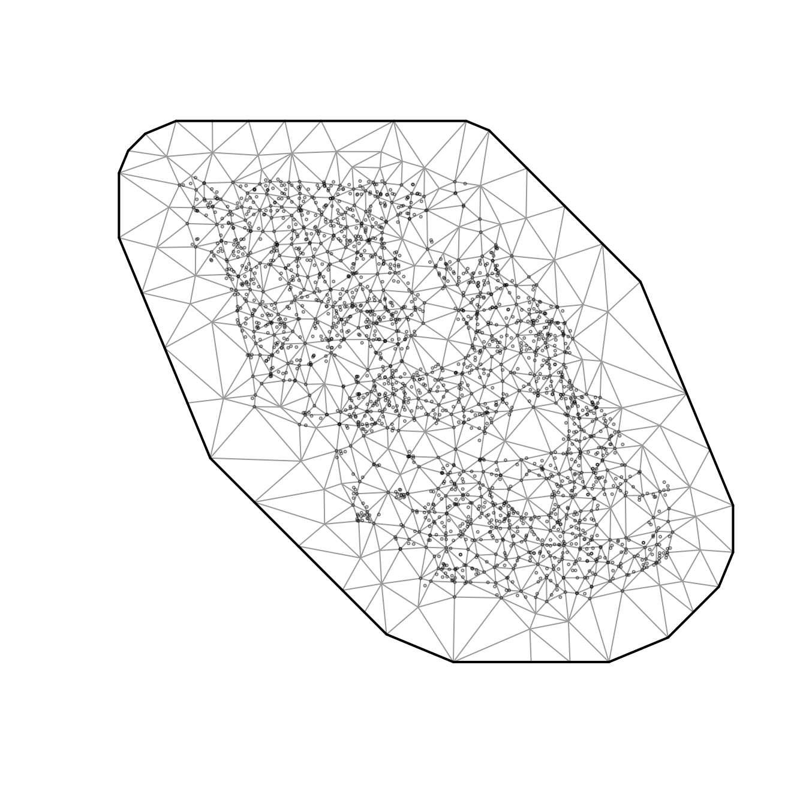
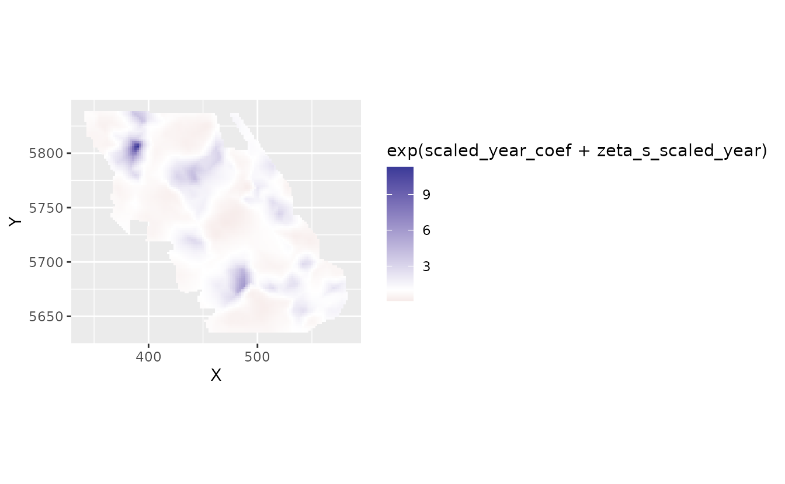
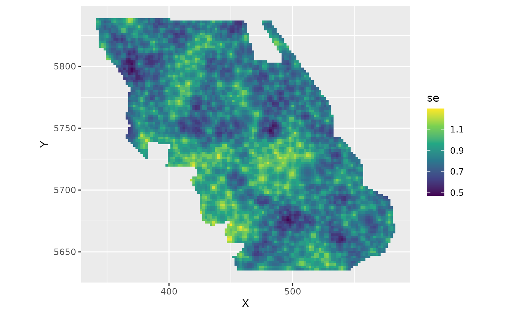

# Fitting spatial trend models with sdmTMB

**If the code in this vignette has not been evaluated, a rendered
version is available on the [documentation
site](https://sdmTMB.github.io/sdmTMB/index.html) under ‘Articles’.**

``` r
library(ggplot2)
library(dplyr)
library(sdmTMB)
```

Using the built-in British Columbia Queen Charlotte Sound Pacific Cod
dataset, we might be interested in fitting a model that describes
spatially varying trends through time. The data are as follows:

- There are columns for depth and depth squared.
- Depth was centred and scaled by its standard deviation and we’ve
  included those in the data frame so that they could be used to
  similarly scale the prediction grid.
- The density units should be kg/km².
- Here, X and Y are coordinates in UTM zone 9.

``` r
pcod_spde <- make_mesh(pcod, c("X", "Y"), cutoff = 5)
plot(pcod_spde)
```



We will fit a model that includes an overall intercept, a slope for
‘year’, an intercept spatial random field, and another random field for
spatially varying slopes that represent temporal trends that vary
spatially (`spatial_varying` argument).

First, we will set up a column for time that is centered to help break
correlation with the intercept and help estimation (and interpretation
of the intercept) and we will scale the year values so that a unit of
change is a decade instead of a year. This is likely more interpretable
and can help with estimation by keeping the coefficients on a reasonable
scale.

``` r
d <- pcod
d$scaled_year <- (pcod$year - mean(pcod$year)) / 10
unique(d$scaled_year)
#> [1] -0.64022399 -0.54022399 -0.44022399 -0.24022399 -0.04022399  0.15977601
#> [7]  0.35977601  0.55977601  0.75977601
```

Now we will fit a model using `spatial_varying ~ 0 + scaled_year`. The
`0 +` drops the intercept, which is already present due to
`spatial = "on"`, which is the default.

``` r
fit <- sdmTMB(
  density ~ scaled_year, 
  data = d,
  mesh = pcod_spde, 
  family = tweedie(link = "log"),
  spatial = "on",
  spatial_varying = ~ 0 + scaled_year
)
```

``` r
print(fit)
#> Spatial model fit by ML ['sdmTMB']
#> Formula: density ~ scaled_year
#> Mesh: pcod_spde (isotropic covariance)
#> Data: d
#> Family: tweedie(link = 'log')
#>  
#> Conditional model:
#>             coef.est coef.se
#> (Intercept)     2.26    0.33
#> scaled_year    -0.06    0.21
#> 
#> Dispersion parameter: 11.77
#> Tweedie p: 1.52
#> Matérn range: 20.50
#> Spatial SD: 2.40
#> Spatially varying coefficient SD (scaled_year): 1.23
#> ML criterion at convergence: 6406.405
#> 
#> See ?tidy.sdmTMB to extract these values as a data frame.
sanity(fit)
#> ✔ Non-linear minimizer suggests successful convergence
#> ✔ Hessian matrix is positive definite
#> ✔ No extreme or very small eigenvalues detected
#> ✔ No gradients with respect to fixed effects are >= 0.001
#> ✔ No fixed-effect standard errors are NA
#> ✔ No standard errors look unreasonably large
#> ✔ No sigma parameters are < 0.01
#> ✔ No sigma parameters are > 100
#> ✔ Range parameter doesn't look unreasonably large
```

We have not included spatiotemporal random fields for this example for
simplicity, but they could also be included.

Let’s extract some parameter estimates. Look for `sigma_Z` coefficients:

``` r
tidy(fit, conf.int = TRUE)
#> # A tibble: 2 × 5
#>   term        estimate std.error conf.low conf.high
#>   <chr>          <dbl>     <dbl>    <dbl>     <dbl>
#> 1 (Intercept)   2.26       0.326    1.62      2.90 
#> 2 scaled_year  -0.0632     0.205   -0.465     0.339
tidy(fit, "ran_pars", conf.int = TRUE)
#> # A tibble: 5 × 5
#>   term      estimate std.error conf.low conf.high
#>   <chr>        <dbl>     <dbl>    <dbl>     <dbl>
#> 1 range        20.5     2.49     16.2       26.0 
#> 2 phi          11.8     0.394    11.0       12.6 
#> 3 sigma_O       2.40    0.175     2.08       2.76
#> 4 sigma_Z       1.23    0.180     0.925      1.64
#> 5 tweedie_p     1.52    0.0111    1.50       1.54
```

Let’s look at the predictions and estimates of the spatially varying
coefficients on a grid. First, we will create a small function to help
with plotting:

``` r
plot_map_raster <- function(dat, column = est) {
  ggplot(dat, aes(X, Y, fill = {{ column }})) +
    geom_raster() +
    coord_fixed() +
    scale_fill_gradient2()
}
```

We need to predict on a grid to make our visualizations. We also need to
add a column for `scaled_year` to match the fitting. Make sure you scale
based on the same values! Here, that means using the mean from our
fitted data and turning years into decades.

``` r
nd <- replicate_df(qcs_grid, "year", unique(pcod$year))
nd$scaled_year <- (nd$year - mean(pcod$year)) / 10
pred <- predict(fit, newdata = nd)
```

Let’s look at the spatial trends. The `zeta_s_scaled_year` in the
predictions are values from a random field describing deviations from
the overall effect of `year_scaled` on species density. These are in
link (log) space. These are the spatially varying coefficients.

``` r
plot_map_raster(pred, zeta_s_scaled_year)
```


If we wanted to get at the actual slope of `scaled_year` in space, we
would also have to add on the main overall (fixed effect) coefficient.

``` r
coefs <- tidy(fit, conf.int = TRUE)
scaled_year_coef <- coefs$estimate[coefs$term == "scaled_year"]
scaled_year_coef
#> [1] -0.0632089
exp(scaled_year_coef)
#> [1] 0.9387474
```

Our main effect tells us that the overall linear trend of density has
been a multiplicative factor of 0.94 per decade. Conversely, the overall
trend has been a decline of 6% per decade.

We can add this overall effect to the spatial deviations from this
effect to get the spatially varying trend:

``` r
plot_map_raster(pred, scaled_year_coef + zeta_s_scaled_year)
```


We could put those slopes back into natural space:

``` r
plot_map_raster(pred, exp(scaled_year_coef + zeta_s_scaled_year)) +
  scale_fill_gradient2(midpoint = 1)
#> Scale for fill is already present.
#> Adding another scale for fill, which will replace the existing scale.
```



Here, 2, for example, means a 2-fold change in density in that location
per decade.

We might prefer to log transform the color scale. This gets us back to
the plot in log space but with values on the colour legend that
represent (multiplicative) values in natural space.

``` r
plot_map_raster(pred, exp(scaled_year_coef + zeta_s_scaled_year)) +
  scale_fill_gradient2(midpoint = 0, trans = "log10")
#> Scale for fill is already present.
#> Adding another scale for fill, which will replace the existing scale.
```


The fastest way to get uncertainty on this spatially varying coefficient
is with draws from the joint precision matrix of the parameters:

``` r
set.seed(82938)
psim <- predict(fit, newdata = nd, nsim = 200, sims_var = "zeta_s")
pred$se <- apply(psim, 1, sd)
plot_map_raster(pred, se) +
  scale_fill_viridis_c()
```



We can see a visual pattern of the SPDE mesh in this plot. The
uncertainty standard error is most accurate at the nodes (vertices,
knots) of the mesh.
