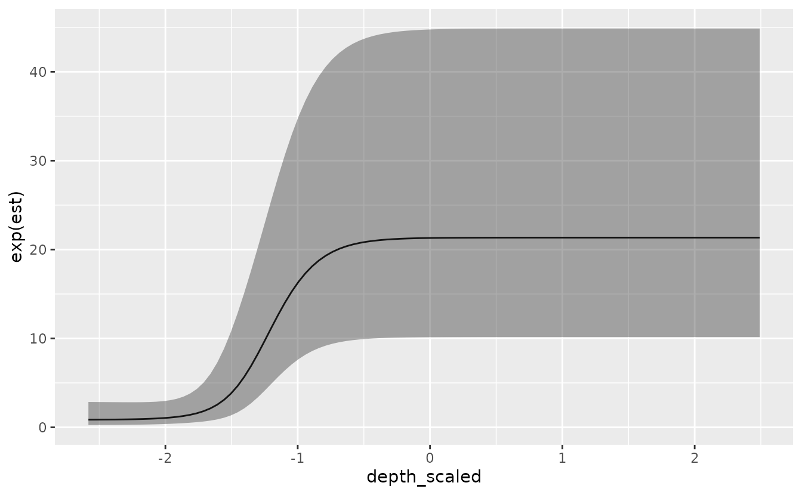
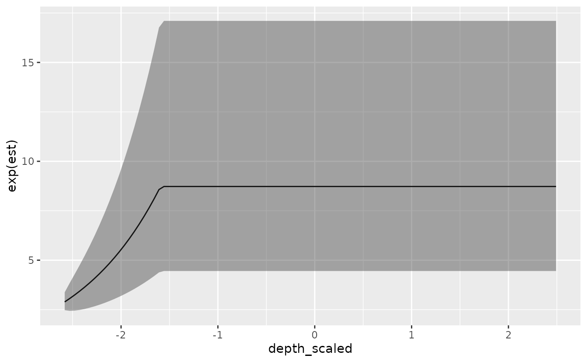

# Threshold modeling with sdmTMB

**If the code in this vignette has not been evaluated, a rendered
version is available on the [documentation
site](https://sdmTMB.github.io/sdmTMB/index.html) under ‘Articles’.**

``` r
library(ggplot2)
library(dplyr)
library(sdmTMB)
```

We’ll repeat the same models used for the index standardization
vignette, using the built-in data for Pacific cod.

As a summary, - We’ve included columns for depth and depth squared. -
Depth was centred and scaled by its standard deviation and we’ve
included those in the data frame so that they could be used to similarly
scale the prediction grid. - The density units should be kg/km². - Here,
X and Y are coordinates in UTM zone 9.

``` r
glimpse(pcod)
#> Rows: 2,143
#> Columns: 12
#> $ year          <int> 2003, 2003, 2003, 2003, 2003, 2003, 2003, 2003, 2003, 20…
#> $ X             <dbl> 446.4752, 446.4594, 448.5987, 436.9157, 420.6101, 417.71…
#> $ Y             <dbl> 5793.426, 5800.136, 5801.687, 5802.305, 5771.055, 5772.2…
#> $ depth         <dbl> 201, 212, 220, 197, 256, 293, 410, 387, 285, 270, 381, 1…
#> $ density       <dbl> 113.138476, 41.704922, 0.000000, 15.706138, 0.000000, 0.…
#> $ present       <dbl> 1, 1, 0, 1, 0, 0, 0, 0, 0, 1, 0, 0, 0, 0, 0, 0, 0, 0, 0,…
#> $ lat           <dbl> 52.28858, 52.34890, 52.36305, 52.36738, 52.08437, 52.094…
#> $ lon           <dbl> -129.7847, -129.7860, -129.7549, -129.9265, -130.1586, -…
#> $ depth_mean    <dbl> 5.155194, 5.155194, 5.155194, 5.155194, 5.155194, 5.1551…
#> $ depth_sd      <dbl> 0.4448783, 0.4448783, 0.4448783, 0.4448783, 0.4448783, 0…
#> $ depth_scaled  <dbl> 0.3329252, 0.4526914, 0.5359529, 0.2877417, 0.8766077, 1…
#> $ depth_scaled2 <dbl> 0.11083919, 0.20492947, 0.28724555, 0.08279527, 0.768440…
```

As before, the SPDE mesh is created using 75 knots for a balance between
speed and accuracy. You will likely want to use more for applied
scenarios. You will want to make sure that increasing the number of
knots does not change the conclusions.

``` r
pcod_spde <- make_mesh(pcod, c("X", "Y"), cutoff = 12)
```

We will extend the simple GLMM used in the index standardization
vignette to include a threshold effect. For real applications, the
threshold effect might be a function of habitat covariates,
environmental variables, etc. Because ‘depth’ is the only external
variable in the `pcod` data frame, we’ll use that. For any threshold
model, you can specify the model as a linear threshold (`breakpt()`) or
logistic (`logistic()`) as part of the formula. Note: as before, if we
want to use this model for index standardization then we need to include
`0 + as.factor(year)` or `-1 + as.factor(year)` so that we have a factor
predictor that represents the mean estimate for each time slice.

This first example uses the ‘depth_scaled’ covariate (depth,
standardized ~ N(0,1)) and the logistic function, similar to selectivity
curves used in fisheries models. The form is

$$s(x) = \tau + \psi*\quad\left\lbrack 1 + \exp^{- ln{(19)}\quad*\quad{(x - s50)}\quad/\quad{(s95\quad - \quad s50)}} \right\rbrack^{- 1}$$
where $\psi$ is a scaling parameter (controlling the height of the
y-axis for the response, and is unconstrained), $\tau$ is an intercept,
$s50$ is a parameter controlling the point at which the function reaches
50% of the maximum ($\psi$), and $s95$ is a parameter controlling the
point at which the function reaches 95%. The parameter $s50$ is
unconstrained, and $s95$ is constrained to be larger than $s50$.

``` r
m <- sdmTMB(
  data = pcod,
  formula = density ~ 0 + logistic(depth_scaled) + as.factor(year),
  time = "year", mesh = pcod_spde,
  family = tweedie(link = "log")
)
```

We can then look at the important coefficients from the model. Here
we’re looking at ‘s50’, ‘s95’, and ‘smax’.

``` r
print(m)
#> Spatiotemporal model fit by ML ['sdmTMB']
#> Formula: density ~ 0 + logistic(depth_scaled) + as.factor(year)
#> Mesh: pcod_spde (isotropic covariance)
#> Time column: year
#> Data: pcod
#> Family: tweedie(link = 'log')
#>  
#> Conditional model:
#>                     coef.est coef.se
#> as.factor(year)2003    -0.52    0.63
#> as.factor(year)2004     0.06    0.62
#> as.factor(year)2005    -0.08    0.62
#> as.factor(year)2007    -1.28    0.63
#> as.factor(year)2009    -0.80    0.63
#> as.factor(year)2011    -0.33    0.62
#> as.factor(year)2013    -0.13    0.61
#> as.factor(year)2015    -0.16    0.62
#> as.factor(year)2017    -0.75    0.63
#> depth_scaled-s50       -1.48    0.12
#> depth_scaled-s95       -0.89    0.11
#> depth_scaled-smax       3.22    0.53
#> 
#> Dispersion parameter: 12.33
#> Tweedie p: 1.53
#> Matérn range: 22.09
#> Spatial SD: 2.02
#> Spatiotemporal IID SD: 1.40
#> ML criterion at convergence: 6435.001
#> 
#> See ?tidy.sdmTMB to extract these values as a data frame.
```

We can visualize the effect:

``` r
nd <- data.frame(
  depth_scaled = seq(min(pcod$depth_scaled) + 0.5, 
    max(pcod$depth_scaled) - 0.2, length.out = 100), 
  year = 2015L # a chosen year
)
p <- predict(m, newdata = nd, se_fit = TRUE, re_form = NA)
ggplot(p, aes(depth_scaled, exp(est), 
  ymin = exp(est - 1.96 * est_se), 
  ymax = exp(est + 1.96 * est_se))) +
  geom_line() + geom_ribbon(alpha = 0.4)
```



Next, we can try to fit the same model but use a linear breakpoint /
cutpoint model:

``` r
m <- sdmTMB(
  data = pcod,
  formula = density ~ 0 + breakpt(depth_scaled) + as.factor(year),
  time = "year", mesh = pcod_spde,
  family = tweedie(link = "log")
)
```

For this model, the important parameters are the slope,
‘depth_scaled-slope’, and breakpoint, ‘depth_scaled-breakpt’.

``` r
print(m)
#> Spatiotemporal model fit by ML ['sdmTMB']
#> Formula: density ~ 0 + breakpt(depth_scaled) + as.factor(year)
#> Mesh: pcod_spde (isotropic covariance)
#> Time column: year
#> Data: pcod
#> Family: tweedie(link = 'log')
#>  
#> Conditional model:
#>                      coef.est coef.se
#> as.factor(year)2003      3.63    0.33
#> as.factor(year)2004      4.19    0.32
#> as.factor(year)2005      4.00    0.32
#> as.factor(year)2007      2.89    0.33
#> as.factor(year)2009      3.38    0.33
#> as.factor(year)2011      3.78    0.32
#> as.factor(year)2013      4.09    0.32
#> as.factor(year)2015      3.94    0.32
#> as.factor(year)2017      3.39    0.33
#> depth_scaled-slope       1.12    0.17
#> depth_scaled-breakpt    -1.59    0.23
#> 
#> Dispersion parameter: 12.14
#> Tweedie p: 1.51
#> Matérn range: 15.93
#> Spatial SD: 1.82
#> Spatiotemporal IID SD: 1.70
#> ML criterion at convergence: 6397.346
#> 
#> See ?tidy.sdmTMB to extract these values as a data frame.
```

We can visualize the linear breakpoint effect:

``` r
p <- predict(m, newdata = nd, se_fit = TRUE, re_form = NA, xy_cols = c("X", "Y"))
ggplot(p, aes(depth_scaled, exp(est), 
  ymin = exp(est - 1.96 * est_se), 
  ymax = exp(est + 1.96 * est_se))) +
  geom_line() + geom_ribbon(alpha = 0.4)
```


