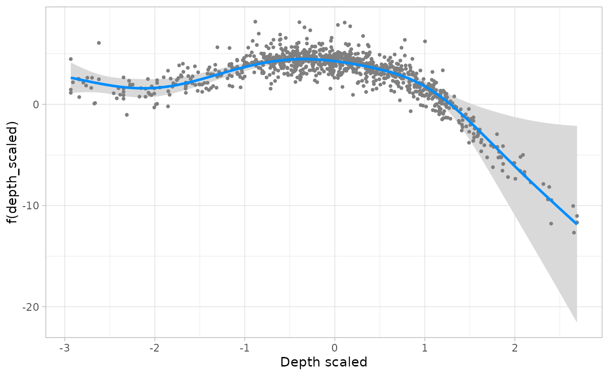
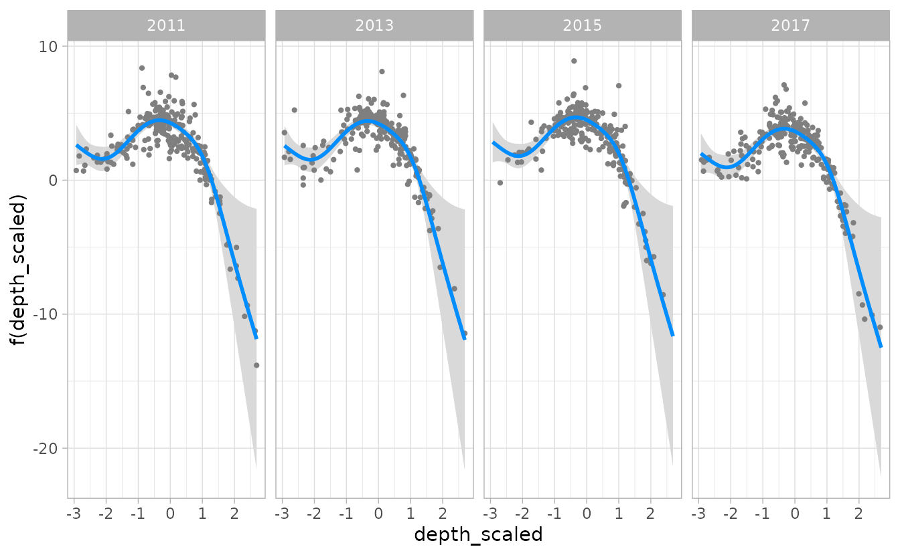
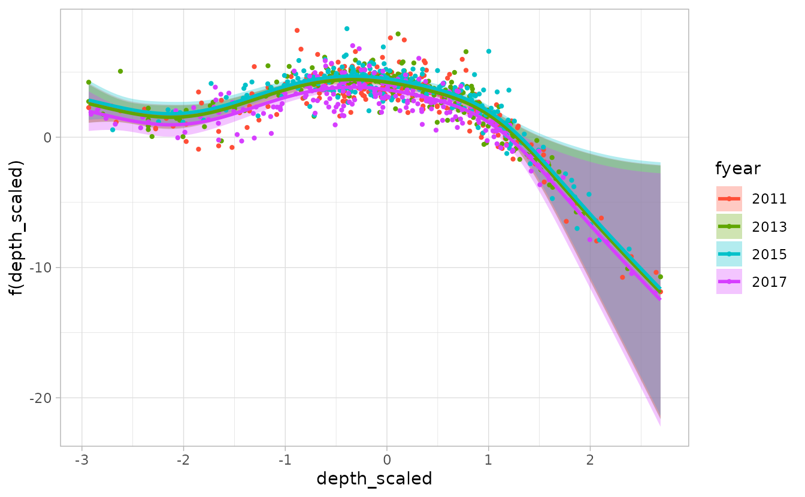
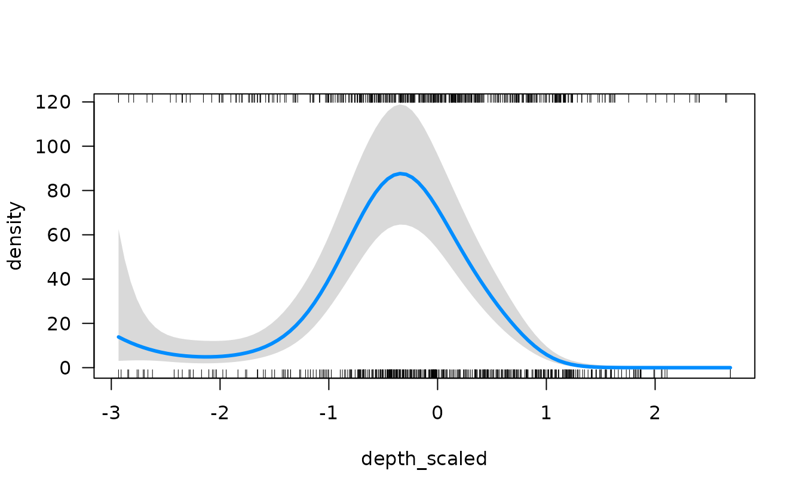
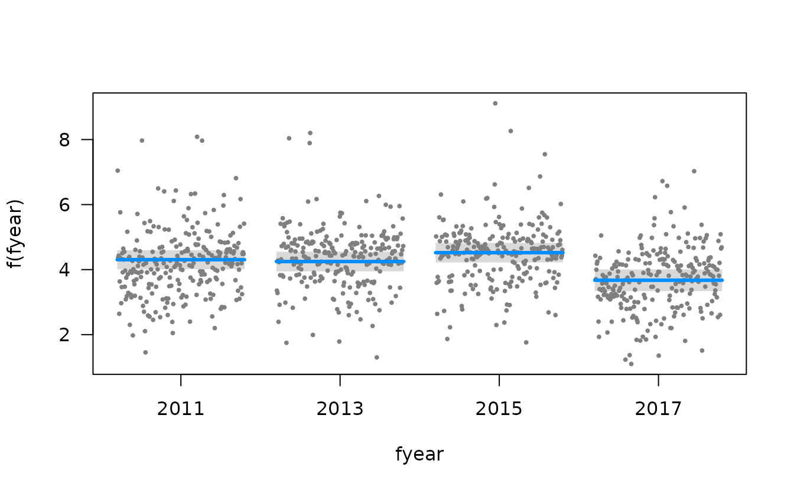
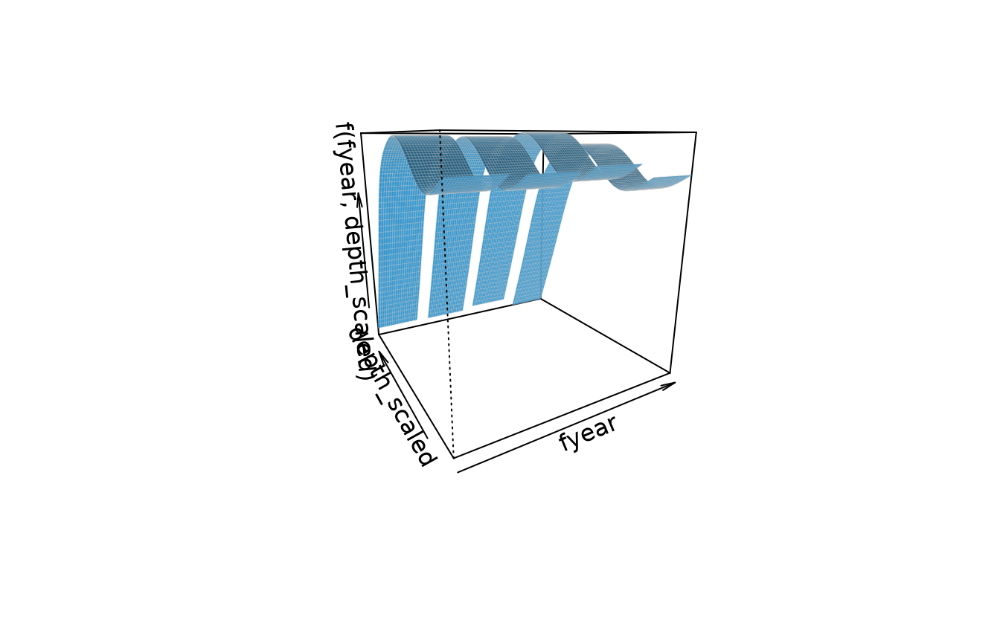
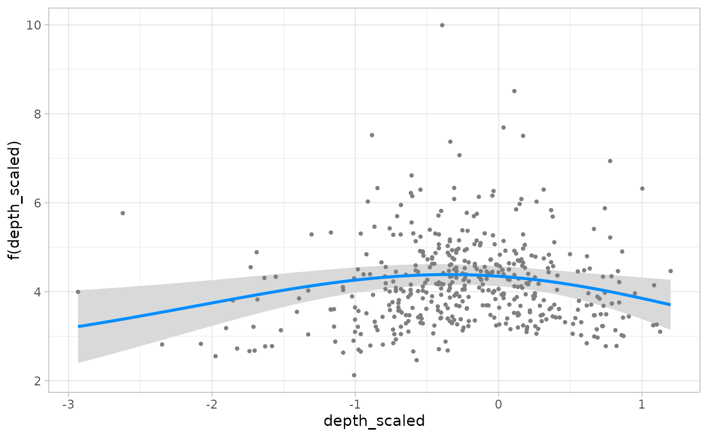

# Visualizing sdmTMB conditional effects using visreg

**If the code in this vignette has not been evaluated, a rendered
version is available on the [documentation
site](https://sdmTMB.github.io/sdmTMB/index.html) under ‘Articles’.**

We can use the [visreg](https://CRAN.R-project.org/package=visreg)
package to visually inspect the conditional effects of explanatory
variables in sdmTMB models.

We will use the built-in Pacific cod survey data for this example. We
will fit a model with scaled depth and a factor effect of year using a
Tweedie distribution.

``` r
pcod_2011$fyear <- as.factor(pcod_2011$year)
mesh <- make_mesh(pcod_2011, c("X", "Y"), cutoff = 20)
fit <- sdmTMB(
  density ~ 0 + s(depth_scaled) + fyear,
  data = pcod_2011,
  mesh = mesh,
  spatial = "off", # off for vignette building speed
  family = tweedie(link = "log")
)
```

We can then plot the effect of depth in link space. This shows the value
of depth on the x-axis and the change in response on the y-axis, holding
all other variables constant.

``` r
visreg(fit, xvar = "depth_scaled")
```


Note that by default, randomized quantile residuals are included. These
should be normally distributed in link space if the model is consistent
with the data. These can be turned off with `partial = FALSE`

The default, a visreg plot uses base graphics. We can set `gg = TRUE` to
get a ggplot version:

``` r
g <- visreg(fit, xvar = "depth_scaled", gg = TRUE)
#> Warning: `aes_string()` was deprecated in ggplot2 3.0.0.
#> ℹ Please use tidy evaluation idioms with `aes()`.
#> ℹ See also `vignette("ggplot2-in-packages")` for more information.
#> ℹ The deprecated feature was likely used in the visreg package.
#>   Please report the issue at <https://github.com/pbreheny/visreg/issues>.
#> This warning is displayed once every 8 hours.
#> Call `lifecycle::last_lifecycle_warnings()` to see where this warning was
#> generated.
#> Warning: Using `size` aesthetic for lines was deprecated in ggplot2 3.4.0.
#> ℹ Please use `linewidth` instead.
#> ℹ The deprecated feature was likely used in the ggplot2 package.
#>   Please report the issue at <https://github.com/tidyverse/ggplot2/issues>.
#> This warning is displayed once every 8 hours.
#> Call `lifecycle::last_lifecycle_warnings()` to see where this warning was
#> generated.
g + xlab("Depth scaled")
```



We can also grab the underlying data it creates and make our own plot:

``` r
d <- visreg(fit, xvar = "depth_scaled", plot = FALSE)
head(d$fit)
#>   depth_scaled fyear density visregFit visregLwr visregUpr
#> 1    -2.933490  2011       0  2.629110  1.122039  4.136182
#> 2    -2.877239  2011       0  2.524430  1.158455  3.890404
#> 3    -2.820988  2011       0  2.420118  1.185481  3.654756
#> 4    -2.764737  2011       0  2.316778  1.200202  3.433355
#> 5    -2.708486  2011       0  2.215283  1.199395  3.231171
#> 6    -2.652235  2011       0  2.116733  1.180157  3.053310
g <- ggplot(d$fit, aes(x = depth_scaled, y = visregFit)) +
  geom_line() +
  geom_ribbon(aes(ymin = visregLwr, ymax = visregUpr), alpha = 0.5)

# residuals are in d$res
head(d$res)
#>   depth_scaled fyear density visregRes visregPos
#> 1    0.7408840  2011       0  5.633490      TRUE
#> 2   -2.7062455  2011       0  2.135630     FALSE
#> 3   -2.9334899  2011       0  2.532105     FALSE
#> 4   -0.2224156  2011       0  1.894249     FALSE
#> 5    1.8685071  2011       0 -4.864248      TRUE
#> 6    2.3175211  2011       0 -8.423270      TRUE

g + geom_point(aes(y = visregRes), data = d$res, size = 1, alpha = 0.4)
```


We can look at the effect of depth in each year separately, either in
separate plots or overlaid on the same plot.

``` r
visreg(fit, xvar = "depth_scaled", by = "fyear", gg = TRUE)
```



``` r
visreg(fit, xvar = "depth_scaled", by = "fyear", overlay = TRUE, gg = TRUE)
```



And at the effect of depth on the response scale, rather than link (log)
scale.

``` r
visreg(fit, xvar = "depth_scaled", scale = "response")
```



In this case, visreg adds “rug” lines indicating the where the data were
observed along the x-axis variable.

[`visreg()`](https://pbreheny.github.io/visreg/reference/visreg.html)
can also be used to visualize just the categorical effect of year.

``` r
visreg(fit, xvar = "fyear")
```



We can also simultaneously compare both depth and year with a
two-dimensional contour plot.

``` r
visreg2d(fit, xvar = "fyear", yvar = "depth_scaled")
```


[`visreg2d()`](https://pbreheny.github.io/visreg/reference/visreg2d.html)
is different from
[`visreg()`](https://pbreheny.github.io/visreg/reference/visreg.html) in
that it doesn’t take a `gg` argument. Instead, it takes
`plot.type = c("image", "persp", "rgl", "gg")`. For example:

``` r
visreg2d(fit, xvar = "fyear", yvar = "depth_scaled", plot.type = "gg")
```


``` r
visreg2d(fit, xvar = "fyear", yvar = "depth_scaled", plot.type = "persp")
```



## Delta models

[`visreg()`](https://pbreheny.github.io/visreg/reference/visreg.html)
can also be used to plot the output of delta models from
[`sdmTMB()`](https://sdmTMB.github.io/sdmTMB/reference/sdmTMB.md) by
using similar code for the previous plots, but using the sdmTMB wrapper
function
[`visreg_delta()`](https://sdmTMB.github.io/sdmTMB/reference/visreg_delta.md)
and specifying `model = 1` for the encounter (0 vs. non-zero) model or
`model = 2` for the positive component model (e.g., Gamma, lognormal).
For example:

``` r
fit_dg <- sdmTMB(
  density ~ s(depth_scaled, year, k = 8),
  data = pcod_2011,
  mesh = pcod_mesh_2011,
  spatial = "off", # for vignette speed
  family = delta_gamma()
)

visreg_delta(fit_dg, xvar = "depth_scaled", model = 1, gg = TRUE)
#> These are residuals for delta model component 1. Use the `model` argument to
#> select the other component.
```


``` r
visreg_delta(fit_dg, xvar = "depth_scaled", model = 2, gg = TRUE)
#> These are residuals for delta model component 2. Use the `model` argument to
#> select the other component.
```



Note that for plotting with
[`visreg_delta()`](https://sdmTMB.github.io/sdmTMB/reference/visreg_delta.md),
categorical variables like year need to be designated as a factor in the
data frame, as in the example above with `fyear`, rather than in the
model formula (e.g., `+ as.factor(year)`).
