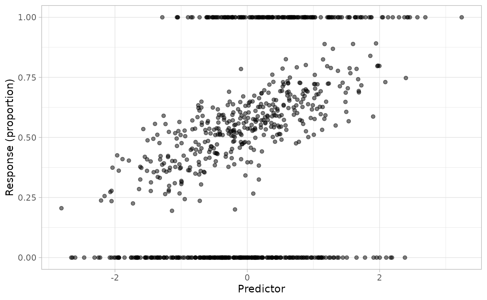
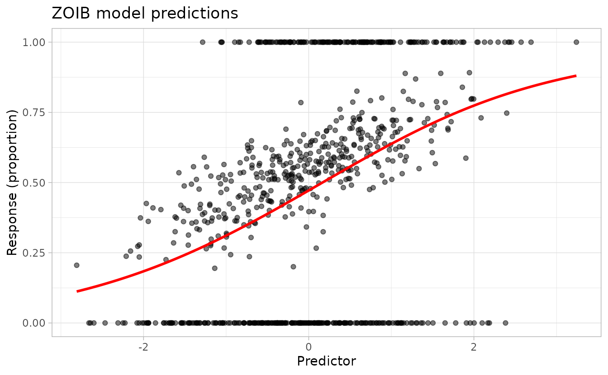
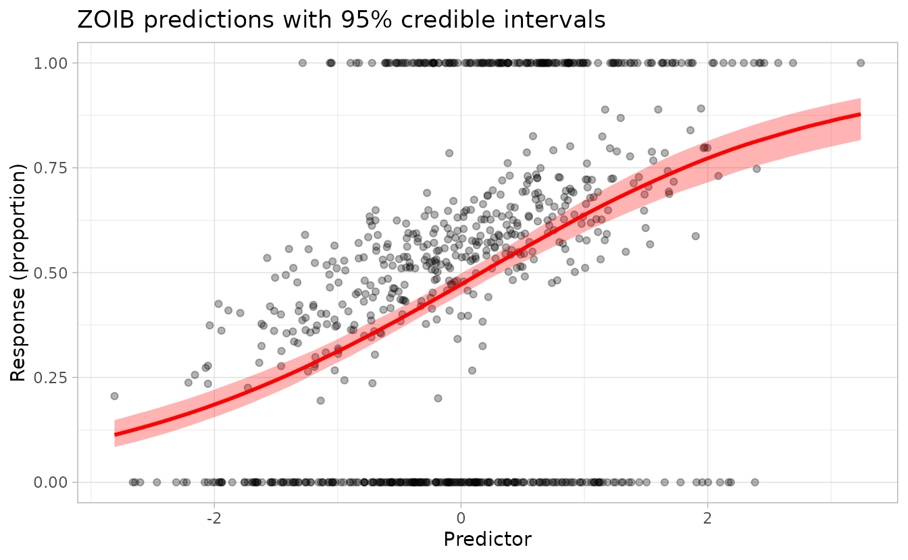

# Zero-one-inflated beta (ZOIB) models with sdmTMB

**If the code in this vignette has not been evaluated, a rendered
version is available on the [documentation
site](https://sdmTMB.github.io/sdmTMB/index.html) under ‘Articles’.**

``` r
library(sdmTMB)
library(ggplot2)
theme_set(theme_light())
```

## Introduction

Zero-one-inflated beta (ZOIB) models are used for modeling proportional
data (values bounded between 0 and 1) that include excess zeros and/or
ones beyond what would be expected from a standard beta distribution.
These models are useful for analyzing data such as:

- Species abundance as a proportion of maximum capacity
- Habitat suitability indices
- Proportional cover data in ecology
- Any other response variable that is a true proportion with potential
  inflation at the boundaries

A ZOIB model consists of three components:

1.  A **zero component**: models the probability of a zero value
    (typically using a binomial/logit model)
2.  A **one component**: models the probability of a one value
    (typically using a binomial/logit model)
3.  A **proportion component**: models the continuous proportion between
    0 and 1 (typically using a beta distribution)

The final prediction combines all three components:

$${\mathbb{E}}\lbrack Y\rbrack = \left( 1 - p_{0} \right) \times \left( p_{1} + \left( 1 - p_{1} \right) \times \mu \right)$$

where $p_{0}$ is the probability of zero, $p_{1}$ is the probability of
one (given not zero), and $\mu$ is the expected proportion from the beta
component.

Currently, sdmTMB does not have a built-in ZOIB family. However, ZOIB
models can be implemented by fitting three separate models and combining
their predictions. This vignette demonstrates this approach.

## Simulating ZOIB data

Let’s simulate data from a ZOIB process to illustrate how to fit these
models in sdmTMB.

First, we’ll set up the parameters for our simulation:

``` r
set.seed(123)
N <- 800
x <- rnorm(N)

# Coefficients for the zero component (logit scale)
b_0 <- c(-1, -0.4)

# Coefficients for the one component (logit scale)
b_1 <- c(-1, 0.6)

# Coefficients for the proportion component (logit scale for mean)
b_prop <- c(0.2, 0.5)

# Precision parameter for beta distribution
phi <- 30
```

Now we’ll simulate the three components:

``` r
# Zero component: probability of observing a zero
p <- plogis(cbind(rep(1, N), x) %*% b_0)
y_p <- rbinom(N, 1, p)

# One component: probability of observing a one (given not zero)
q <- plogis(cbind(rep(1, N), x) %*% b_1)
y_q <- rbinom(N, 1, q)

# Proportion component: beta-distributed values between 0 and 1
mu <- plogis(cbind(rep(1, N), x) %*% b_prop)
a <- phi * mu
b <- phi * (1 - mu)
y_r <- rbeta(N, a, b)
```

Finally, we combine the components to create the ZOIB response:

``` r
y <- numeric(length = N)
y[y_p == 1] <- 0
y[y_p != 1 & y_q == 1] <- 1
y[y_p != 1 & y_q != 1] <- y_r[y_p != 1 & y_q != 1]

dat <- data.frame(x, y)
ggplot(dat, aes(x, y)) +
  geom_point(alpha = 0.5) +
  labs(x = "Predictor", y = "Response (proportion)")
```



The plot shows the characteristic ZOIB pattern: data concentrated at 0
and 1, with continuous values between.

## Fitting the ZOIB model components

To fit a ZOIB model with sdmTMB, we fit three separate models and
combine their predictions.

First, we prepare the data for each component:

``` r
# Zero component: 1 if zero, 0 otherwise
dat$y_zero <- ifelse(dat$y == 0, 1, 0)

# One component: 1 if one, 0 if between 0 and 1, NA if zero
dat$y_one <- ifelse(dat$y == 1, 1, ifelse(dat$y < 1 & dat$y != 0, 0, NA))

# Proportion component: the value itself, but only for values between 0 and 1
dat$y_proportion <- ifelse(dat$y < 1 & dat$y > 0, dat$y, NA)
```

Now we fit the three models. In this example, we turn off spatial
effects with `spatial = "off"`, but in practice you could include
spatial and spatiotemporal random fields in any or all of the
components:

``` r
# Model 1: Zero component
fit_zero <- sdmTMB(
  y_zero ~ x,
  data = dat,
  family = binomial(link = "logit"),
  spatial = "off"
)

# Model 2: One component (excluding zeros)
fit_one <- sdmTMB(
  y_one ~ x,
  data = subset(dat, !is.na(y_one)),
  family = binomial(link = "logit"),
  spatial = "off"
)

# Model 3: Proportion component (values between 0 and 1)
fit_proportion <- sdmTMB(
  y_proportion ~ x,
  data = subset(dat, !is.na(y_proportion)),
  family = Beta(link = "logit"),
  spatial = "off"
)
```

Let’s check how well we recovered the simulation parameters:

``` r
# Zero component coefficients
coef(fit_zero)
#> (Intercept)           x 
#>  -0.8702097  -0.4254690
b_0
#> [1] -1.0 -0.4

# One component coefficients
coef(fit_one)
#> (Intercept)           x 
#>  -1.0390158   0.7738772
b_1
#> [1] -1.0  0.6

# Proportion component coefficients
coef(fit_proportion)
#> (Intercept)           x 
#>   0.2114247   0.4901013
b_prop
#> [1] 0.2 0.5

# Precision parameter
tidy(fit_proportion, "ran_pars")
#> # A tibble: 1 × 5
#>   term  estimate std.error conf.low conf.high
#>   <chr>    <dbl>     <dbl>    <dbl>     <dbl>
#> 1 phi       29.6      2.09     25.8      34.0
phi
#> [1] 30
```

The estimated coefficients should be close to the true values used in
the simulation.

## Making predictions

To make predictions from a ZOIB model, we need to:

1.  Generate predictions from each component
2.  Combine them using the ZOIB formula

First, create a new data frame for prediction:

``` r
nd <- data.frame(x = seq(min(x), max(x), length.out = 100))
```

### Point predictions

Generate point predictions from each component and combine:

``` r
# Get predictions on the response scale (probabilities/proportions)
p0 <- plogis(predict(fit_zero, newdata = nd)$est)
p1 <- plogis(predict(fit_one, newdata = nd)$est)
pp <- plogis(predict(fit_proportion, newdata = nd)$est)

# Combine using ZOIB formula: E[Y] = (1 - p0) * (p1 + (1 - p1) * pp)
nd$est <- (1 - p0) * (p1 + (1 - p1) * pp)
```

Plot the predictions:

``` r
ggplot(dat, aes(x, y)) +
  geom_point(alpha = 0.5) +
  geom_line(aes(x, est), data = nd, colour = "red", linewidth = 1) +
  labs(
    x = "Predictor", y = "Response (proportion)",
    title = "ZOIB model predictions"
  )
```



### Predictions with uncertainty

To incorporate parameter uncertainty, we use can use simulation-based
inference. The [`predict()`](https://rdrr.io/r/stats/predict.html)
function with `nsim` will draw from the joint precision matrix of the
fixed effects and random effects:

``` r
# Generate simulation draws from each model
p0 <- plogis(predict(fit_zero, newdata = nd, nsim = 500))
p1 <- plogis(predict(fit_one, newdata = nd, nsim = 500))
pp <- plogis(predict(fit_proportion, newdata = nd, nsim = 500))

# Combine the simulations
combined <- (1 - p0) * (p1 + (1 - p1) * pp)

# Calculate median and credible intervals
nd$est2 <- apply(combined, 1, median)
nd$lwr <- apply(combined, 1, quantile, probs = 0.025)
nd$upr <- apply(combined, 1, quantile, probs = 0.975)
```

Plot with uncertainty bands:

``` r
ggplot() +
  geom_point(data = dat, aes(x = x, y = y), alpha = 0.3) +
  geom_ribbon(
    data = nd, aes(x = x, ymin = lwr, ymax = upr),
    fill = "red", alpha = 0.3
  ) +
  geom_line(
    data = nd, aes(x = x, y = est2),
    colour = "red", linewidth = 1
  ) +
  labs(
    x = "Predictor", y = "Response (proportion)",
    title = "ZOIB predictions with 95% credible intervals"
  )
```



The red line shows the median prediction and the shaded region shows the
95% credible interval accounting for parameter uncertainty.

## Comparison with the zoib package

For reference, we can compare our approach to the dedicated ZOIB
implementation in the `zoib` package, which uses Bayesian methods:

``` r
library(zoib)
m <- zoib(y ~ x | 1 | x | x,
  data = dat,
  zero.inflation = TRUE,
  one.inflation = TRUE,
  joint = FALSE,
  n.iter = 600,
  n.thin = 1,
  n.burn = 100
)
```

``` r
# Extract parameter estimates
sample1 <- m$coeff
summary(sample1, quantiles = 0.5)

# Compare with our estimates
coef(fit_proportion)
coef(fit_zero)
coef(fit_one)
```

``` r
# Generate predictions
pred <- pred.zoib(m, xnew = nd)
nd2 <- data.frame(x = nd$x, zoib = pred$summary[, "mean"])

# Compare predictions
ggplot(dat, aes(x, y)) +
  geom_point(alpha = 0.3) +
  geom_line(aes(x, est), data = nd, colour = "red", linewidth = 1) +
  geom_line(aes(x, zoib), data = nd2, colour = "blue", linewidth = 1, linetype = 2) +
  labs(
    x = "Predictor", y = "Response (proportion)",
    title = "Comparison: sdmTMB (red) vs zoib package (blue)"
  )
```

## Summary

While sdmTMB does not currently have a built-in ZOIB family, this
three-model approach provides flexibility to:

- Include different predictors in each component
- Add spatial/spatiotemporal random fields to any component
- Use different spatial structures across components
- Leverage all of sdmTMB’s modeling features for each piece

The main limitation is that there is no built-in function to calculate
derived quantities like population indices with integrated uncertainty
across all three model components. However, the simulation approach
shown here can be extended to calculate any derived quantities of
interest.
