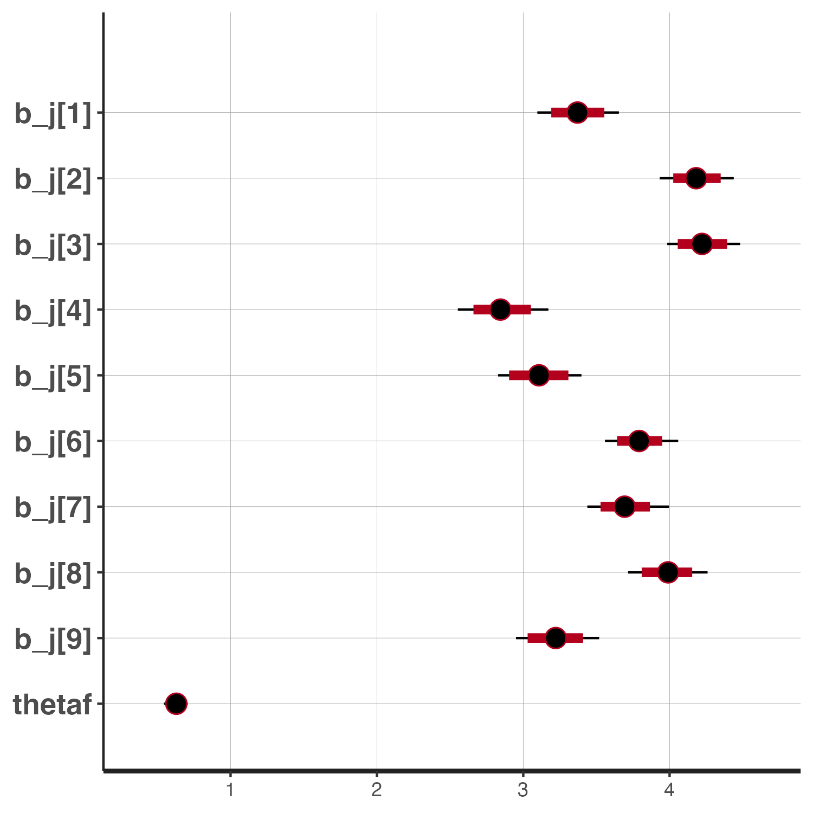
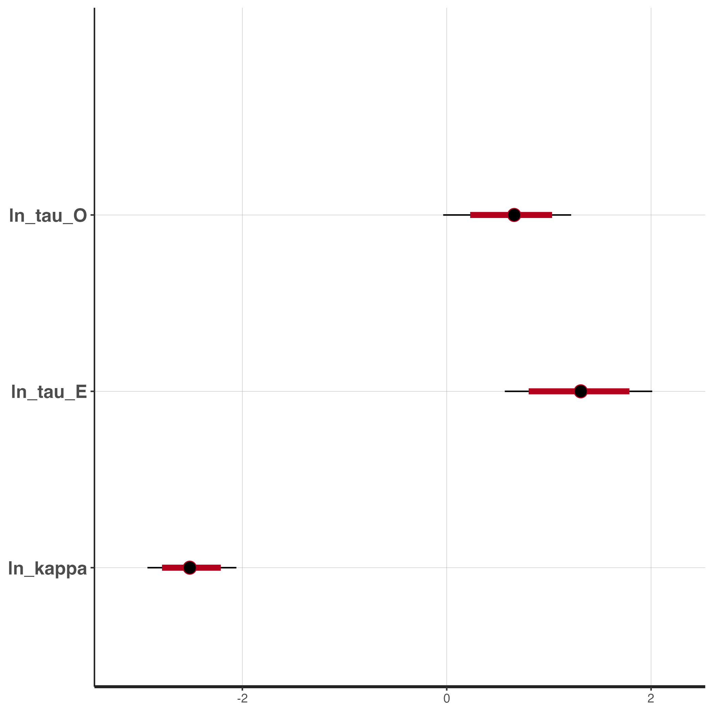
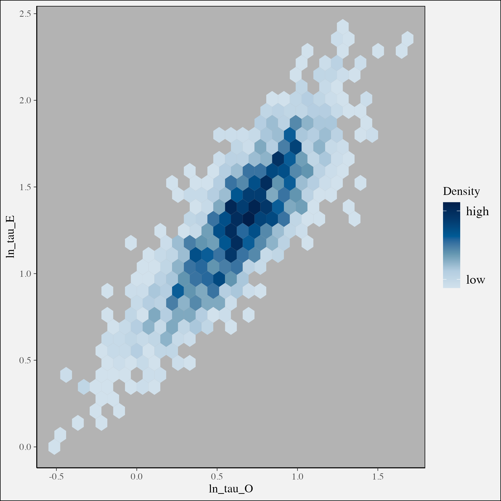
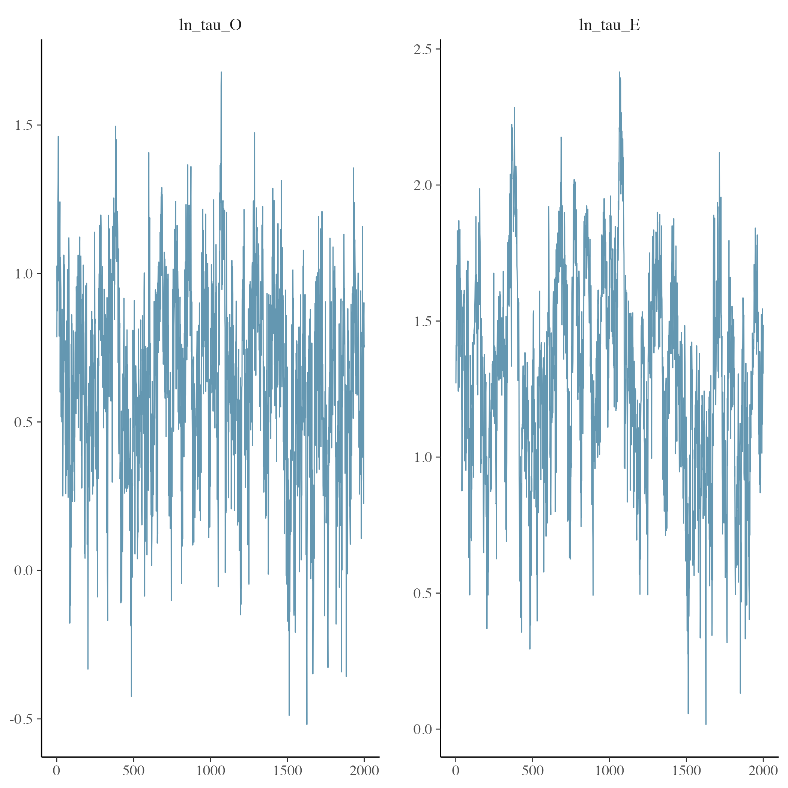

```{r setup, include = FALSE, cache=FALSE}
dplyr_installed <- require("dplyr", quietly = TRUE)
ggplot_installed <- require("ggplot2", quietly = TRUE)
inla_installed <- requireNamespace("INLA", quietly = TRUE)
tmbstan <- requireNamespace("tmbstan", quietly = TRUE)
pkgs <- dplyr_installed && ggplot_installed && inla_installed && tmbstan
knitr::opts_chunk$set(
  collapse = TRUE,
  comment = "#>",
  fig.width = 7,
  fig.asp = 0.618,
  eval = identical(Sys.getenv("NOT_CRAN"), "true") && pkgs
)
```

```{r packages, message=FALSE, warning=TRUE}
library(ggplot2)
library(dplyr)
library(sdmTMB)
```

Bayesian estimation is possible with sdmTMB by passing fitted models to `tmbstan` [@monnahan2018]. All sampling is then done using Stan [@standev_2021], and output is returned as a `stanfit` object. 

As a simple example, we'll fit a non-spatial model 

```{r data}
data(pcod)
pcod_spde <- make_mesh(pcod, c("X", "Y"), cutoff = 20)
```

```{r fit, message = FALSE, warning = FALSE}
fit <- sdmTMB(density ~ 0 + as.factor(year),
  data = pcod,
  mesh = pcod_spde,
  family = tweedie(link = "log"),
  time = "year",
  spatial = "off",
  spatiotemporal = "off"
)
```

The `$tmb_obj` can then be passed to `tmbstan`. Here, 1000 iterations and 1 MCMC chain is probably too small -- but is used for the sake of speed (takes ~ 1 minute).   
```{r fitstan, eval = FALSE}
fit_stan <- tmbstan(fit$tmb_obj, iter = 1000, chains = 1)
```

Lots of plotting and diagnostics can be done with this, and by default all `stanfit` objects can be passed to bayesplot [@gabry_2019], e.g.

```{r plotstan, eval=FALSE}
library(bayesplot)
plot(fit_stan)
```

```{r genfig1, echo=FALSE, eval=FALSE}
plot(fit_stan)
ggsave("vignettes/fig_1.png", height = 7, width = 7)
```


```{r showfig1, echo=FALSE, out.width = "80%", out.height = "80%"}

```

As a more complex example, we'll fit a spatiotemporal model with a quadratic of depth to Pacific cod using a presence-absence response. One major difference between this example and the model above is that we also implement penalized complexity (PC) priors on the range and variance of the Matern correlation (using `sdmTMBpriors()`). Without the prior, the MCMC sampling won't converge (and takes a long time to run).

```{r fitm2, eval=FALSE}
fit <- sdmTMB(present ~ 0 + as.factor(year) + depth_scaled + depth_scaled2,
  data = pcod,
  mesh = pcod_spde,
  family = binomial(link = "logit"),
  time = "year",
  spatiotemporal = "iid",
  priors = sdmTMBpriors(
    matern_s = pc_matern(range_gt = 5, sigma_lt = 1),
    matern_st = pc_matern(range_gt = 5, sigma_lt = 1)
  )
)
```

Evaluating this full model will take some time (4000 iterations on 1 chain takes about ~ 10 minutes). For real applications we have to run this on multiple chains, and for lots of iterations. 

```{r fitstan2, eval = FALSE}
fit_stan <- tmbstan(fit$tmb_obj, iter = 4000, chains = 1)
```

```{r savefig2, echo=FALSE, eval=FALSE}
plot(fit_stan, pars = c("ln_tau_O", "ln_tau_E", "ln_kappa"))
ggsave("fig_2.png", height = 7, width = 7)
```

As before we can make basic plots with `bayesplot`,   

```{r showfig2, echo=FALSE, out.width = "80%", out.height = "80%"}

```

and extract raw parameter estimates with `rstan::extract()`,

```{r getpars, eval=FALSE}
pars <- rstan::extract(fit_stan)
```

We can also make some diagnostic plots showing the tradeoff between different variances. For example, with the 

```{r fig3, eval = FALSE, echo=TRUE}
p <- bayesplot::mcmc_hex(fit_stan, pars = c("ln_tau_O", "ln_tau_E")) +
  bayesplot::plot_bg(fill = "gray95") +
  bayesplot::panel_bg(fill = "gray70")
```

```{r savefig3, eval = FALSE, echo=FALSE}
p <- bayesplot::mcmc_hex(fit_stan, pars = c("ln_tau_O", "ln_tau_E")) +
  bayesplot::plot_bg(fill = "gray95") +
  bayesplot::panel_bg(fill = "gray70")
p
ggsave("fig_3.png", height = 7, width = 7)
```  
  
```{r showfig3, echo=FALSE, out.width = "80%", out.height = "80%"}

```

The MCMC traces look ok (Rhat < 1.05) but this is also a case where it would be good to compare with more chains.  

```{r fig4, eval = FALSE, echo=TRUE}
p <- bayesplot::mcmc_trace(fit_stan, pars = c("ln_tau_O", "ln_tau_E"))
p
```

```{r savefig4, eval = FALSE, echo=FALSE}
p <- bayesplot::mcmc_trace(fit_stan, pars = c("ln_tau_O", "ln_tau_E"))
p
ggsave("fig_4.png", height = 7, width = 7)
```


```{r showfig4, echo=FALSE, out.width = "80%", out.height = "80%"}

```

### References  
  
  
